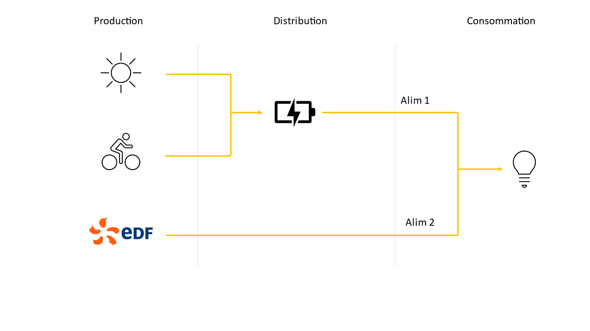
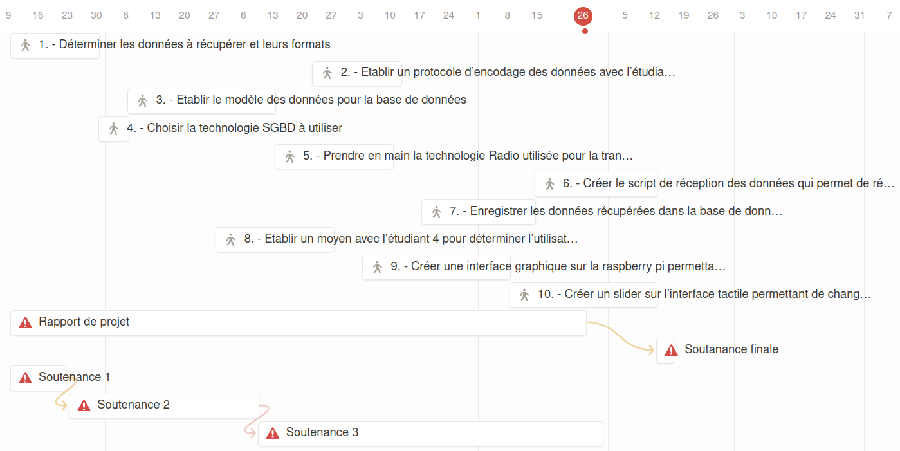
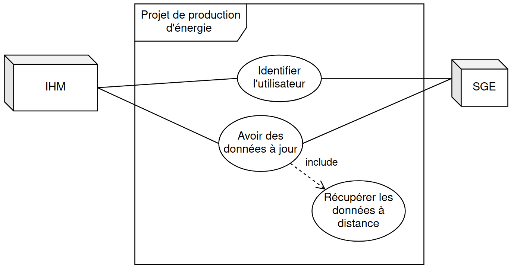

IR3 - Olivier Jourdain
======================

.. _installation:

I- Présentation du contrat
--------------------------

Mon contrat consiste à réceptionner les informations concernant l’énergie produite par l’utilisateur, données venant de l’étudiant EC1 et EC2, et à les enregistrer dans une base de données locale.

Mon contrat m’impose également de créer une interface graphique sur la raspberry pi permettant de changer la source d’alimentation de l'éclairage, depuis le réseau EDF ou la batterie. La batterie étant elle-même alimentée par les panneaux solaires et le vélo. Puis de créer un slider sur l’interface tactile permettant de changer la luminosité du luminaire.

Le slider permet de choisir entre “Alim 1” ou “Alim2”.

Dans le cadre du processus de réception et d'enregistrement des informations dans une base de données locale, plusieurs étapes doivent être suivies. Tout d'abord, il est essentiel de déterminer les données à récupérer ainsi que leurs formats respectifs. Cela implique de travailler en collaboration avec l'étudiant :doc:`Djibril_CHAABI` et l'étudiant :doc:`Laurent_CARDONA` pour établir un protocole d'encodage des données, permettant le transfert fluide des informations depuis la carte électronique.

En parallèle, il est nécessaire d'établir le modèle des données qui sera utilisé pour la base de données. Cette étape joue un rôle crucial dans l'organisation et la structure des informations enregistrées. De plus, il est important de se familiariser avec la technologie radio utilisée pour la transmission des données, afin de garantir une communication fiable et sécurisée.

Pour assurer la réception périodique des données, un script doit être créé. Ce script permettra de récupérer les informations à intervalle de temps régulier, assurant ainsi une mise à jour constante de la base de données. Les données récupérées sont ensuite enregistrées dans la base de données, créant ainsi un système d'archivage et de stockage efficace.

En collaboration avec l'étudiant :doc:`Bastien_VIVIAN`, il convient d'établir un moyen de déterminer l'utilisateur actuel du système. Cette information est ensuite enregistrée dans la base de données en tant que données utilisateur, permettant une identification précise des responsables des enregistrements.

Par ailleurs, il est envisagé de créer une interface graphique sur la Raspberry Pi. Cette interface tactile facilitera la manipulation et le contrôle du réseau électrique d'alimentation, offrant ainsi la possibilité de basculer entre les sources d'énergie, qu'il s'agisse d'EDF ou des panneaux solaires.

Enfin, dans le cadre de l'interface tactile, il est prévu de créer un slider permettant d'ajuster et de contrôler facilement le réseau électrique d'alimentation. Ce dispositif interactif offre une solution conviviale et intuitive pour gérer l'alimentation électrique selon les besoins spécifiques.

En suivant ces différentes étapes, il sera possible d'assurer une réception et un enregistrement efficaces des informations dans la base de données locale, tout en offrant une interface conviviale pour le contrôle du réseau électrique d'alimentation.

Pour voir le code le code de Olivier JOURDAIN :doc:`Annexe_IR3`

OU

`Cliquez ici pour voir le code de Olivier JOURDAIN sur GitHub <https://github.com/Oliopti/pppe/tree/main/Code_de_Olivier>`_

II – Ressources, matériel utilisé et choix technologiques
---------------------------------------------------------

A – Logiciels
^^^^^^^^^^^^^

Pour l’organisation :
++++++++++++++++++++

- Notion : Notion est une plateforme tout-en-un de productivité et de collaboration qui offre des fonctionnalités telles que la prise de notes, création d’un diagramme de Gantt, la gestion de tâches, la création de bases de connaissances et la collaboration en équipe, le tout dans une interface personnalisable. Cela m’a permis d’avoir une vision globale de l'avancée du projet.
- Draw.io : Draw.io est un logiciel polyvalent de conception de diagrammes, idéal pour créer des diagrammes UML et SysML pour représenter les différentes facettes d'un projet, tels que les classes, les exigences, etc.

Pour développer :
+++++++++++++++++

- PyCharm : PyCharm est un environnement de développement intégré (IDE) spécialement conçu pour la programmation en Python, offrant des fonctionnalités avancées telles que la complétion de code, le débogage, la gestion de projets et l'intégration avec des outils de développement populaires.
- XCTU est un logiciel développé par Digi International qui permet de configurer, surveiller et mettre à jour les modules XBee.

Pour la base de données :
+++++++++++++++++++++++++

- MariaDB : MariaDB est un système de gestion de base de données (SGBD) open source et performant, qui constitue une alternative compatible à MySQL et offre des fonctionnalités avancées pour la gestion et le stockage des données.

- phpMyAdmin : PhpMyAdmin est un outil open-source permettant de gérer et d'administrer facilement des bases de données MySQL à travers une interface web.

- Apache2 : Apache2 est un serveur web open-source largement utilisé, offrant une plateforme stable et sécurisée pour héberger des sites web et servir des pages aux utilisateurs. Apache2 m’a fourni un accès à phpMyAdmin via un navigateur web.

Pour le contrôle à distance :
+++++++++++++++++++++++++++++

- Remmina : c’est une application open-source de bureau à distance qui permet aux utilisateurs de se connecter et de contrôler facilement des ordinateurs distants à partir d'une seule interface via le protocole RDP (Remote Desktop Protocol).
- Microsoft Virtual Desktop : c’est une solution de virtualisation qui permet aux utilisateurs d'accéder à distance à des ordinateurs virtuels et à des applications Windows à partir de n'importe quel appareil, offrant une expérience de bureau virtuel sécurisée et flexible via le protocole RDP (Remote Desktop Protocol). 

B – Matériel
^^^^^^^^^^^^

Une base de données de test pour effectuer les premiers tests d’interaction avec linux :

 **Raspberry Pi 3 Model B v1.2** 

- ROM : SD Card : 8-16 Go
- RAM : 1Go
- Operating System : Raspbian GNU/Linux 11 (bullseye)
- Kernel : Linux 6.1.21-v7+
- Architecture : arm7l
- CPU(s) : 4
- CPU max MHz : 1200.0000
- CPU min MHz : 600.0000

Une base de données avec l’écran tactile pour gérer le passage entre le réseau EDF et les panneaux solaires et gérer la luminosité via un slider dans l’interface tactile :

 **Raspberry Pi 3 Model B v1.2 avec Touch Display 7″**

- ROM : SD Card : 8-16 Go
- RAM : 1Go
- Operating System : Raspbian GNU/Linux 11 (bullseye)
- Kernel : Linux 6.1.21-v7+
- Architecture : arm7l
- CPU(s) : 4
- CPU max MHz : 1200.0000
- CPU min MHz : 600.0000

- Taille de l'écran (diagonale) : 7 pouces
- Format d'affichage : 800 (RGB) × 480 pixels
- Zone active : 154,08 mm × 85,92 mm
- Écran tactile : Véritable écran tactile capacitif multi-touch avec jusqu'à 10 points d'absolution

**Ordinateur MacBook Pro** : pour la bureautique, l’organisation, créer différents diagrammes et mettre à jour le diagramme de Gantt.

**Ordinateur avec Ubuntu 22.04** : pour programmer, faire des différents tests, exécuter du code

C – Choix technologiques
^^^^^^^^^^^^^^^^^^^^^^^^

Communication radio : 
+++++++++++++++++++++

Pour la transmission des données j’ai choisi XBee Pro S1 comme module de communication sans fil. Les modules XBee Pro S1 sont faciles à utiliser et offrent une connectivité fiable et sécurisée. Ils ont une faible consommation d'énergie, une grande flexibilité et une capacité à être intégrés dans une large gamme d'applications. Ils prennent en charge diverses interfaces de communication, telles que UART, SPI et I2C.

Protocole de communication :
Le module XBee Pro S1 prend uniquement en charge le protocole de communication Zigbee. Il est important de noter qu’il n'est pas compatible avec d'autres protocoles tels que le Wi-Fi ou Bluetooth. Zigbee offre une portée étendue, une faible consommation d'énergie, la connectivité à plusieurs appareils et des fonctionnalités avancées, le distinguant ainsi du Bluetooth, du Wi-Fi, du LoRa et de Sigfox.

**Quel équivalent ?**

WiFi :

- Consommation d'énergie plus élevée, ce qui peut limiter l'autonomie des appareils alimentés par batterie.
- Plus complexe à mettre en œuvre et à configurer

Bluetooth :

- Consommation d'énergie plus élevée, ce qui peut être un inconvénient dans les applications nécessitant une autonomie prolongée des batteries.
- Courte portée, ce qui peut être un inconvénient dans les applications nécessitant une communication à longue distance à travers un réseau de capteurs.
- Connectivité limitée, conçue pour connecter directement deux appareils à proximité.

LoRa :

- Débit de données plus faible, optimisé pour des applications nécessitant une communication longue portée avec une faible consommation d'énergie.
- Latence plus élevée, délai plus important entre l'envoi et la réception des données

Sigfox :

- Limitation du débit de données dans ses réseaux pour réduire la consommation d'énergie et les coûts
- Abonnement nécessaire donc coût supplémentaire
- Couverture réseau peut varier selon les régions

Ordinateurs monocartes :
++++++++++++++++++++++++

Raspberry Pi :

- énorme communauté d'utilisateurs et de développeurs qui partagent des projets, des tutoriels et des ressources
- Variété d'accessoires et de modules complémentaires, tels que des écrans tactiles, des caméras, des capteurs, des cartes d'extension, etc
- Prend en charge une grande variété de systèmes d'exploitation, notamment Raspbian (basé sur Linux), Ubuntu, Windows IoT Core, etc
- Connectivité, ports Ethernet, USB, HDMI et sans fil (Wi-Fi et Bluetooth) intégrées

**Quel équivalent ?**

BeagleBone Black, Odroid, Nvidia Jetson Nano, Asus Tinker Board, majoritairement manque de connectivité, flexibilité et de documentations

Système d’exploitation :
++++++++++++++++++++++++

- Raspberry Pi OS : Optimisé pour la Raspberry Pi, vaste compatibilité logicielle

**Quel équivalent ?**

- Ubuntu Desktop : mais pas assez optimisé pour la Raspberry Pi qui est peu puissante
- Ubuntu server : besoin d’une interface graphique
- Arch Linux : beaucoup trop complexe à entretenir (bas niveau => plus de codage)

Systèmes de gestion de bases de données (SGBD) :
++++++++++++++++++++++++++++++++++++++++++++++++

MariaDB :

- Open-source maintenu par une communauté active
- Compatible avec MySQL cela permet d’être facilement migrées vers MariaDB
- Fonctionnalités supplémentaires par rapport à MySQL, moteurs de stockage supplémentaires

**Quel équivalent ?**

- Oracle Database : Oracle est un SGBD propriétaire largement utilisé dans les entreprises. Il offre une grande puissance, une évolutivité élevée, des fonctionnalités avancées et une intégration étroite avec d'autres produits Oracle. Cependant, en raison de son statut “propriétaire” (code source fermé), il peut être plus coûteux et moins accessible pour les petites et moyennes entreprises.
- Microsoft SQL Server : Il s'agit d'un SGBD propriétaire développé par Microsoft, largement utilisé dans les environnements Windows. SQL Server est apprécié pour son intégration transparente avec d'autres produits Microsoft, sa convivialité et ses outils de développement. Cependant, comme Oracle, il peut être plus coûteux et moins adapté aux environnements non-Windows.

Langage de programmation :
++++++++++++++++++++++++++

Python présente de nombreux avantages, notamment une syntaxe claire et concise, une vaste bibliothèque standard, une compatibilité multiplate-forme, une grande polyvalence dans divers domaines tels que le développement web et l'analyse de données, une communauté. En somme, Python est un langage de programmation puissant, facile à apprendre et largement utilisé.

**Quel équivalent ?**

- Langage C : C'est un langage de programmation de bas niveau qui offre un contrôle précis sur le matériel informatique. Il est plus rapide que Python, mais nécessite généralement plus de travail et de code pour accomplir les mêmes tâches.
- Langage Java : Un langage de programmation populaire utilisé pour créer des applications de bureau, des applications mobiles et des systèmes distribués. Java est souvent considéré comme plus verbeux que Python, ce qui signifie qu'il nécessite généralement plus de code pour accomplir les mêmes tâches.
- Langage C++ : Une extension du langage C qui prend en charge la programmation orientée objet. C++ est également plus rapide que Python, mais il peut être plus complexe et nécessite souvent plus de compétences en programmation.

III- Présentation des diagrammes
--------------------------------

A – Diagramme de Gantt
^^^^^^^^^^^^^^^^^^^^^^

B – Diagrammes des cas d’utilisation
^^^^^^^^^^^^^^^^^^^^^^^^^^^^^^^^^^^^

C – Diagramme de déploiement
^^^^^^^^^^^^^^^^^^^^^^^^^^^^

IV - Automatisation
--------------------

A - Mise à jours des paquets du système d'exploitation
^^^^^^^^^^^^^^^^^^^^^^^^^^^^^^^^^^^^^^^^^^^^^^^^^^^^^^

1. Créer le fichier ``update.sh``

.. code-block:: bash
   :linenos:

   sudo nano update.sh

2. La commande ``sudo chmod +x update.sh`` est utilisée pour changer les permissions du fichier ``update.sh`` et le rendre exécutable

.. code-block:: bash
   :linenos:

   sudo chmod +x update.sh

4. Voici une explication ligne par ligne du script permettant de mettre à jours les paquets du système d'exploitation :

.. code-block:: bash
   :linenos:

   #!/bin/bash

Cette ligne indique que le script est écrit en shell et sera exécuté par ``/bin/bash``.

.. code-block:: bash
   :linenos:

   # Code rédigé par Olivier JOURDAIN le 10/04/2023

Ce commentaire indique le nom de l'auteur et la date de rédaction du code.

.. code-block:: bash
   :linenos:

   echo -e "\033[1;32mExécution de la commande pour télécharger les paquets de mise à jour :\033[0m"
   sudo apt-get update -y && sudo apt update -y

Cette ligne affiche un message à l'utilisateur en utilisant ``echo -e`` et la séquence d'échappement ``\033[1;32m`` pour spécifier la couleur du texte (vert clair). Ensuite, la commande `sudo apt-get update -y` est exécutée pour télécharger les informations sur les nouveaux paquets disponibles. La commande `sudo apt update -y` est également exécutée pour mettre à jour les listes de paquets.

.. code-block:: bash
   :linenos:

   echo -e "\033[1;32mExécution de la commande pour lister tous les paquets à mettre à jour :\033[0m"
   apt list --upgradable && apt list --upgradable -a

Cette ligne affiche un autre message à l'utilisateur. Ensuite, la commande ``apt list --upgradable`` est exécutée pour lister tous les paquets pouvant être mis à jour. La commande ``apt list --upgradable -a`` est également exécutée pour afficher toutes les versions disponibles des paquets pouvant être mis à jour.

.. code-block:: bash
   :linenos:

   echo -e "\033[1;32mExécution de la commande pour mettre à jour tous les paquets :\033[0m"
   sudo apt-get upgrade -y && sudo apt upgrade -y

Cette ligne affiche un autre message à l'utilisateur. Ensuite, la commande ``sudo apt-get upgrade -y`` est exécutée pour mettre à jour tous les paquets installés. La commande ``sudo apt upgrade -y`` est également exécutée pour mettre à jour les paquets.

.. code-block:: bash
   :linenos:

   echo -e "\033[1;32mExécution de la commande pour supprimer les paquets inutiles :\033[0m"
   sudo apt-get autoremove -y && sudo apt autoremove -y

Cette ligne affiche un autre message à l'utilisateur. Ensuite, la commande ``sudo apt-get autoremove -y`` est exécutée pour supprimer les paquets qui ne sont plus nécessaires. La commande ``sudo apt autoremove -y`` est également exécutée pour supprimer les paquets.

.. code-block:: bash
   :linenos:

   echo -e "\033[1;36mMise à jour terminée.\033[0m"

Cette ligne affiche un message à l'utilisateur pour indiquer que la mise à jour est terminée. Le texte est coloré en cyan clair.

5. Pour executer le script il vous suffira d'être dans le bon répertoire exécuter ``./update.sh``.

Le script shell est destiné à mettre à jour les paquets du système d'exploitation en utilisant la commande ``apt-get``, ``apt`` et à afficher des informations sur les paquets pouvant être mis à jour. Il effectue également la suppression des paquets inutiles.

B - Automatiser l'installation d'Apache2, PHP, MariaDB et phpMyAdmin
^^^^^^^^^^^^^^^^^^^^^^^^^^^^^^^^^^^^^^^^^^^^^^^^^^^^^^^^^^^^^^^^^^^^

1. Créer le fichier ``phpmyadmin-install.sh``

.. code-block:: bash
   :linenos:

   sudo nano phpmyadmin-install.sh

2. La commande ``sudo chmod +x phpmyadmin-install.sh`` est utilisée pour changer les permissions du fichier ``phpmyadmin-install.sh`` et le rendre exécutable

.. code-block:: bash
   :linenos:

   sudo chmod +x phpmyadmin-install.sh

3. Ce script shell est destiné à installer et configurer Apache2, PHP, MariaDB et phpMyAdmin. Voici une explication ligne par ligne :

.. code-block:: bash
   :linenos:

   #!/bin/bash

Cette ligne indique que le script est écrit en shell et sera exécuté par ``/bin/bash``.

.. code-block:: bash
   :linenos:

   # Code rédigé par Olivier JOURDAIN le 09/06/2023

Ce commentaire indique l'auteur et la date de rédaction du code.

.. code-block:: bash
   :linenos:

   echo -e "\033[1;32mInstallation d'Apache2\033[0m"
   sudo apt-get install apache2 -y
   echo -e "\033[1;36mInstallation d'Apache2 et configuration terminée.\033[0m"

Ces lignes affichent un message à l'écran, puis utilisent la commande ``apt-get`` pour installer Apache2. L'option ``-y`` permet d'automatiser les réponses "oui" aux questions de confirmation. Le message de confirmation est ensuite affiché à l'écran.

.. code-block:: bash
   :linenos:

   echo -e "\033[1;32mInstallation de PHP\033[0m"
   sudo apt-get install php -y
   echo -e "\033[1;36mInstallation de PHP et configuration terminée.\033[0m"

Ces lignes installent PHP de la même manière que précédemment, en affichant des messages avant et après l'installation.

.. code-block:: bash
   :linenos:

   echo -e "\033[1;32mInstallation de MariaDB\033[0m"
   sudo apt-get install mariadb-server mariadb-client -y
   echo -e "\033[1;36mInstallation de MariaDB et configuration terminée.\033[0m"

Ces lignes installent MariaDB, à la fois le serveur et le client, en affichant des messages appropriés.

.. code-block:: bash
   :linenos:

   echo -e "\033[1;32mCréation d'un lien symbolique pour accéder à phpMyAdmin via le navigateur\033[0m"
   sudo ln -s /usr/share/phpmyadmin /var/www/html

Ces lignes créent un lien symbolique pour accéder à phpMyAdmin via le navigateur. Cela permet d'accéder à phpMyAdmin en utilisant l'URL ``http://localhost/phpmyadmin``.

.. code-block:: bash
   :linenos:

   echo -e "\033[1;32mInstallation de phpMyAdmin\033[0m"
   sudo apt-get install phpmyadmin -y
   echo -e "\033[1;36mInstallation de phpMyAdmin et configuration terminée.\033[0m"

Ces lignes installent phpMyAdmin en utilisant ``apt-get``, en affichant des messages appropriés.

.. code-block:: bash
   :linenos:

   echo -e "\033[1;32mRedémarrage d'Apache2\033[0m"
   sudo systemctl restart apache2
   echo -e "\033[1;36mRedémarrage d'Apache2 terminé.\033[0m"

Ces lignes redémarrent Apache2 à l'aide de la commande ``systemctl`` et affichent des messages appropriés.

.. code-block:: bash
   :linenos:

   echo -e "\033[0;35mInstallation de Apache2, PHP, MariaDB et phpMyAdmin terminée.\033[0m"

Cette ligne affiche un message indiquant la fin de l'installation de tous les composants.

.. code-block:: bash
   :linenos:

   echo -e "\033[0;35mExecutez 'sudo systemctl status apache2' ou '

   sudo systemctl status mariadb' pour connaître le statut de Apache 2 ou MariaDB.\033[0m"

Cette ligne donne une instruction à l'utilisateur pour vérifier le statut d'Apache 2 ou de MariaDB en utilisant la commande ``systemctl status``.

4. Pour executer le script il vous suffira d'être dans le bon répertoire exécuter ``./phpmyadmin-install.sh``.

Ces commandes permettent donc d'automatiser l'installation et la configuration d'Apache2, PHP, MariaDB et phpMyAdmin sur un système Linux.

C - Autoriser les connexion étrangère
^^^^^^^^^^^^^^^^^^^^^^^^^^^^^^^^^^^^^

Pour autoriser les connexion étrangère ouvrir le fichier de configuration ``/etc/mysql/mariadb.conf.d/50-server.cnf``.

.. code-block:: bash
   :linenos:

   sudo nano /etc/mysql/mysql.conf.d/mysql.cnf

Puis, renplacer ``bind-address = 127.0.0.1`` par ``bind-address = 0.0.0.0``.

D - Automatiser l'execution du code au démarrage :
^^^^^^^^^^^^^^^^^^^^^^^^^^^^^^^^^^^^^^^^^^^^^^^^^^

Voici une série de commandes utilisées pour configurer et gérer un service systemd sur un système Linux.

Voici une explication de chaque commande :

1. Créer le fichier ``phpmyadmin-install.sh``

.. code-block:: bash
   :linenos:

   sudo sudo nano monservice.service

2. Insérer dans le fichier :

.. code-block:: bash
   :linenos:

   [Unit]
   Description=Mon service
   After=network.target

   [Service]
   ExecStart=/usr/bin/python3 /home/pi/Documents/code-reception-envoie-serveur/1v-main.py
   WorkingDirectory=/home/pi/Documents/code-reception-envoie-serveur
   StandardOutput=inherit
   StandardError=inherit
   Restart=always
   User=pi

   [Install]
   WantedBy=default.target

Ce code est un fichier de configuration pour un service sous systemd sur un système Linux. Il décrit la configuration d'un service appelé "Mon service" qui exécute un script Python.

Voici une explication du code :

- ``[Unit]`` : Cette section spécifie des informations sur le service.
  - ``Description=Mon service`` : C'est une description textuelle du service.
  - ``After=network.target`` : Cela indique que le service doit démarrer après que le réseau soit prêt.

- ``[Service]`` : Cette section contient les détails de l'exécution du service.
  - ``ExecStart=/usr/bin/python3 /home/pi/Documents/code-reception-envoie-serveur/1v-main.py`` : C'est la commande qui est exécutée pour démarrer le service. Elle exécute le script Python ``1v-main.py`` en utilisant l'interpréteur Python 3.
  - ``WorkingDirectory=/home/pi/Documents/code-reception-envoie-serveur`` : C'est le répertoire de travail dans lequel le service sera lancé. Cela définit le répertoire dans lequel se trouve le script Python.
  - ``StandardOutput=inherit`` et ``StandardError=inherit`` : Ces options indiquent que la sortie standard (stdout) et la sortie d'erreur (stderr) du service seront héritées du processus parent.
  - ``Restart=always`` : Cela spécifie que le service sera redémarré automatiquement en cas d'échec ou de terminaison.
  - ``User=pi` : Cela définit l'utilisateur sous lequel le service sera exécuté.

- ``[Install]`` : Cette section spécifie comment le service doit être installé.
  - ``WantedBy=default.target`` : Cela indique que le service sera activé au démarrage par défaut.

En résumé, ce fichier de configuration définit un service qui exécute un script Python lors du démarrage du système. Le service sera redémarré automatiquement en cas de besoin. Les sorties standard et d'erreur du service seront héritées du processus parent, et le service sera exécuté sous l'utilisateur "pi".

3. 

.. code-block:: bash
   :linenos:

   sudo mv monservice.service /etc/systemd/system/

Cette commande déplace le fichier ``monservice.service`` dans le répertoire ``/etc/systemd/system/``. Le répertoire ``/etc/systemd/system/`` est l'emplacement standard pour les fichiers de service systemd.

4. 

.. code-block:: bash
   :linenos:

   cd /etc/systemd/system/ 

Cette commande se déplace dans le répertoire ``/etc/systemd/system/``. Cela permet d'accéder au répertoire où le fichier de service a été déplacé.

5. 

.. code-block:: bash
   :linenos:
   
   sudo systemctl daemon-reload
   
Cette commande demande à systemd de recharger sa configuration. Cela est nécessaire lorsque de nouveaux fichiers de service sont ajoutés ou modifiés.

6. 

.. code-block:: bash
   :linenos:
   
   sudo systemctl enable monservice

Cette commande active le service ``monservice``. Cela signifie que le service sera automatiquement démarré au démarrage du système.

7. 

.. code-block:: bash
   :linenos:

   sudo systemctl status monservice

Cette commande affiche le statut actuel du service ``monservice``. Cela permet de vérifier si le service est en cours d'exécution, s'il a échoué ou s'il a été arrêté.

En résumé, ces commandes sont utilisées pour déplacer le fichier de service dans le répertoire approprié, recharger la configuration de systemd, activer le service pour le démarrage automatique et vérifier son statut. Cela permet de gérer efficacement un service systemd sur un système Linux.
Executer cesudo mv monservice.service /etc/systemd/system/

.. warning::

   Ce code s'exécute en tâche de fond alors ATTENTION à ne pas saturer le système.

Si vous souhaitez savoir quel processus utilise du python vous pouvez executer la commande:

.. code-block:: bash
   :linenos:

   ps aux | grep python

V - Description de la Base de Données
---------------------------------------

`Cliquez ici pour voir une sauvegarde du code de la base de donnée sur GitHub <https://github.com/Oliopti/pppe/blob/main/Code_de_Olivier/Sauvegarde-bdd-projet/PPPE-database/1v-sauvegarde-pppe.sql>`_

OU

Pour voir le code complet :doc:`Annexe_IR3`

Ce code est un fichier de sauvegarde SQL généré par phpMyAdmin. Il contient une série d'instructions SQL pour créer une base de données et ses tables, ainsi que pour insérer des données dans ces tables.

Voici une explication partie par partie de sauvegarde du code de la base de donnée :

1. Les premières lignes du code sont des commentaires indiquant la version de phpMyAdmin utilisée, l'hôte, la date et l'heure de génération du fichier, ainsi que les versions du serveur MariaDB et de PHP.

.. code-block:: sql
   :linenos:

   -- phpMyAdmin SQL Dump
   -- version 5.0.4deb2+deb11u1
   -- https://www.phpmyadmin.net/
   --
   -- Hôte : localhost:3306
   -- Généré le : ven. 09 juin 2023 à 01:31
   -- Version du serveur :  10.5.19-MariaDB-0+deb11u2
   -- Version de PHP : 7.4.33

2. Ensuite, certaines instructions SQL sont utilisées pour configurer le mode SQL, le fuseau horaire et les jeux de caractères.

.. code-block:: sql
   :linenos:

   SET SQL_MODE = "NO_AUTO_VALUE_ON_ZERO";
   START TRANSACTION;
   SET time_zone = "+00:00";

   /*!40101 SET @OLD_CHARACTER_SET_CLIENT=@@CHARACTER_SET_CLIENT */;
   /*!40101 SET @OLD_CHARACTER_SET_RESULTS=@@CHARACTER_SET_RESULTS */;
   /*!40101 SET @OLD_COLLATION_CONNECTION=@@COLLATION_CONNECTION */;
   /*!40101 SET NAMES utf8mb4 */;

3. La section suivante concerne la création de la base de données ``pppe`` si elle n'existe pas déjà, ainsi que la sélection de cette base de données pour les instructions suivantes.

.. code-block:: sql
   :linenos:

   --
   -- Base de données : `pppe`
   --
   CREATE DATABASE IF NOT EXISTS `pppe` DEFAULT CHARACTER SET utf8mb4 COLLATE utf8mb4_general_ci;
   USE `pppe`;

   -- --------------------------------------------------------
   4. Le code crée ensuite plusieurs tables avec leurs structures et leurs clés primaires. Les tables créées sont les suivantes :
      - `batterie` avec les colonnes `id` et `date_service`.
      - `mesure_batterie` avec les colonnes `id`, `id_batterie`, `tension` et `timestamp`.
      - `panneaux_solaire` avec les colonnes `id`, `tension` et `timestamp`.
      - `releve_puissance` avec les colonnes `id`, `id_session` et `mesures`.
      - `role` avec les colonnes `id` et `nom_role`.
      - `session` avec les colonnes `id`, `id_user`, `datetime_debut` et `datetime_fin`.
      - `utilisateur` avec les colonnes `id`, `role`, `nom`, `prenom`, `email`, `mdp` et `date_inscription`.
      
5. Après la création des tables, le code insère des données dans chaque table. Les données sont insérées à l'aide des instructions ``INSERT INTO``. Chaque instruction ``INSERT INTO`` spécifie les colonnes et les valeurs à insérer pour chaque enregistrement.

.. code-block:: sql
   :linenos:

   --
   -- Structure de la table `batterie`
   --

   CREATE TABLE `batterie` (
   `id` int(23) NOT NULL,
   `date_service` timestamp(1) NOT NULL DEFAULT current_timestamp(1) ON UPDATE current_timestamp(1)
   ) ENGINE=InnoDB DEFAULT CHARSET=utf8mb4 COLLATE=utf8mb4_general_ci;

   --
   -- Déchargement des données de la table `batterie`
   --

   INSERT INTO `batterie` (`id`, `date_service`) VALUES
   (1, '2023-03-31 22:00:00.0');

   -- --------------------------------------------------------

   --
   -- Structure de la table `mesure_batterie`
   --

   CREATE TABLE `mesure_batterie` (
   `id` int(23) NOT NULL,
   `id_batterie` int(23) NOT NULL,
   `tension` int(16) NOT NULL,
   `timestamp` timestamp(1) NOT NULL DEFAULT current_timestamp(1)
   ) ENGINE=InnoDB DEFAULT CHARSET=utf8mb4 COLLATE=utf8mb4_general_ci;

   --
   -- Déchargement des données de la table `mesure_batterie`
   --

   INSERT INTO `mesure_batterie` (`id`, `id_batterie`, `tension`, `timestamp`) VALUES
   (1, 1, 20, '2023-05-09 08:56:26.0'),
   (4, 1, 1023, '0000-00-00 00:00:00.0'),
   (5, 1, 1, '0000-00-00 00:00:00.0'),
   (6, 1, 1, '0000-00-00 00:00:00.0'),
   (7, 1, 1, '0000-00-00 00:00:00.0'),
   (8, 1, 1234, '0000-00-00 00:00:00.0');

   -- --------------------------------------------------------

   --
   -- Structure de la table `panneaux_solaire`
   --

   CREATE TABLE `panneaux_solaire` (
   `id` int(23) NOT NULL,
   `tension` int(23) NOT NULL,
   `timestamp` timestamp(1) NOT NULL DEFAULT current_timestamp(1)
   ) ENGINE=InnoDB DEFAULT CHARSET=utf8mb4 COLLATE=utf8mb4_general_ci;

   --
   -- Déchargement des données de la table `panneaux_solaire`
   --

   INSERT INTO `panneaux_solaire` (`id`, `tension`, `timestamp`) VALUES
   (1, 1022, '0000-00-00 00:00:00.0'),
   (2, 1234, '0000-00-00 00:00:00.0');

   -- --------------------------------------------------------

   --
   -- Structure de la table `releve_puissance`
   --

   CREATE TABLE `releve_puissance` (
   `id` int(23) NOT NULL,
   `id_session` int(23) NOT NULL,
   `mesures` int(16) NOT NULL
   ) ENGINE=InnoDB DEFAULT CHARSET=utf8mb4 COLLATE=utf8mb4_general_ci;

   --
   -- Déchargement des données de la table `releve_puissance`
   --

   INSERT INTO `releve_puissance` (`id`, `id_session`, `mesures`) VALUES
   (128, 21, 1234),
   (129, 74, 0),
   (130, 74, 0),
   (131, 74, 123),
   (142, 74, 123),
   (143, 74, 80),
   (144, 74, 1023),
   (156, 74, 1023),
   (157, 74, 123),
   (158, 74, 1234);

   -- --------------------------------------------------------

   --
   -- Structure de la table `role`
   --

   CREATE TABLE `role` (
   `id` int(10) NOT NULL,
   `nom_role` varchar(20) NOT NULL
   ) ENGINE=InnoDB DEFAULT CHARSET=utf8mb4 COLLATE=utf8mb4_general_ci;

   --
   -- Déchargement des données de la table `role`
   --

   INSERT INTO `role` (`id`, `nom_role`) VALUES
   (1, 'admin'),
   (2, 'utilisateur');

   -- --------------------------------------------------------

   --
   -- Structure de la table `session`
   --

   CREATE TABLE `session` (
   `id` int(16) NOT NULL,
   `id_user` int(16) NOT NULL,
   `datetime_debut` timestamp(1) NOT NULL DEFAULT current_timestamp(1),
   `datetime_fin` timestamp(1) NOT NULL DEFAULT current_timestamp(1)
   ) ENGINE=InnoDB DEFAULT CHARSET=utf8mb4 COLLATE=utf8mb4_general_ci;

   --
   -- Déchargement des données de la table `session`
   --

   INSERT INTO `session` (`id`, `id_user`, `datetime_debut`, `datetime_fin`) VALUES
   (21, 17, '2023-05-09 09:53:53.6', '2023-05-09 10:01:10.0'),
   (23, 3, '2023-05-10 13:47:08.5', '2023-05-10 14:11:10.0'),
   (24, 3, '2023-05-10 13:54:48.6', '2023-05-10 14:11:10.0'),
   (25, 17, '2023-05-10 13:55:35.4', '2023-05-10 14:11:10.0'),
   (28, 3, '2023-05-10 14:16:59.9', '2023-05-10 14:17:11.0'),
   (29, 3, '2023-05-10 14:20:14.5', '2023-05-12 08:22:06.0'),
   (50, 3, '2023-05-12 09:46:03.6', '2023-05-12 09:46:10.0'),
   (51, 3, '2023-05-12 09:52:17.4', '2023-05-12 09:52:23.0'),
   (52, 19, '2023-05-12 09:56:55.8', '2023-05-12 09:57:04.0'),
   (53, 19, '2023-05-12 09:57:33.9', '2023-05-12 09:57:36.0'),
   (54, 19, '2023-05-12 09:58:34.4', '2023-05-12 09:58:38.0'),
   (55, 3, '2023-05-12 09:58:49.5', '2023-05-12 09:59:00.0'),
   (57, 19, '2023-05-12 10:25:49.8', '2023-05-12 10:50:02.0'),
   (58, 19, '2023-05-12 10:50:07.8', '2023-05-12 10:53:52.0'),
   (59, 19, '2023-05-12 10:50:25.0', '2023-05-12 10:53:52.0'),
   (60, 19, '2023-05-12 10:53:45.5', '2023-05-12 10:53:52.0'),
   (61, 19, '2023-05-12 12:07:31.3', '2023-05-12 12:08:53.0'),
   (62, 19, '2023-05-12 12:08:55.8', '2023-05-12 12:14:05.0'),
   (63, 19, '2023-05-12 12:09:10.1', '2023-05-12 12:14:05.0'),
   (64, 15, '2023-05-12 12:14:32.7', '2023-05-12 12:14:48.0'),
   (65, 15, '2023-05-12 12:15:20.3', '2023-05-12 12:15:24.0'),
   (66, 15, '2023-05-12 12:15:49.8', '2023-05-12 12:15:57.0'),
   (67, 15, '2023-05-12 12:16:52.2', '2023-05-12 12:16:57.0'),
   (68, 15, '2023-05-12 12:16:59.5', '2023-05-23 07:03:51.0'),
   (69, 15, '2023-05-12 12:17:12.7', '2023-05-23 07:03:51.0'),
   (70, 17, '2023-05-23 06:59:00.7', '2023-05-23 07:03:51.0'),
   (71, 17, '2023-05-23 07:03:24.0', '2023-05-23 07:03:51.0'),
   (72, 3, '2023-05-23 07:04:21.4', '2023-05-23 07:04:57.0'),
   (73, 3, '2023-05-23 07:04:59.0', '2023-05-23 07:05:07.0'),
   (74, 3, '2023-05-23 07:09:47.3', '2023-05-23 07:09:54.0');

   -- --------------------------------------------------------

   --
   -- Structure de la table `utilisateur`
   --

   CREATE TABLE `utilisateur` (
   `id` int(11) NOT NULL,
   `role` int(10) NOT NULL,
   `nom` varchar(50) NOT NULL,
   `prenom` varchar(50) NOT NULL,
   `email` varchar(50) NOT NULL,
   `mdp` varchar(50) NOT NULL,
   `date_inscription` timestamp(1) NOT NULL DEFAULT current_timestamp(1)
   ) ENGINE=InnoDB DEFAULT CHARSET=utf8mb4 COLLATE=utf8mb4_general_ci;

   --
   -- Déchargement des données de la table `utilisateur`
   --

   INSERT INTO `utilisateur` (`id`, `role`, `nom`, `prenom`, `email`, `mdp`, `date_inscription`) VALUES
   (3, 1, 'VIVIAN', 'Bastien', 'bastienvivian29@gmail.com', '*CC67043C7BCFF5EEA5566BD9B1F3C74FD9A5CF5D', '0000-00-00 00:00:00.0'),
   (15, 1, 'administrateurtest', 'administrateurtest', 'adminpppe@gmail.com', '*01A6717B58FF5C7EAFFF6CB7C96F7428EA65FE4C', '0000-00-00 00:00:00.0'),
   (17, 2, 'Utilisateur_simple', 'Utilisateur_simple', 'utilisateur_simple@gmail.com', '*CC67043C7BCFF5EEA5566BD9B1F3C74FD9A5CF5D', '0000-00-00 00:00:00.0'),
   (19, 1, 'JOUDRAIN', 'Olivier', 'olivierjourdaintechnitien@gmail.com', '*CC67043C7BCFF5EEA5566BD9B1F3C74FD9A5CF5D', '2023-05-12 08:45:14.4'),
   (20, 2, 'de Djibril', 'Nintendoswitch', 'Djib@gmail.com', '*CC67043C7BCFF5EEA5566BD9B1F3C74FD9A5CF5D', '2023-05-23 06:46:38.1');

6. Enfin, le code définit des index pour certaines tables.

.. code-block:: sql
   :linenos:

   --
   -- Index pour les tables déchargées
   --

   --
   -- Index pour la table `batterie`
   --
   ALTER TABLE `batterie`
   ADD PRIMARY KEY (`id`);

   --
   -- Index pour la table `mesure_batterie`
   --
   ALTER TABLE `mesure_batterie`
   ADD PRIMARY KEY (`id`),
   ADD KEY `id_batterie` (`id_batterie`) USING BTREE;

   --
   -- Index pour la table `panneaux_solaire`
   --
   ALTER TABLE `panneaux_solaire`
   ADD PRIMARY KEY (`id`);

   --
   -- Index pour la table `releve_puissance`
   --
   ALTER TABLE `releve_puissance`
   ADD PRIMARY KEY (`id`),
   ADD KEY `id-session` (`id_session`);

   --
   -- Index pour la table `role`
   --
   ALTER TABLE `role`
   ADD PRIMARY KEY (`id`);

   --
   -- Index pour la table `session`
   --
   ALTER TABLE `session`
   ADD PRIMARY KEY (`id`),
   ADD KEY `id-user` (`id_user`);

   --
   -- Index pour la table `utilisateur`
   --
   ALTER TABLE `utilisateur`
   ADD PRIMARY KEY (`id`),
   ADD KEY `fk_role` (`role`);

   --
   -- AUTO_INCREMENT pour les tables déchargées
   --

   --
   -- AUTO_INCREMENT pour la table `batterie`
   --
   ALTER TABLE `batterie`
   MODIFY `id` int(23) NOT NULL AUTO_INCREMENT, AUTO_INCREMENT=2;

   --
   -- AUTO_INCREMENT pour la table `mesure_batterie`
   --
   ALTER TABLE `mesure_batterie`
   MODIFY `id` int(23) NOT NULL AUTO_INCREMENT, AUTO_INCREMENT=9;

   --
   -- AUTO_INCREMENT pour la table `panneaux_solaire`
   --
   ALTER TABLE `panneaux_solaire`
   MODIFY `id` int(23) NOT NULL AUTO_INCREMENT, AUTO_INCREMENT=3;

   --
   -- AUTO_INCREMENT pour la table `releve_puissance`
   --
   ALTER TABLE `releve_puissance`
   MODIFY `id` int(23) NOT NULL AUTO_INCREMENT, AUTO_INCREMENT=159;

   --
   -- AUTO_INCREMENT pour la table `role`
   --
   ALTER TABLE `role`
   MODIFY `id` int(10) NOT NULL AUTO_INCREMENT, AUTO_INCREMENT=3;

   --
   -- AUTO_INCREMENT pour la table `session`
   --
   ALTER TABLE `session`
   MODIFY `id` int(16) NOT NULL AUTO_INCREMENT, AUTO_INCREMENT=75;

   --
   -- AUTO_INCREMENT pour la table `utilisateur`
   --
   ALTER TABLE `utilisateur`
   MODIFY `id` int(11) NOT NULL AUTO_INCREMENT, AUTO_INCREMENT=21;

   --
   -- Contraintes pour les tables déchargées
   --

   --
   -- Contraintes pour la table `mesure_batterie`
   --
   ALTER TABLE `mesure_batterie`
   ADD CONSTRAINT `mesure_batterie_ibfk_1` FOREIGN KEY (`id_batterie`) REFERENCES `batterie` (`id`);

   --
   -- Contraintes pour la table `releve_puissance`
   --
   ALTER TABLE `releve_puissance`
   ADD CONSTRAINT `releve_puissance_ibfk_1` FOREIGN KEY (`id_session`) REFERENCES `session` (`id`);

   --
   -- Contraintes pour la table `session`
   --
   ALTER TABLE `session`
   ADD CONSTRAINT `session_ibfk_1` FOREIGN KEY (`id_user`) REFERENCES `utilisateur` (`id`);

   --
   -- Contraintes pour la table `utilisateur`
   --
   ALTER TABLE `utilisateur`
   ADD CONSTRAINT `fk_role` FOREIGN KEY (`role`) REFERENCES `role` (`id`);
   COMMIT;

   /*!40101 SET CHARACTER_SET_CLIENT=@OLD_CHARACTER_SET_CLIENT */;
   /*!40101 SET CHARACTER_SET_RESULTS=@OLD_CHARACTER_SET_RESULTS */;
   /*!40101 SET COLLATION_CONNECTION=@OLD_COLLATION_CONNECTION */;

En résumé, le code fourni crée la structure de deux tables (« batterie », « mesure_batterie », « panneaux_solaire », « releve_puissance », « role », « session » et « utilisateur ») dans la base de données « pppe » et insère des données initiales dans ces tables. Des index, des contraintes et des configurations supplémentaires sont également définis pour les tables.

VI - Description du code pour récupérer les données et les importer dans la base de donnée:
--------------------------------------------------------------------------------------------

`Cliquez ici pour voir ce code sur GitHub <https://github.com/Oliopti/pppe/blob/main/Code_de_Olivier/Sauvegarde-bdd-projet/PPPE-database/1v-sauvegarde-pppe.sql>`_

OU

Pour voir le code complet :doc:`Annexe_IR3`

Voici une explication ligne par ligne du code :

Voici une explication détaillée du code ligne par ligne :

.. code-block:: python
   :linenos:

   import time
   import serial

   import mysql.connector as mysql

Dans cette section, nous importons les modules nécessaires pour le programme. Le module ``time`` est utilisé pour gérer les attentes et les intervalles de temps, le module ``serial`` permet la communication avec les périphériques série, et le module ``mysql.connector`` est utilisé pour se connecter à une base de données MySQL.

.. code-block:: python
   :linenos:

   ser = serial.Serial(
      port='/dev/ttyUSB0',                  # Port série à utiliser
      baudrate=9600,                        # Vitesse de communication en bauds
      parity=serial.PARITY_NONE,            # Parité (aucune parité)
      stopbits=serial.STOPBITS_ONE,         # Bits d'arrêt (1 bit)
      bytesize=serial.EIGHTBITS,            # Taille des octets de données (8 bits)
      timeout=5                             # Délai d'attente pour la lecture de données (5 secondes)
   )

Cette partie configure la connexion série en utilisant les paramètres spécifiés. ``port`` indique le port série à utiliser (dans cet exemple, '/dev/ttyUSB0'), ``baudrate`` définit la vitesse de communication en bauds (9600), ``parity`` indique la parité (aucune parité), ``stopbits`` spécifie le nombre de bits d'arrêt (1 bit), ``bytesize`` détermine la taille des octets de données (8 bits), et ``timeout`` représente le délai d'attente pour la lecture de données (5 secondes).

.. code-block:: python
   :linenos:

   if ser.isOpen():
      ser.close()

Cette condition vérifie si le port série est déjà ouvert à l'aide de la méthode ``isOpen()``. Si c'est le cas, la méthode ``close()`` est appelée pour fermer le port série.

.. code-block:: python
   :linenos:

   ser.open()

Cette ligne ouvre le port série en appelant la méthode ``open()``.

.. code-block:: python
   :linenos:

   ser.isOpen()

Cette ligne vérifie si le port série est ouvert en appelant la méthode ``isOpen()``. Cependant, le résultat de cet appel n'est pas stocké ou utilisé dans ce code.

.. code-block:: python
   :linenos:

   while True:
      try:
         res = ser.read(6)
         res = res.decode()
         res = res.split("-")
         print("Signal recu :",res)
         if len(res)==2:
               insertion(res)
         time.sleep(1)
      except:
         print('erreur while true')

Ceci est la boucle principale du programme. Il s'agit d'une boucle infinie ``while True`` qui lit en continu les données à partir du port série, effectue certaines opérations sur ces données, puis attend 1 seconde avant la prochaine lecture.

Dans la boucle, les étapes suivantes sont effectuées :
- ``res = ser.read(6)`` lit 6 octets de données à partir du port série et les stocke dans la variable ``res``.
- ``res = res.decode()`` décode les données lues en une chaîne de caractères lisible.
- ``res = res.split("-")`` divise la chaîne de caractères en une liste de sous-chaînes en utilisant le caractère "-" comme séparateur.
- ``print("Signal recu :", res)`` affiche les données reçues du port série.
- ``if len(res)==2:`` vér ifie si la longueur de la liste ``res`` est égale à 2.
- Si la condition est vraie, la fonction ``insertion(res)`` est appelée avec la liste ``res`` en tant qu'argument.
- ``time.sleep(1)`` fait une pause d'une seconde avant de continuer à la prochaine itération de la boucle.

.. code-block:: python
   :linenos:

   def insertion(mesures):
      try:
         connection = mysql.connector.connect(
               host='192.168.0.104',
               database='pppe',
               user='admin',
               password='admin'
         )
         cursor = connection.cursor()

         if mesures[0] == '0':
               mySql_insert_query = f"INSERT INTO mesure_batterie(id_batterie, tension, timestamp) VALUES((SELECT MAX(id) FROM batterie), {mesures[1]}, timestamp)"
         elif mesures[0] == '1':
               mySql_insert_query = f"INSERT INTO panneaux_solaire(tension, timestamp) VALUES({mesures[1]}, timestamp)"
         elif mesures[0] == '2':
               mySql_insert_query = f"INSERT INTO releve_puissance(id_session, mesures) VALUES((SELECT MAX(id) FROM session), {mesures[1]})"

         print(mySql_insert_query)

         cursor.execute(mySql_insert_query)
         connection.commit()
         print("Exécuter la commande :", mySql_insert_query)

         cursor.close()
         print("Enregistrement inséré avec succès dans la table releve_puissance")
      except mysql.connector.Error as error:
         print("Échec de l'insertion d'un enregistrement dans la table :", error)
         return False
      return True

Cette partie du code définit la fonction ``insertion(mesures)`` qui est appelée pour insérer les données dans une base de données MySQL.

Dans la fonction, les étapes suivantes sont effectuées :

- Une connexion est établie avec le serveur MySQL en utilisant les informations de connexion fournies (hôte, base de données, nom d'utilisateur, mot de passe).
- Un curseur est créé pour exécuter les requêtes SQL.
- En fonction de la valeur ``mesures[0]`` (le premier élément de la liste ``mesures``), une requête d'insertion appropriée est construite pour insérer les données dans la table correspondante de la base de données.
- La requête d'insertion est affichée à des fins de débogage.
- La requête d'insertion est exécutée à l'aide de la méthode ``execute()`` du curseur.
- Les modifications sont validées dans la base de données à l'aide de la méthode ``commit()`` de la connexion.
- La requête d'insertion est à nouveau affichée.
- Le curseur est fermé.
- Un message indiquant le succès de l'insertion est affiché.
- Si une exception ``mysql.connector.Error`` est levée pendant le processus, un message d'échec est affiché et la valeur ``False`` est renvoyée.
- Sinon, la valeur ``True`` est renvoyée pour indiquer le succès de l'insertion.

VII - Description du code de l'IHM *in Situ*
--------------------------------------------

`Cliquez ici pour voir ce code sur GitHub <https://github.com/Oliopti/pppe/blob/main/Code_de_Olivier/IHM_in_situ/0v-Projet_solaire.py>`_

OU

Pour voir le code complet :doc:`Annexe_IR3`

1. Importation des bibliothèques :

.. code-block:: python
   :linenos:

   from tkinter import *
   import smbus
   import time
   import RPi.GPIO as GPIO

- ``tkinter`` est une bibliothèque pour créer des interfaces graphiques.
- ``smbus`` est une bibliothèque pour communiquer avec des périphériques I2C (non utilisée dans ce code).
- ``time`` est une bibliothèque pour gérer les délais.
- ``RPi.GPIO`` est une bibliothèque pour contrôler les GPIO (General Purpose Input/Output) du Raspberry Pi.

2. Configuration des GPIO :

.. code-block:: python
   :linenos:

   GPIO.setmode(GPIO.BOARD)
   GPIO.setup(37, GPIO.OUT)
   GPIO.setup(12, GPIO.OUT)

- ``GPIO.setmode(GPIO.BOARD)`` configure la numérotation des broches GPIO selon la numérotation du Raspberry Pi.
- ``GPIO.setup(37, GPIO.OUT)`` configure la broche 37 comme une sortie.
- ``GPIO.setup(12, GPIO.OUT)`` configure la broche 12 comme une sortie.

3. Configuration de la modulation de largeur d'impulsion (PWM) :

.. code-block:: python
   :linenos:

   p = GPIO.PWM(12, 100)
   p.start(0)

- ``GPIO.PWM(12, 100)`` crée un objet PWM pour contrôler la broche 12 avec une fréquence de 100 Hz.
- ``p.start(0)`` démarre la PWM avec un rapport cyclique de 0%.

4. Configuration de la fenêtre et des éléments d'interface utilisateur :

.. code-block:: python
   :linenos:

   fenetre = Tk()
   fenetre.title("Pilotage progressif des luminaires")
   fenetre.geometry("650x300")
   fenetre.configure(bg="ghost white")

- ``Tk()`` crée une fenêtre principale.
- ``fenetre.title("Pilotage progressif des luminaires")`` définit le titre de la fenêtre.
- ``fenetre.geometry("650x300")`` définit la taille de la fenêtre.
- ``fenetre.configure(bg="ghost white")`` définit la couleur de fond de la fenêtre.

5. Création de l'étiquette "Production d'énergie" :

.. code-block:: python
   :linenos:

   message = Label(fenetre, text="Production d'énergie",
   fg="blue", bg="ghost white", font=("Courier", 25))
   message.place(x=120, y=25)

- ``Label(fenetre, text="Production d'énergie", fg="blue", bg="ghost white", font=("Courier", 25))`` crée un widget d'étiquette avec le texte "Production d'énergie", une couleur de texte bleue, une couleur de fond "ghost white" et une police "Courier" de taille 25.
- ``message.place(x=120, y=25)`` place le widget d'étiquette à la position (120, 25) dans la fenêtre.

6. Définition des fonctions de contrôle du luminaire :

.. code-block:: python
   :linenos:

   def Allumer():
   print("Allumage du luminaire")
   GPIO.output(37, GPIO.HIGH)
   time.sleep(1)
   def Eteindre():
   print("Eteindre le luminaire")
   GPIO.output(37, GPIO.LOW)
   time.sleep(1)

- ``Allumer()`` est une fonction appelée lorsque le bouton "Allumer" est cliqué. Elle affiche un message et met la broche 37 en état haut (HIGH) pour allumer le luminaire.
- ``Eteindre()`` est une fonction appelée lorsque le bouton "Eteindre" est cliqué. Elle affiche un message et met la broche 37 en état bas (LOW) pour éteindre le luminaire.

7. Définition de la fonction de mise à jour de la valeur du curseur :

.. code-block:: python
   :linenos:

   def valeur(var):
   temp = var.get()
   print(temp)
   p.ChangeDutyCycle(temp)

- ``valeur(var)`` est une fonction appelée chaque fois que la valeur du curseur est modifiée. Elle récupère la valeur actuelle du curseur, l'affiche et utilise la méthode ``ChangeDutyCycle()`` de l'objet PWM ``p`` pour régler le rapport cyclique de la PWM.

8. Création des boutons Quitter, Allumer et Eteindre :

.. code-block:: python
   :linenos:

   bouton1 = Button(fenetre, text="Quitter", fg="blue",
   command=fenetre.destroy)
   bouton1.place(x=250, y=100)
   bouton2 = Button(fenetre, text="Allumer", fg="blue",
   activebackground="white", command=Allumer)
   bouton2.place(x=50, y=100)
   61/120E 6-2 – PROJET TECHNIQUE – BTS SN IR/EC 2023
   bouton3 = Button(fenetre, text="Eteindre", fg="blue",
   activebackground="white", command=Eteindre)
   bouton3.place(x=150, y=100)

- ``Button(fenetre, text="Quitter", fg="blue", command=fenetre.destroy)`` crée un bouton "Quitter" qui détruit la fenêtre principale lorsqu'il est cliqué.
- ``Button(fenetre, text="Allumer", fg="blue", activebackground="white", command=Allumer)`` crée un bouton "Allumer" qui appelle la fonction ``Allumer()`` lorsque cliqué.
- ``Button(fenetre, text="Eteindre", fg="blue", activebackground="white", command=Eteindre)`` crée un bouton "Eteindre" qui appelle la fonction ``Eteindre()``lorsque cliqué.

9. Création du curseur pour régler l'intensité lumineuse :

.. code-block:: python
   :linenos:

   var = DoubleVar()
   curseur = Scale(fenetre, orient='horizontal', from_=0, to=100,
   resolution=1, tickinterval=10, length=450,
   activebackground="blue", variable=var, command=lambda x:
   valeur(var))
   curseur.place(x=100, y=175)

- ``var = DoubleVar()`` crée une variable de type DoubleVar pour stocker la valeur du curseur.
- ``Scale(fenetre, orient='horizontal', from_=0, to=100, resolution=1, tickinterval=10, length=450, activebackground="blue", variable=var, command=lambda x: valeur(var))`` crée un curseur horizontal avec une plage de valeurs de 0 à 100, une résolution de 1, un intervalle de graduation de 10, une longueur de 450 pixels et une couleur de fond active bleue. La variable ``var`` est liée au curseur, et la fonction ``valeur(var)`` est appelée à chaque modification de la valeur du curseur.

10. Lancement de la boucle principale de la fenêtre :

.. code-block:: python
   :linenos:

   fenetre.mainloop()

- ``fenetre.mainloop()`` démarre la boucle principale de la fenêtre, ce qui permet d'afficher l'interface utilisateur et de gérer les interactions avec les widgets. La boucle se poursuit jusqu'à ce que la fenêtre soit fermée.

IX – Problèmes rencontrés
-------------------------

.. warning::

   Cette partie est en cours de mise à jour.

**serveur NTP salle 20**

Dans la salle des BTS le protocole NTP a été bloqué ce qui empêchait de se connecter à internet de la Raspberry Pi. Pour cela il était nécessaire de configurer manuellement la date et l’heure sur la Raspberry Pi. Même lorsque la connexion à internet était établie, elle restait instable et pouvait corrompre le système lors de l’installation des paquets ou de mises à jours.

**Configuation des module XBee**

Trouver dans XCTU sur quel paramètre agir pour établir une connexion entre les deux modules XBee.

**Réception des données via les modules XBee**

Les données reçues n’étaient pas les données envoyées, il fallait « nettoyer » le message reçu.

**IHM in situ**

Établir une connexion entre l’IHM et le système de gestion d’énergie.

X – Remerciements
-----------------

Je tiens à remercier Monsieur Duchiron et Monsieur Dubois qui, en tant que professeurs encadrant, se sont montrés toujours à l’écoute et disponibles durant la réalisation de ce projet. Ainsi je les remercie pour leurs aides et tout le temps qu’ils ont bien voulu me consacrer afin de répondre à mes questions.

Enfin, je n’oublie pas de remercier Bastien VIVIAN, Djibril CHAABI et Laurent CARDONA qui ont fait un bout de chemin dans ce projet avec moi.

XI – Conclusion
---------------

Pour conclure, certaines fonctionnalités du Projet Pédagogique de Production d’Énergie sont opérationnelles. L’émission et la réception des données et l’importation des données fonctionnent, il reste à établir le lien entre les deux.

L’IHM est opérationnelle mais ne communique que partiellement avec les Systèmes de Gestion d’Énergie (SGE).

A l’heure actuelle nous attendons encore la livraison du vélo et espérons vivement pouvoir mettre en pratique notre projet.

Ce projet m’a apporté beaucoup de connaissances techniques, telles que la gestion de base de données, le développement en python, le contrôle et la gestion à distance de serveurs.

Personnellement j’ai aussi beaucoup appris sur le travail en groupe.