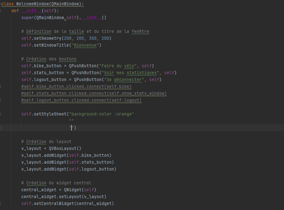
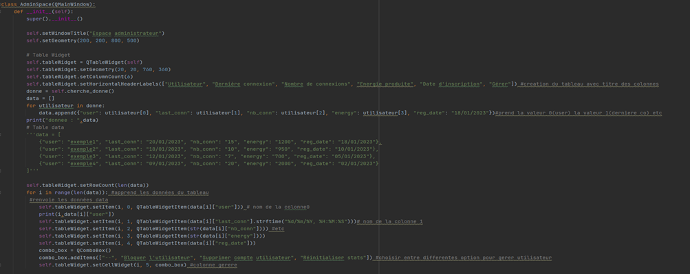

IR4 - Bastien Vivian
====================

.. _installation:

I- Présentation du contrat
--------------------------

Mon contrat porte, en premier lieu, sur la création d’une Interface Homme-Machine (IHM) permettant aux utilisateurs de voir leurs productions d’énergie en temps reel ainsi que leurs statistiques.
 
En second, mon contrat est de distinguer différents types de connexions : les utilisateurs simples qui peuvent uniquement voir leurs statistiques et faire du vélo, et les administrateurs, qui peuvent intervenir sur les profils des utilisateurs simples en réinitialisant leurs statistiques, bloquer temporairement ou supprimer leurs comptes. Ils peuvent également comme les utilisateurs simple, faire du vélo ou voir leurs statistiques. Enfin, ils peuvent ajouter manuellement des utilisateurs sans passer par la fenêtre authentification (trop fort !).
 
Enfin, mon contrat est d’établir un moyen avec l’étudiant IR3 :doc:`Olivier_JOURDAIN` pour que lorsqu’un cycliste est connecté, les données de production soient enregistrées sous son profil (toutes les données des utilisateurs devront être sur une base de données gérée par les étudiants IR3 et 4).
 
Mon contrat étant assez fourni, il contient à lui seul 10 fichiers de type “.py”. Il comporte en tout 10 classes et 34 fonctions.

Pour faciliter la visualisation des informations, il est nécessaire de choisir une technologie graphique appropriée, telle que C++, Python, PHP, etc. Cette technologie permettra de créer une interface graphique conviviale pour les utilisateurs. Il est important de fournir une représentation visuelle des données, à la fois de manière générale et de manière spécifique lorsque l'utilisateur est connecté.

Afin de permettre aux utilisateurs de se connecter, une interface de connexion utilisateur est créée. Cette interface permet aux utilisateurs de s'authentifier et d'accéder à leurs profils respectifs. Deux types de connexions sont distingués : utilisateur, administrateur.

Pour assurer la liaison avec l'étudiant 3  :doc:`Olivier_JOURDAIN`, un moyen est établi pour enregistrer les données de production sous le profil d'un cycliste lorsqu'il est connecté. Cela permet de suivre et de stocker les informations spécifiques à chaque cycliste.

L'administrateur dispose de la fonctionnalité d'ajouter de nouveaux utilisateurs ou cyclistes au système. Cela lui permet de gérer les comptes et les autorisations d'accès.

Un utilisateur connecté a la possibilité de visualiser l'état du système, y compris la production instantanée d'énergie.

L'ensemble de ces fonctionnalités graphiques et d'interaction utilisateur contribue à une expérience conviviale et informative pour les utilisateurs du système.

`Cliquez ici pour voir le code complet <https://github.com/Oliopti/pppe/tree/main/Code_de_Bast>`_

OU 

Pour voir le code le code de Bastien Vivian :doc:`Annexe_IR4`

II - Ressources logicielles,matérielles et diagramme de Gantt
-------------------------------------------------------------

Afin de pouvoir réaliser mon contrat, j’ai eu recours aux logiciels suivants :

- **Pycharm** : J’ai utilisé Pycharm afin de réaliser tous les fichiers de type “.py” (voir Choix Technologique).

- **Qt Designer** :  J’ai utilisé Qt Designer afin de réaliser l’interface graphique (voir Choix Technologique).

- **MindView** : J’ai utilisé MindView afin de réaliser mon diagramme de Gantt afin de prévoir la répartition de mon temps sur les différentes parties de mon contrat.

- **Paint** : J’ai utilisé Paint afin de créer des schémas pour mon Interface Graphique

J’ai aussi eu recours aux matériels suivant :

- Ordinateur fixe Windows 10 : J’ai utilisé cet ordinateur, situé dans la salle de cours, pour faire les différents fichiers .py, mon diagramme de Gantt et commencer mon contrat mais également pour des raisons d’ergonomie.

- Ordinateur portable personnel Chrombook : J’ai utilisé cet ordinateur pour accéder à de nombreuses ressources présentes sur le web afin de m’aider à avancer sur le projet. Je l’ai aussi utilisé pour faire les différents diagrammes UML du projet.

- Ordinateur fixe personnel Windows 11 : J’ai utilisé cet ordinateur, situé à mon domicile, pour continuer à travailler sur les différents fichiers .py, mais aussi pour accéder à de nombreux cours et de vidéos afin de m’aider dans la réalisation de mon contrat

- Raspberry pi 3 Linux : J’ai utilisé cette carte afin de pouvoir travailler et interagir sur la base de données pour avancer dans mon code.
 

**Diagramme de Gantt**

III - Choix Technologiques
--------------------------

Afin de réaliser mon contrat, j’ai dû choisir parmi plusieurs langages de programmation. Pour n’en citer que deux, j’avais le choix entre le C++ et le Python. Pour trancher entre tous ces langages, j’ai comparé leurs avantages et leurs inconvénients.

Le langage de programmation que nous avons finalement choisi est Python car ce langage est facile à apprendre, comprendre et à coder. Notre projet va être porté vers une carte Raspberry pi 3 sous Linux. Le python nous permet de réaliser un portage d’un OS à l’autre sans problèmes (voir Ressources logicielles et matérielles). Enfin, c’est un langage très documenté sur internet, ce qui m’a permis de régler plus rapidement quelques erreurs que j'ai eues. Pour conclure sur ce choix, grâce au langage Python, j’ai été plus productif que si j’avais choisi un autre langage de programmation.

J’ai dû également choisir entre PyQt5 (qui est une bibliothèque de Qt) et Tkinter pour créer l’Interface Homme-Machine. Qt possède son propre logiciel graphique qui permet de créer l’Interface en voyant ce que l’on fait, ce qui est plus pratique et rapide. Lorsque l’on enregistre l’Interface, elle est de type “.ui”, il suffit alors de convertir ce fichier en “.py” grâce à Pycharm.

PyQt5 et Qt prennent également en charge tout type d’OS. Ils sont aussi beaucoup documentés sur internet.

Enfin, contrairement à Qt, Tkinter est moins fiable et on doit écrire un code pour placer les labels à l’aveugle (ce qui n’est pas très ergonomique).

J’ai donc choisi PyQt5 afin de gagner du temps sur le développement de mon contrat.

IV - Diagramme des cas d’utilisation
------------------------------------

Afin de créer mon Interface Homme-Machine, je me suis mis dans la peau de l’utilisateur en exprimant mes besoins vis-à-vis de cette application. Puis, j’ai créé un diagramme des cas d’utilisation qui retranscrit mes besoins.

V - Interface Graphique
-----------------------

Pour créer mon interface graphique, j’ai regardé mon diagramme des cas d’utilisations (Voir diagramme des cas d’utilisation) afin de déterminer les éléments et les différentes actions possibles qu’il devrait y avoir sur l’IHM. Suite à ça, j’ai créé les schémas des différentes pages de mon application. Ces schémas m’ont permis de représenter ce à quoi devrait ressembler mon travail une fois terminé. Au niveau esthétique, certaines fenêtres ont été modifiées pour le rendu final (voir photo dans mode d’emploi).

*Schéma page administrateur*

*Schéma page faire du vélo*

.. image:: img/Bastien_Vivian/Interface_Graphique/image3.png

*Schéma page authentification*

*Schéma page statistiques*

*Schéma page d’accueil*

*Schéma page inscription*

VI - Diagramme de classe
------------------------

Pour récapituler, tout part de la classe Manager.
Presque chaque classe hérite également de QMainWindow, 
sauf la classe SuperWindow qui hérite de QDialog.  Toutes les 
classes du programme sont liées à la classe principale Manager par un lien de composition. 

VII - Explication des codes de chaque classes
---------------------------------------------

A - Explication du code pour la classe Manager
^^^^^^^^^^^^^^^^^^^^^^^^^^^^^^^^^^^^^^^^^^^^^^

Pour cette classe, je vais expliquer comment j’ai organisé mon code et comment elle fonctionne.
Voici une capture d’écran des lignes du code

Cet extrait de code me sert à afficher les fenêtres des différentes classes. Chaque classe est donc associé à une fenêtre.

Cette partie du code est donc très importante.

Cet extrait de code me sert à connecter les différents boutons de chaque fenêtre. A chaque clic, cela envoie un signal à la fonction associée à la fenêtre où est présente le bouton, permettant ainsi le passage d’une fenêtre à une autre. 

Par exemple, quand je clique sur le bouton « s’inscrire », un signal est envoyé à la fonction « signup ». A la réception de ce signal, cette dernière affiche la fenêtre connectée au bouton (ici, elle affichera la page d’inscription)

Voici les fonctions servant à passer d’une fenêtre à une autre. Chaque fonction est donc associée à des boutons qui leurs correspondent et attendent le signal d’un clic. Chaque fonction fait le jonglage entre plusieurs fenêtres différentes.

Voici comment je connecte mon code à la base de données. Chaque fois que le logiciel a besoin d’avoir accès à la BDD, on crée une fonction avec le squelette de « try » jusqu’à « exept error as e » en modifiant à chaque fois le contenu à l’intérieur.

Par exemple sur l’image ci-dessus, lorsqu’un utilisateur se connecte, le logiciel va aller chercher si les informations de connexions (email et mot de passe dans ce cas) ne sortent pas de nulle part et si elles sont bien présentes dans BDD. Si la connexion avec la base échoue, le message « Error while connecting to Mysl » apparaîtra. Cette partie du code et notamment ce squelette est donc très important et nécessaire.

B - Explication du code pour la classe AutentWindow
^^^^^^^^^^^^^^^^^^^^^^^^^^^^^^^^^^^^^^^^^^^^^^^^^^^

Ce code concerne la fenêtre d’authentification. Chaque fenêtre est présente dans un fichier différent MAIS seul le fichier principal « main.py » contient les différentes connexions et boutons. Dans les autres fenêtres (sauf pour la fenêtre d’administrateur qui est un peu particulière comme nous le verrons après) comme nous pouvons le voir, il n’y a que du graphique (taille des boutons, tailles des fenêtres etc). Sur l’extrait du code ci-dessus nous définissons donc la taille de la fenêtre, le placement des boutons et ce qu’il y a écrit dessus.

C - Explication du code pour la classe InfoWindow
^^^^^^^^^^^^^^^^^^^^^^^^^^^^^^^^^^^^^^^^^^^^^^^^^

Voici le code de la fenêtre qui affiche un message d’erreur lorsque nous rentrons de mauvaises informations de connexions. Est présent la taille de la fenêtre, du bouton, le message d’erreur qui s’affiche ainsi que son placement.

D - Explication du code pour la classe SuperWindow
^^^^^^^^^^^^^^^^^^^^^^^^^^^^^^^^^^^^^^^^^^^^^^^^^^

Voici cette fois le code de la petite fenêtre qui s’ouvre informant l’utilisateur que son compte a bien été créé, cette fenêtre est très simple et contient juste un message avec un simple bouton

E - Explication du code pour la classe LoginWindow
^^^^^^^^^^^^^^^^^^^^^^^^^^^^^^^^^^^^^^^^^^^^^^^^^^

Cette partie du code concerne la fenêtre de connexion ou sont présent 2 labels pour entrer son email et son mot de passe. Il y a également un bouton. Comme d’habitude, sont présentes leurs positions dans la fenêtre, leurs tailles et ce qu’il y a écrit sur le bouton. J’ai également fait en sorte que lorsque nous rentrons le mot de passe, nous ne voyons pas ce que nous écrivons (des points apparaissent à la place du texte écrit) grâce à « setEchoMode »

F - Explication du code pour la classe SignupWindow
^^^^^^^^^^^^^^^^^^^^^^^^^^^^^^^^^^^^^^^^^^^^^^^^^^^

Ici, nous avons la fenêtre d’inscriptions. Comme vous pouvez le voir, elle est assez similaire à la fenêtre de connexion. Sont présents les différents labels avec les différents champs pour écrire.

G - Explication du code pour la classe FenêtreVelo
^^^^^^^^^^^^^^^^^^^^^^^^^^^^^^^^^^^^^^^^^^^^^^^^^^

Ici est présent le code pour la fenêtre « Faire du vélo » ou comme d’habitude, j’ai défini sa taille, ses boutons et régler leurs placements

H - Explication du code pour la classe StatWindow
^^^^^^^^^^^^^^^^^^^^^^^^^^^^^^^^^^^^^^^^^^^^^^^^^

Cette fenêtre concerne la fenêtre des statistiques ou 3 labels sont présents : Nombre de participations, Énergie produite et Date de création de compte. Contrairement aux fenêtres précédentes, cette page possède une image que j’ai inséré le widget QPixmap pour insérer une photo.  J’ai comme d’habitude défini la taille de l’image, l’orientation des labels et la taille de la fenêtre.

I - Explication du code pour la classe WelcomeWindow
^^^^^^^^^^^^^^^^^^^^^^^^^^^^^^^^^^^^^^^^^^^^^^^^^^^^

Cette partie du code traite de la fenêtre de bienvenue qui s’affiche lorsqu’un utilisateur se connecte. C’est une fenêtre très simple avec 3 boutons menant vers différentes fenêtres de l’application.

J - Explication du code pour la classe AdminSpace
^^^^^^^^^^^^^^^^^^^^^^^^^^^^^^^^^^^^^^^^^^^^^^^^^

Enfin, voici le code de la fenêtre administrateur qui, contrairement aux autres fenêtres que l’on a vues, est plus complexe.

Dans cet extrait, j’ai créé un tableau avec le widget TableWidget en définissant sa taille, son nombre de colonne ainsi que les titres de chaque colonne (au nombre de 6).

Je dis aussi au code que pour le terme user, utilisateur aura la valeur 0. Pour le terme last_conn, utilisateur aura la valeur 1.

Ensuite, grâce à une seconde boucle for, les données du tableau seront apprises. Toutes les données avec la valeur 0 seront dans la colonne user, toutes les données avec la valeur 1 seront dans la colonne last_conn au format jour/mois/année etc .

Enfin vous pouvez voir que j’ai ajouté « str » pour nb_conn et energy. Pour faire simple, ce str signifie que les valeurs pourront changer en fonction du combo box. En effet l’administrateur aura le choix d’afficher les informations de la semaine en cours, du mois ou de l’année (voir photo ci-dessous). L’énergie produite d’un utilisateur dans le mois n’aura donc surement pas la même valeur que l’énergie qui l’a produite dans la semaine. Ce qui n’est pas le cas de la date d'inscription ou du nom d’utilisateur qui lui ne changera jamais.

Le str signifie donc pour faire simple que les valeurs de nb_conn et energy pourront changer en fonction du combo box.

*Page administrateur*

Enfin, j’ai ajouté un combo box dans la 6ème colonne du tableau (ayant pour titre « Gérer » avec « -- », « Bloquer l’utilisateur », « Supprimer compte utilisateur » et « Réinitialiser stats »

Pour finir, la suite de mon code de la classe AdminSpace reprend le squelette avec Try ou il y a divers requête SQL à l’intérieur afin de récupérer les informations nécessaires pour le tableau tel que le nombre de sessions, la date de déconnexion d’un utilisateur etc.

VIII - Description du code
--------------------------

A - Description du code main.py
^^^^^^^^^^^^^^^^^^^^^^^^^^^^^^^

Ce code est un programme Python utilisant la bibliothèque PyQt5 pour créer une interface graphique. Il s'agit d'une application de gestion d'utilisateurs et de statistiques liées à la production d'énergie.

Voici une explication de la structure du code et de ses fonctionnalités principales :

- Importations : Le code commence par importer différents modules et classes de la bibliothèque PyQt5, ainsi que des modules externes tels que ``mariadb`` et ``mysql.connector`` pour la communication avec une base de données MySQL.

- Classe ``Manager`` : Cette classe représente le gestionnaire principal de l'application. Elle gère les différentes fenêtres et actions de l'interface utilisateur.

- Méthode ``__init__`` : Le constructeur de la classe ``Manager`` initialise les différentes fenêtres de l'application, telles que la fenêtre d'authentification (`AutentWindow`), la fenêtre d'inscription (`SignupWindow`)``, la fenêtre de connexion (`LoginWindow`), etc. Il connecte également les boutons des fenêtres à des méthodes de traitement.

- Méthodes de gestion de l'interface utilisateur : Le reste des méthodes de la classe ``Manager`` sont des méthodes de gestion de l'interface utilisateur. Elles sont appelées lorsque l'utilisateur effectue des actions spécifiques, telles que la connexion, l'inscription, la navigation entre les fenêtres, etc. Ces méthodes utilisent les fenêtres et les widgets définis précédemment pour afficher les interfaces et effectuer les actions correspondantes.

- Méthodes de communication avec la base de données : Les méthodes ``bdd_inscription`` et ``bdd_connexion`` sont utilisées pour communiquer avec une base de données MySQL. Elles récupèrent les données saisies par l'utilisateur (par exemple, lors de l'inscription ou de la connexion), établissent une connexion à la base de données, exécutent des requêtes SQL et récupèrent les résultats.

- Fonction ``window`` : Cette fonction crée l'application Qt et instancie la classe ``Manager``. Elle lance ensuite l'exécution de l'application.

- Point d'entrée du programme : La condition ``if __name__ == '__main__':`` vérifie si le script Python est exécuté en tant que programme principal, puis appelle la fonction ``window`` pour démarrer l'application.

Cela résume la structure générale du code et ses principales fonctionnalités. Cependant, sans les définitions des classes ``AutentWindow``, ``SignupWindow``, ``LoginWindow``, etc., il est difficile de comprendre en détail le fonctionnement de chaque fenêtre et widget.

.. code-block:: python
   :linenos:

    import sys
    from PyQt5.QtWidgets import QApplication, QMainWindow, QPushButton, QHBoxLayout, QVBoxLayout, QWidget, QLabel, QLineEdit,QTableWidget, QTableWidgetItem, QComboBox, QDialog, QCheckBox
    from PyQt5.QtGui import *
    from PyQt5.QtCore import *
    from autentif import AutentWindow
    from admin import AdminSpace
    from bvn import WelcomeWindow
    from faireduvelo import FenetreVelo
    from Inscription import SignupWindow
    from inscriptionreussi import SuperWindow
    from meststats import StatWindow
    from seconnecter import LoginWindow
    from msgerror import InfoWindow
    import mariadb
    import mysql.connector
    from mysql.connector import Error

    class Manager :
        def __init__(self):
            #super().__init__()
            self.autentwindow = AutentWindow() # fenetre atentif
            self.signupwindow = SignupWindow() # fenetre s'inscrire
            self.loginwindow = LoginWindow() # fenetre se connecter
            self.welcomewindow = WelcomeWindow() # fenetre bvn
            self.superwindow = SuperWindow(message="Super ! Vous êtes maintenant inscrit ! Vous pouvez à présent rentrer vos nouveaux identifiants sur la page de connexion pour commencer à produire de l'énergie, voir vos stats et bien plus !") # fenetre de confirmation d'inscription
            self.fenetrevelo = FenetreVelo() #fenetre velo
            self.statwindow = StatWindow() #fenetre statistiques
            self.adminspace = AdminSpace() #fenetre d'administrateur; cette fenetre sera accessible uniquement par un utilisateur ayant pour identifiant "admin" et un mot de passe à lui seul
            self.infowindow = InfoWindow() #fenetre indiquant que les informations de connexion sont erronées

            self.autentwindow.signup_button.clicked.connect(self.signup)#quand on clique sur s'inscrire sur la page d'autentif
            self.autentwindow.login_button.clicked.connect(self.login)#quand on clique sur se connecter sur la page autentif
            self.autentwindow.show() # Fenetre à afficher en 1er

            self.loginwindow.login_button.clicked.connect(self.espaceadmin) #quand on clique sur se connecter dans la page se connecter
            self.signupwindow.signup_button.clicked.connect(self.bdd_inscription)  #quand on clique sur s'inscrire quand on est sur la page d'inscription
            self.superwindow.button.clicked.connect(self.backtopageauto) #quand on clique sur ok quand on est sur le msg de confirmation
            self.welcomewindow.bike_button.clicked.connect(self.velo) #quand on clique sur faire du velo quand on est la page d'accueil
            self.fenetrevelo.bouton_retour.clicked.connect(self.backtobvn) #quand on clique sur retour à l'acceueil quand on est sur la page faire du velo
            self.welcomewindow.stats_button.clicked.connect(self.gotostats) #quand on clique sur voir mes statistiques quand on est sur la page d'accueil
            self.statwindow.back_button.clicked.connect(self.retour) #quand on clique sur le bouton retour quand on est sur la page des statistiques
            self.welcomewindow.logout_button.clicked.connect(self.deco) #quand on clique sur le bouton se deconnecter quand on est sur la page d'accueil
            self.adminspace.btn_accueil.clicked.connect(self.adminvelo) #quand on clique sur aller à l'accueil quand on est la page admin
            self.adminspace.btn_deconnexion.clicked.connect(self.admindeco) #quand on clique sur deconnexion quand on est sur la page admin
            self.infowindow.ok_button.clicked.connect(self.error) #quand on clique sur le bouton ok quand on est sur le msg d'erreur lors d'une tentative de connexion

        def autent(self): #bascule vers page auto
            #self.autentwindow = AutentWindow()
            self.autentwindow.show()

        def login(self): #bascule vers page connex
            self.autentwindow.close()
            self.loginwindow.show()
            # self.close()

        def signup(self): #bascule vers page s'inscr
            # Code pour la page d'inscription
            self.autentwindow.close()
            self.signupwindow.show()

        def bvn(self): #bascule vers page d'accuel
            self.loginwindow.close()

            # Récupération des données saisies
            email = self.loginwindow.email_edit.text()
            password = self.loginwindow.password_edit.text()

            if email == "adminpppe@gmail.com" and password == "admin123": #test pour utilisateur admin
                self.loginwindow.close()

                self.adminspace.show()
                print(1)
            elif email == "error" and password == "error": #test msg erreur
                self.loginwindow.close()
                # self.bvn.close()
                self.infowindow.show()
            else:
                self.welcomewindow.show()
            print(email)
            print(password)

        def confirmation(self): #bascule vers conf d'inscription

            self.signupwindow.close()
            self.superwindow.show()

            name = self.signupwindow.name_edit.text()
            firstname =  self.signupwindow.firstname_edit.text()
            email = self.signupwindow.email_edit.text()
            password = self.signupwindow.password_edit.text()

            print(name)
            print(firstname)
            print(email)
            print(password)

        def backtopageauto(self): #rebascule vers page autentif
            self.superwindow.close()
            self.autentwindow.show()

        def velo(self): #bascule vers la fenetre de velo
            self.welcomewindow.close()
            self.fenetrevelo.show()

        def backtobvn(self): #rebascule vers la page d'accueil
            self.fenetrevelo.close()
            self.welcomewindow.show()

        def gotostats(self): #bascule vers la page stats
            self.welcomewindow.close()
            self.statwindow.show()

        def retour(self): # rebascule vers la page d'accueil quand on est sur la page des stats
            self.statwindow.close()
            self.welcomewindow.show()

        def deco(self): #rebascule vers la page d'autentification quand on est sur la page d'accueil
            self.welcomewindow.close()
            self.session_fini()
            self.autentwindow.show()

        def adminvelo(self):# rebascule vers la page d'acceuil quand on est sur la page d'admin
            self.adminspace.close()
            self.welcomewindow.show()

        def admindeco(self):#rebascule vers la page d'autentification quand on est sur la page d'admin
            self.adminspace.close()
            self.session_fini()
            self.autentwindow.show()

        def error(self): #rebascule vers la page de connexion par appuis du bouton "OK" sur le msg d'erreur
            self.infowindow.close()
            self.loginwindow.show()

        def bdd_inscription(self):
            # Récupération des données saisies lors de l'inscription
            name = self.signupwindow.name_edit.text()
            firstname = self.signupwindow.firstname_edit.text()
            email = self.signupwindow.email_edit.text()
            password = self.signupwindow.password_edit.text()
            print(name, firstname, email, password)

            # Connexion à la base de données
            try:
                mydb = mysql.connector.connect(
                    host="172.20.10.1",
                    user="bastien",
                    password="123456",
                    database="pppe"
                )
                print("Try to connected to MySQL Server")
            # db_Info = connection.get_server_info()
                #print("Connected to MySQL Server version", db_Info)
                # Insertion des données dans la table "utilisateur"
                mycursor = mydb.cursor()
                sql = f"INSERT INTO utilisateur (role, nom, prenom, email, mdp) VALUES (2, '{name}', '{firstname}', '{email}', PASSWORD('{password}'))"
                print(sql)
                #val = (name, firstname, email, password)
                mycursor.execute(sql)
                mydb.commit()

                # Fermeture de la connexion
                mydb.close()
                #si la syntaxe est bonne et que l'inscription a fonctionné, le message de confirmation d'inscription s'affiche
                message = "Super ! Vous êtes maintenant inscrit ! Vous pouvez à présent rentrer vos nouveaux identifiants sur la page de connexion pour commencer à produire de l'énergie, voir vos stats et bien plus !"
                self.confirmation()
                self.super_window = SuperWindow(message)

            except Error as e:
                print("Error while connecting to MySQL", e)

        def bdd_connexion(self):
            #récupération des données saisies lors de la connexion
            email = self.loginwindow.email_edit.text()
            password = self.loginwindow.password_edit.text()
            print (email, password)
            try:
                mydb = mysql.connector.connect(
                    host="172.20.10.1",
                    user="bastien",
                    password="123456",
                    database="pppe"
                )
                print("Try to connected to MySQL Server")
            # db_Info = connection.get_server_info()
                #print("Connected to MySQL Server version", db_Info)
                # Insertion des données dans la table "utilisateur"
                mycursor = mydb.cursor()
                query = f"SELECT role, prenom, id FROM utilisateur WHERE email = '{email}' AND mdp = password('{password}')" # interroge la bdd pour voir si les informations rentré ne sont pas sortis de nul part
                mycursor.execute(query)

                result = mycursor.fetchone()
                mycursor.close()
                mydb.close()
                return result

            except Error as e:
                print("Error while connecting to MySQL", e)

        def session(self, resultat):
            print("conn")
            try:
                mydb = mysql.connector.connect(
                    host="172.20.10.1",
                    user="bastien",
                    password="123456",
                    database="pppe"
                )
                print("Try to connected to MySQL Server")
            # db_Info = connection.get_server_info()
                #print("Connected to MySQL Server version", db_Info)
                # Insertion des données dans la table "utilisateur"

                mycursor = mydb.cursor()
                query = f"INSERT INTO pppe.session (id_user) VALUES ({resultat[2]});" #ajoute un nbr de connexion en +
                mycursor.execute(query)
                mydb.commit()
                query = "INSERT INTO releve_puissance(id_session,mesures) VALUES((SELECT MAX(id) FROM `session`),0)" #ajoute un id de session en +
                mycursor.execute(query)
                mydb.commit()
                mycursor.close()
                mydb.close()
                print(query)

            except Error as e:
                print("Error while connecting to MySQL", e)

        def session_fini(self): #lorsqu'on se déconnecte
            print("deconn")
            try:
                mydb = mysql.connector.connect(
                    host="172.20.10.1",
                    user="bastien",
                    password="123456",
                    database="pppe"
                )
                print("Try to connected to MySQL Server")
            # db_Info = connection.get_server_info()
                #print("Connected to MySQL Server version", db_Info)
                # Insertion des données dans la table "utilisateur"

                mycursor = mydb.cursor()
                query = f"UPDATE session set datetime_fin = NOW() WHERE datetime_debut = datetime_fin;" #met la date actuelle à la date de déconnexion
                mycursor.execute(query)
                mydb.commit()

                mycursor.close()
                mydb.close()
                print(query)

            except Error as e:
                print("Error while connecting to MySQL", e)

        def espaceadmin(self): #bascule vers la page admin
            resultat_login = self.bdd_connexion() #se connecte à la BDD
            if resultat_login==None : #si role est introuvable
                self.infowindow.show()
            elif len(resultat_login)>0 and resultat_login[0]==2: # renvoie le resultat et voit si role est trouvable et correspond à 2 (role utilisateur)
                self.session(resultat_login)
                self.loginwindow.close()
                self.welcomewindow.show()

            elif len(resultat_login)>0 and resultat_login[0]==1: # renvoie le resultat et voit si role est trouvable et correspond à 1 (role admin)
                self.session(resultat_login)
                self.loginwindow.close()
                self.adminspace.show()

    def window():
        app = QApplication(sys.argv)
        man = Manager()
        sys.exit(app.exec_())

    if __name__ == '__main__':
        window()

        

B - Description du code admin.py
^^^^^^^^^^^^^^^^^^^^^^^^^^^^^^^^

Ce code est écrit en Python et utilise la bibliothèque PyQt5 pour créer une interface graphique. Voici une explication des principales parties du code :

1. Les importations :
   - ``import sys`` : importe le module système.
   - ``from PyQt5.QtWidgets import ...`` : importe les classes nécessaires pour créer l'interface graphique.
   - ``import mariadb`` : importe le module pour se connecter à une base de données MariaDB.
   - ``import mysql.connector`` : importe le module pour se connecter à une base de données MySQL.
   - ``from datetime import datetime`` : importe la classe ``datetime`` pour manipuler les dates et les heures.

2. La classe ``AdminSpace`` :
   - Cette classe hérite de la classe ``QMainWindow`` de PyQt5, ce qui permet de créer une fenêtre principale.
   - La méthode ``__init__`` est le constructeur de la classe. Elle est appelée lorsque vous créez une instance de la classe ``AdminSpace``.
   - Dans le constructeur, la fenêtre principale est configurée en définissant le titre, la géométrie et le style.
   - Un tableau ``(`QTableWidget`)`` est créé et ajouté à la fenêtre principale. Les colonnes du tableau sont définies à l'aide de ``setColumnCount`` et les en-têtes des colonnes sont définis à l'aide de ``setHorizontalHeaderLabels``.
   - La méthode ``cherche_donne`` est appelée pour récupérer les données à afficher dans le tableau.
   - Les données sont ensuite ajoutées au tableau à l'aide de ``setRowCount`` et ``setItem``.
   - Un menu déroulant ``(`QComboBox`)`` est créé et ajouté à la fenêtre principale. Des boutons ``(`QPushButton`)`` sont également ajoutés.
   - Des connexions de signaux sont établies pour réagir aux événements tels que le changement de valeur dans le menu déroulant ou le clic sur les boutons.
   - La méthode ``remplir_tab`` est définie pour remplir le tableau en fonction de la valeur sélectionnée dans le menu déroulant.
   - La méthode ``sup_compte`` est définie pour supprimer un compte utilisateur en fonction de l'action sélectionnée dans le tableau.

3. La méthode ``cherche_donne`` :
   - Cette méthode se connecte à une base de données MariaDB/MySQL et exécute une requête SQL pour récupérer les données des utilisateurs.
   - Les données sont retournées sous forme de résultats de requête.

4. La méthode ``remplir_tab`` :
   - Cette méthode est appelée lorsque la valeur sélectionnée dans le menu déroulant change.
   - Selon la valeur sélectionnée, une requête SQL est exécutée pour récupérer les données correspondantes dans la base de données.
   - Les données sont ensuite ajoutées au tableau.

5. La méthode ``sup_compte`` :
   - Cette méthode est appelée lorsque l'action "Supprimer compte utilisateur" est sélectionnée dans le tableau.
   - Elle se connecte à la base de données et exécute une requête SQL pour supprimer le compte utilisateur sélectionné.

Le reste du code comporte des commentaires et des parties de code commentées, qui semblent être en cours de développement ou désactivées pour le moment.

.. code-block:: python
   :linenos:

    import sys
    from PyQt5.QtWidgets import QApplication, QWidget, QLabel, QLineEdit, QPushButton, QTableWidget, QTableWidgetItem, QComboBox, QMainWindow
    #from faireduvelo import FenetreVelo
    from autentif import AutentWindow
    import mariadb
    import mysql.connector
    from datetime import datetime
    from mysql.connector import Error

    class AdminSpace(QMainWindow):
        def __init__(self):
            super().__init__()

            self.setWindowTitle("Espace administrateur")
            self.setGeometry(200, 200, 800, 500)

            # Table Widget
            self.tableWidget = QTableWidget(self)
            self.tableWidget.setGeometry(20, 20, 760, 360)
            self.tableWidget.setColumnCount(6)
            self.tableWidget.setHorizontalHeaderLabels(["Utilisateur", "Dernière connexion", "Nombre de connexions", "Energie produite", "Date d'inscription", "Gérer"]) #creation du tableau avec titre des colonnes
            donne = self.cherche_donne()
            data = []
            for utilisateur in donne:
                data.append({"user": utilisateur[0], "last_conn": utilisateur[1], "nb_conn": utilisateur[2], "energy": utilisateur[3], "reg_date": "18/01/2023"})#prend la valeur 0(user) la valeur 1(derniere co) etc
            print("donnee : ",data)
            # Table data
            '''data = [
                {"user": "exemple1", "last_conn": "20/01/2023", "nb_conn": "15", "energy": "1200", "reg_date": "18/01/2023"},
                {"user": "exemple2", "last_conn": "18/01/2023", "nb_conn": "10", "energy": "950", "reg_date": "10/01/2023"},
                {"user": "exemple3", "last_conn": "12/01/2023", "nb_conn": "7", "energy": "700", "reg_date": "05/01/2023"},
                {"user": "exemple4", "last_conn": "09/01/2023", "nb_conn": "20", "energy": "2000", "reg_date": "02/01/2023"}
            ]'''

            self.tableWidget.setRowCount(len(data))
            for i in range(len(data)): #apprend les données du tableau
            #renvoie les données data
                self.tableWidget.setItem(i, 0, QTableWidgetItem(data[i]["user"])) # nom de la colonne0
                print(i,data[i]["user"])
                self.tableWidget.setItem(i, 1, QTableWidgetItem(data[i]["last_conn"].strftime("%d/%m/%Y, %H:%M:%S")))# nom de la colonne 1 ; jour mois année et heure minute seconde
                self.tableWidget.setItem(i, 2, QTableWidgetItem(str(data[i]["nb_conn"]))) #etc
                self.tableWidget.setItem(i, 3, QTableWidgetItem(str(data[i]["energy"])))
                self.tableWidget.setItem(i, 4, QTableWidgetItem(data[i]["reg_date"])) #date d'inscription
                combo_box = QComboBox()
                combo_box.addItems(["--", "Bloquer l'utilisateur", "Supprimer compte utilisateur", "Réinitialiser stats"]) #choisir entre differentes option pour gerer utilisateur
                #self.combo_box.currentIndexChanged.connect(self.sup_compte)
                self.tableWidget.setCellWidget(i, 5, combo_box) #colonne gerere

            # Combo box
            self.combo_box = QComboBox(self)
            self.combo_box.setGeometry(20, 400, 150, 30)
            self.combo_box.addItems(["Cette semaine", "Ce mois", "Cette année"])# choisir la période
            self.combo_box = QComboBox(self)
            self.combo_box.setGeometry(20, 400, 150, 30)
            self.combo_box.addItems(["Cette semaine", "Ce mois", "Cette année"])# choisir la période
            self.combo_box.currentIndexChanged.connect(self.remplir_tab)
            # Buttons
            self.btn_accueil = QPushButton("Aller à l'accueil", self)  # retour à la page d'accueil
            self.btn_accueil.setGeometry(240, 400, 120, 30)

            self.btn_deconnexion = QPushButton("Se déconnecter", self)  # se deconnecte du service
            self.btn_deconnexion.setGeometry(380, 400, 120, 30)

            self.setStyleSheet("background-color :lightblue")  # couleur de fond (ici bleu claire)
            # self.btn_faire_velo.clicked.connect(self.ouvrir_fenetre_velo)
            # self.btn_deconnexion.clicked.connect(self.deconnecter)
            self.sup_compte()

        def remplir_tab(self): #combo box cette semaine
            pass #le pass évite les erreurs de compilations
            '''value = self.combo_box.currentText()
            if value == "Cette semaine" :
                try:
                    mydb = mysql.connector.connect(
                        host="172.20.10.1",
                        user="bastien",
                        password="123456",
                        database="pppe"
                    )
                    print("Try to connected to MySQL Server")
                    mycursor = mydb.cursor()
                    demande = f"SELECT nombre_connexion, mesures FROM session, releve_puissance WHERE session.id = releve_puissance.id_session AND session.datetime_fin >= now() "
                    print(demande)
                    mycursor.execute(demande)
                    result = mycursor.fetchall()
                    data=[]
                    for row in result:
                        data.append({"user": row[0], "last_conn": row[1], "nb_conn": row[2], "energy": row[3], "reg_date": row[4]})
                    mycursor.close()
                    mydb.close()

                    self.tableWidget.setRowCount(len(data))
                    for i, row in enumerate(data):  # renvoie les données data
                        self.tableWidget.setItem(i, 0, QTableWidgetItem(row["user"]))  # nom de la colonne0
                        self.tableWidget.setItem(i, 1, QTableWidgetItem(row["last_conn"]))  # nom de la colonne 1
                        self.tableWidget.setItem(i, 2, QTableWidgetItem(row["nb_conn"]))  # etc
                        self.tableWidget.setItem(i, 3, QTableWidgetItem(row["energy"]))
                        self.tableWidget.setItem(i, 4, QTableWidgetItem(row["reg_date"]))
                        combo_box = QComboBox()
                        combo_box.addItems(["--", "Bloquer l'utilisateur", "Supprimer compte utilisateur",
                                            "Réinitialiser stats"])  # choisir entre differentes option pour gerer utilisateur
                        self.tableWidget.setCellWidget(i, 5, combo_box)  # colonne gerere

                except Error as e:
                    print("Error while connecting to MySQL", e)

            elif value == "Ce mois" : #combo box ce mois
                try:
                    mydb = mysql.connector.connect(
                        host="172.20.10.1",
                        user="bastien",
                        password="123456",
                        database="pppe"
                    )
                    print("Try to connected to MySQL Server")
                    mycursor = mydb.cursor()
                    demande = f"SELECT nombre_connexion, mesures FROM session, releve_puissance WHERE session.id = releve_puissance.id_session AND session.datetime_fin >= MONTH() "
                    print(demande)
                    mycursor.execute(demande)
                    result = mycursor.fetchall()
                    data=[]
                    for row in result:
                        data.append({"user": row[0], "last_conn": row[1], "nb_conn": row[2], "energy": row[3], "reg_date": row[4]})
                    mycursor.close()
                    mydb.close()

                    self.tableWidget.setRowCount(len(data))
                    for i, row in enumerate(data):  # renvoie les données data
                        self.tableWidget.setItem(i, 0, QTableWidgetItem(row["user"]))  # nom de la colonne0
                        self.tableWidget.setItem(i, 1, QTableWidgetItem(row["last_conn"]))  # nom de la colonne 1
                        self.tableWidget.setItem(i, 2, QTableWidgetItem(row["nb_conn"]))  # etc
                        self.tableWidget.setItem(i, 3, QTableWidgetItem(row["energy"]))
                        self.tableWidget.setItem(i, 4, QTableWidgetItem(row["reg_date"]))
                        combo_box = QComboBox()
                        combo_box.addItems(["--", "Bloquer l'utilisateur", "Supprimer compte utilisateur", "Réinitialiser stats"])  # choisir entre differentes option pour gerer utilisateur
                        self.tableWidget.setCellWidget(i, 5, combo_box)  # colonne gerere

                except Error as e:
                    print("Error while connecting to MySQL", e)

            elif value == "Cette année" : #combo box cette année
                try:
                    mydb = mysql.connector.connect(
                        host="172.20.10.1",
                        user="bastien",
                        password="123456",
                        database="pppe"
                    )
                    print("Try to connected to MySQL Server")
                    mycursor = mydb.cursor()
                    demande = f"SELECT nombre_connexion, mesures FROM session, releve_puissance WHERE session.id = releve_puissance.id_session AND session.datetime_fin = YEAR() "
                    print(demande)
                    mycursor.execute(demande)
                    result = mycursor.fetchall()
                    data=[]
                    for row in result:
                        data.append({"user": row[0], "last_conn": row[1], "nb_conn": row[2], "energy": row[3], "reg_date": row[4]})
                    mycursor.close()
                    mydb.close()

                    self.tableWidget.setRowCount(len(data))
                    for i, row in enumerate(data):  # renvoie les données data
                        self.tableWidget.setItem(i, 0, QTableWidgetItem(row["user"]))  # nom de la colonne0
                        self.tableWidget.setItem(i, 1, QTableWidgetItem(row["last_conn"]))  # nom de la colonne 1
                        self.tableWidget.setItem(i, 2, QTableWidgetItem(row["nb_conn"]))  # etc
                        self.tableWidget.setItem(i, 3, QTableWidgetItem(row["energy"]))
                        self.tableWidget.setItem(i, 4, QTableWidgetItem(row["reg_date"]))
                        combo_box = QComboBox()
                        combo_box.addItems(["--", "Bloquer l'utilisateur", "Supprimer compte utilisateur",
                                            "Réinitialiser stats"])  # choisir entre differentes option pour gerer utilisateur
                        self.tableWidget.setCellWidget(i, 5, combo_box)  # colonne gerere

                except Error as e:
                    print("Error while connecting to MySQL", e)
        # else :'''

        def sup_compte(self): #supprimer un compte dans fenêtre admin (pas au point)
            value = QComboBox
            if value == "Supprimer compte utilisateur":
                print(value)
                try:
                    mydb = mysql.connector.connect(
                        host="172.20.10.1",
                        user="bastien",
                        password="123456",
                        database="pppe"
                    )
                    print("Try to connected to MySQL Server")
                    mycursor = mydb.cursor()
                    email =self.tableWidget.item(7,1)
                    print(email.data(0).toString())
                    delete_session_req = f"DELETE FROM session WHERE id_user=(SELECT id from utilisateur WHERE email = {email})"
                    demande = f"DELETE FROM utilisateur WHERE email = {email} "
                    print(demande)
                    mycursor.execute(demande)
                    mydb.cursor()

                    mycursor.close()
                    mydb.close()
                    print(demande)

                except Error as e:
                    print("Error while connecting to MySQL", e)

        def cherche_donne(self): #affiche les différentes infos des users
            try:
                mydb = mysql.connector.connect(
                    host="172.20.10.1",
                    user="bastien",
                    password="123456",
                    database="pppe"
                )
                print("Try to connected to MySQL Server")
            # db_Info = connection.get_server_info()
                #print("Connected to MySQL Server version", db_Info)
                # Insertion des données dans la table "utilisateur"
                mycursor = mydb.cursor()
                query = f"SELECT utilisateur.email,MAX(session.datetime_fin),COUNT(*),SUM(releve_puissance.mesures) FROM session,utilisateur,releve_puissance WHERE utilisateur.id = session.id_user AND session.id=releve_puissance.id_session GROUP BY email #affiche les infos des utilisateurs inscris"
                mycursor.execute(query)

                result = mycursor.fetchall()
                mycursor.close()
                mydb.close()
                return result

            except Error as e:
                print("Error while connecting to MySQL", e)

        def session(self): #fonction off
            try:
                mydb = mysql.connector.connect(
                    host="172.20.10.1",
                    user="bastien",
                    password="123456",
                    database="pppe"
                )
                print("Try to connected to MySQL Server")
            # db_Info = connection.get_server_info()
                #print("Connected to MySQL Server version", db_Info)
                # Insertion des données dans la table "utilisateur"
                mycursor = mydb.cursor()
                query = f"SELECT email FROM utilisateur" #WHERE email = '{email}' AND mdp = password('{password}')" # interroge la bdd pour voir si les informations rentré ne sont pas sortis de nul part
                mycursor.execute(query)

                result = mycursor.fetchall()
                print (result)
                mycursor.close()
                mydb.close()
                return result

            except Error as e:
                print("Error while connecting to MySQL", e)

        def tableau_admin(self): #bascule vers la page admin --------- Fonction off
            tabl_result = self.cherche_donne() #se connecte à la BDD

            if tabl_result==1 : #si role est introuvable
                """self.infowindow.show()
            elif len(resultat_login)>0 and resultat_login[0]==2: # si role est trouvable et correspond à 2 (role utilisateur)
                self.loginwindow.close()
                self.welcomewindow.show()
            elif len(resultat_login)>0 and resultat_login[0]==1: # si role est trouvable et correspond à 1 (role admin)
                self.loginwindow.close()
                self.adminspace.show()"""

        #def deconnecter(self):
        #   self.autent_window = AutentWindow()
        #  self.autent_window.show()
        # self.close()

    #def ouvrir_fenetre_velo(self):
    #   self.fenetre_velo = FenetreVelo()
    #  self.fenetre_velo.show()

    """if __name__ == '__main__':
        app = QApplication(sys.argv)
        ex = AdminSpace()
        ex.show()
        sys.exit(app.exec_())"""

C - Description du code autentif.py
^^^^^^^^^^^^^^^^^^^^^^^^^^^^^^^^^^^

Ce code est une petite application graphique utilisant la bibliothèque PyQt5 pour créer une fenêtre avec deux boutons : "Se connecter" et "S'inscrire". Voici une explication ligne par ligne :

- ``import sys``: Cette ligne importe le module système, qui fournit un accès à certaines variables et fonctions utilisées ou maintenues par l'interpréteur Python, ainsi qu'à des fonctionnalités spécifiques à l'environnement.
- ``from PyQt5.QtWidgets import QApplication, QMainWindow, QPushButton, QHBoxLayout, QVBoxLayout, QWidget``: Cette ligne importe les classes nécessaires de la bibliothèque PyQt5 pour créer une application avec une fenêtre principale ``(QMainWindow)``, des boutons (QPushButton), des layouts horizontaux (QHBoxLayout), des layouts verticaux (QVBoxLayout) et un widget (QWidget).
- ``from Inscription import SignupWindow`` : Cette ligne importe une classe "SignupWindow" depuis un module appelé "Inscription". Cela suggère que ce module contient le code pour une fenêtre d'inscription, qui n'est pas présent dans le code que vous avez partagé.
- ``from seconnecter import LoginWindow`` : Cette ligne importe une classe "LoginWindow" depuis un module appelé "seconnecter". Cela suggère que ce module contient le code pour une fenêtre de connexion, qui n'est pas présent dans le code que vous avez partagé.

Ensuite, le code définit une classe ``AutentWindow`` qui hérite de la classe ``QMainWindow`` fournie par PyQt5. Cette classe représente la fenêtre principale de l'application.

- ``def __init__(self):`` : C'est le constructeur de la classe ``AutentWindow``. Il est appelé lorsqu'une instance de la classe est créée. 
- ``super().__init__()`` : Cela appelle le constructeur de la classe parente ``QMainWindow`` pour effectuer les initialisations nécessaires.
- ``self.setGeometry(200, 200, 600, 400)``: Cette ligne définit la position et la taille de la fenêtre principale.
- ``self.setWindowTitle("Fenêtre de bienvenue")``: Cette ligne définit le titre de la fenêtre principale.
- ``self.login_button = QPushButton("Se connecter", self)``: Cela crée un bouton avec le texte "Se connecter" et le place dans la fenêtre principale ``(`self`)``.
- ``self.signup_button = QPushButton("S'inscrire", self)``: Cela crée un bouton avec le texte "S'inscrire" et le place dans la fenêtre principale ``(`self`)``.
- ``self.setStyleSheet("background-color :lightgreen")`` : Cette ligne définit la feuille de style CSS pour la fenêtre principale, en définissant la couleur de fond sur "lightgreen".
- Ensuite, les lignes suivantes créent les layouts horizontaux et verticaux, ajoutent les boutons au layout horizontal, ajoutent le layout horizontal au layout vertical, créent un widget central et définissent le layout vertical comme layout pour le widget central. Enfin, le widget central est défini comme widget central de la fenêtre principale.
- Les dernières lignes commentées (``#if __name__ == '__main__':``, ``#app = QApplication(sys.argv)``, etc.) sont des parties du code qui seraient déclenchées si ce fichier était exécuté en tant que programme principal. Cela permet d'exécuter l'application

 et d'afficher la fenêtre principale. Cependant, dans le code que vous avez partagé, ces lignes sont commentées, ce qui signifie que cette partie du code ne sera pas exécutée lors de l'importation de ce fichier depuis un autre module.

.. code-block:: python
   :linenos:

    import sys
    from PyQt5.QtWidgets import QApplication, QMainWindow, QPushButton, QHBoxLayout, QVBoxLayout, QWidget
    from Inscription import SignupWindow
    from seconnecter import LoginWindow
    class AutentWindow(QMainWindow):
        def __init__(self):
            super().__init__()

            # Définition de la taille et du titre de la fenêtre
            self.setGeometry(200, 200, 600, 400)
            self.setWindowTitle("Fenêtre de bienvenue")

            # Création des boutons
            self.login_button = QPushButton("Se connecter", self)
            self.signup_button = QPushButton("S'inscrire", self)

            self.setStyleSheet("background-color :lightgreen")

            # Création des layouts
            h_layout = QHBoxLayout()
            h_layout.addWidget(self.login_button)
            h_layout.addWidget(self.signup_button)

            v_layout = QVBoxLayout()
            v_layout.addLayout(h_layout)

            # Création du widget central
            central_widget = QWidget(self)
            central_widget.setLayout(v_layout)
            self.setCentralWidget(central_widget)

    #if __name__ == '__main__':
    #   app = QApplication(sys.argv)
    #  window = AutentWindow()
    # window.show()
        #sys.exit(app.exec_())

D - Description du code bvn.py
^^^^^^^^^^^^^^^^^^^^^^^^^^^^^^

Ce code définit une classe ``WelcomeWindow`` qui hérite de la classe ``QMainWindow`` fournie par PyQt5. Cette classe représente la fenêtre principale de l'application.

- ``import sys``: Cette ligne importe le module système, qui fournit un accès à certaines variables et fonctions utilisées ou maintenues par l'interpréteur Python, ainsi qu'à des fonctionnalités spécifiques à l'environnement.
- ``from PyQt5.QtWidgets import QApplication, QMainWindow, QPushButton, QVBoxLayout, QWidget``: Cette ligne importe les classes nécessaires de la bibliothèque PyQt5 pour créer une application avec une fenêtre principale (QMainWindow), des boutons (QPushButton), un layout vertical (QVBoxLayout) et un widget (QWidget).
- ``from meststats import StatWindow``: Cette ligne importe une classe "StatWindow" depuis un module appelé "meststats". Cela suggère que ce module contient le code pour une fenêtre de statistiques, qui n'est pas présent dans le code que vous avez partagé.
- ``from PyQt5.QtCore import *``: Cette ligne importe les classes et les fonctionnalités de base de PyQt5 nécessaires pour l'application.

Ensuite, le code définit la classe ``WelcomeWindow`` :

- ``def __init__(self):`` : C'est le constructeur de la classe ``WelcomeWindow``. Il est appelé lorsqu'une instance de la classe est créée.
- ``super(QMainWindow,self).__init__()``: Cela appelle le constructeur de la classe parente ``QMainWindow`` pour effectuer les initialisations nécessaires.
- ``self.setGeometry(200, 200, 300, 200)``: Cette ligne définit la position et la taille de la fenêtre principale.
- ``self.setWindowTitle("Bienvenue")``: Cette ligne définit le titre de la fenêtre principale.
- Ensuite, des boutons sont créés avec des textes correspondants et sont ajoutés à la fenêtre principale.
- ``self.setStyleSheet("background-color :orange")`` : Cette ligne définit la feuille de style CSS pour la fenêtre principale, en définissant la couleur de fond sur "orange".
- Un layout vertical est créé et les boutons sont ajoutés à ce layout.
- Ensuite, un widget central est créé et le layout vertical est défini comme layout pour ce widget central. Enfin, le widget central est défini comme widget central de la fenêtre principale.

Les dernières lignes commentées (``#if __name__ == '__main__':``, ``#app = QApplication(sys.argv)``, etc.) sont des parties du code qui seraient déclenchées si ce fichier était exécuté en tant que programme principal. Cela permet d'exécuter l'application et d'afficher la fenêtre principale. Cependant, dans le code que vous avez partagé, ces lignes sont commentées, ce qui signifie que cette partie du code ne sera pas exécutée lors de l'importation de ce fichier depuis un autre module.

.. code-block:: python
   :linenos:

    import sys
    from PyQt5.QtWidgets import QApplication, QMainWindow, QPushButton, QVBoxLayout, QWidget
    from meststats import StatWindow
    #from autentif import AutentWindow
    #from faireduvelo import FenetreVelo
    from PyQt5.QtCore import *

    class WelcomeWindow(QMainWindow):
        def __init__(self):
            super(QMainWindow,self).__init__()

            # Définition de la taille et du titre de la fenêtre
            self.setGeometry(200, 200, 300, 200)
            self.setWindowTitle("Bienvenue")

            # Création des boutons
            self.bike_button = QPushButton("Faire du vélo", self)
            self.stats_button = QPushButton("Voir mes statistiques", self)
            self.logout_button = QPushButton("Se déconnecter", self)
            #self.bike_button.clicked.connect(self.bike)
            #self.stats_button.clicked.connect(self.show_stats_window)
            #self.logout_button.clicked.connect(self.logout)

            self.setStyleSheet("background-color :orange")

            # Création du layout
            v_layout = QVBoxLayout()
            v_layout.addWidget(self.bike_button)
            v_layout.addWidget(self.stats_button)
            v_layout.addWidget(self.logout_button)

            # Création du widget central
            central_widget = QWidget(self)
            central_widget.setLayout(v_layout)
            self.setCentralWidget(central_widget)

        """def bike(self):
            print("Faire du vélo")
            #self.fenetre_velo = FenetreVelo()
            #self.fenetre_velo.show()
            #self.close()

        def show_stats_window(self):
            print("Voir mes statistiques")
            self.stats_window = StatWindow()  # Créer une instance de la classe StatWindow
            self.stats_window.show()
            self.close()
        def logout(self):
            print("Se déconnecter")
            self.autent_window = AutentWindow()
            self.autent_window.show()
            self.close()"""

    #if __name__ == '__main__':
    #   app = QApplication(sys.argv)
    #  window = WelcomeWindow()
    # window.show()
        #sys.exit(app.exec_())

E - Description du code faireduvelo.py
^^^^^^^^^^^^^^^^^^^^^^^^^^^^^^^^^^^^^^

Ce code définit une classe ``FenetreVelo`` qui hérite de la classe ``QMainWindow`` fournie par PyQt5. Cette classe représente la fenêtre de l'application pour l'activité "Faire du vélo".

- ``import sys``: Cette ligne importe le module système, qui fournit un accès à certaines variables et fonctions utilisées ou maintenues par l'interpréteur Python, ainsi qu'à des fonctionnalités spécifiques à l'environnement.
- ``from PyQt5.QtWidgets import QApplication, QMainWindow, QLabel, QLineEdit, QPushButton, QVBoxLayout, QWidget``: Cette ligne importe les classes nécessaires de la bibliothèque PyQt5 pour créer une application avec une fenêtre principale (QMainWindow), des étiquettes (QLabel), des champs de texte (QLineEdit), des boutons (QPushButton), un layout vertical (QVBoxLayout) et un widget (QWidget).
- ``from PyQt5.QtGui import *``: Cette ligne importe les classes et les fonctionnalités graphiques de base de PyQt5 nécessaires pour l'application.
- ``from PyQt5.QtCore import *``: Cette ligne importe les classes et les fonctionnalités de base de PyQt5 nécessaires pour l'application.
- ``from PyQt5 import *``: Cette ligne importe l'ensemble des classes et fonctionnalités de PyQt5. Cependant, l'utilisation de cette instruction est généralement déconseillée car elle peut entraîner des conflits de noms avec d'autres modules importés.
- ``from bvn import WelcomeWindow``: Cette ligne importe une classe "WelcomeWindow" depuis un module appelé "bvn". Cela suggère que ce module contient le code pour la fenêtre de bienvenue, qui n'est pas présent dans le code que vous avez partagé.

Ensuite, le code définit la classe ``FenetreVelo`` :

- ``def __init__(self):`` : C'est le constructeur de la classe ``FenetreVelo``. Il est appelé lorsqu'une instance de la classe est créée.
- ``super(QMainWindow,self).__init__()``: Cela appelle le constructeur de la classe parente ``QMainWindow`` pour effectuer les initialisations nécessaires.
- ``self.setWindowTitle("Faire du vélo")``: Cette ligne définit le titre de la fenêtre de l'activité "Faire du vélo".
- ``self.setGeometry(200, 200, 300, 300)``: Cette ligne définit la position et la taille de la fenêtre de l'activité.
- ``self.setFixedSize(300, 300)``: Cette ligne définit la taille fixe de la fenêtre de l'activité, ce qui signifie que l'utilisateur ne pourra pas la redimensionner.
- Une étiquette ``self.energie_label`` est créée avec le texte "Energie produite" et est ajoutée à la fenêtre de l'activité.
- ``self.energie_label.move(10, 130)``: Cette ligne définit la position de l'étiquette dans la fenêtre de l'activité.
- Un bouton ``self.bouton_retour`` est créé avec le texte "Retour à l'accueil" et est ajouté à la fenêtre de l'activité.
- ``self.bouton_retour.move(90, 200)``: Cette ligne définit la position du bouton dans la fenêtre de l'activité.
- ``self.setStyleSheet("background-color :brown")`` : Cette ligne définit la feuille de

 style CSS pour la fenêtre de l'activité, en définissant la couleur de fond sur "brown".

Les dernières lignes commentées (``#def retour_accueil(self):``, ``#self.welcome_window = WelcomeWindow()``, etc.) sont des méthodes de la classe ``FenetreVelo`` qui semblent être destinées à être utilisées pour gérer les événements (comme le clic sur le bouton "Retour à l'accueil") et effectuer des actions spécifiques. Cependant, elles sont actuellement commentées, ce qui signifie qu'elles ne sont pas utilisées dans le code que vous avez partagé.

.. code-block:: python
   :linenos:

    import sys
    from PyQt5.QtWidgets import QApplication, QMainWindow, QLabel, QLineEdit, QPushButton, QVBoxLayout, QWidget
    #from PyQt5.QtWidgets import * #QApplication, QMainWindow, QLabel, QVBoxLayout, QHBoxLayout,
    from PyQt5.QtGui import *
    from PyQt5.QtCore import *
    from PyQt5 import *
    #from bvn import WelcomeWindow

    class FenetreVelo(QMainWindow):
        def __init__(self):
            super(QMainWindow,self).__init__()
            self.setWindowTitle("Faire du vélo")
            self.setGeometry(200, 200, 300, 300)
            self.setFixedSize(300, 300)

            self.energie_label = QLabel("Energie produite", self)
        # self.energie.setText("Energie produite: 0 kJ")
            self.energie_label.move(10, 130)

            self.bouton_retour = QPushButton("Retour à l'accueil", self)
            #self.bouton_retour.setText("Retour à l'accueil")
            self.bouton_retour.move(90, 200)
            #self.bouton_retour.clicked.connect(self.retour_accueil)

            self.setStyleSheet("background-color :brown")

        #def retour_accueil(self):
        #   self.welcome_window = WelcomeWindow()
        #  self.welcome_window.show()
        # self.close()# Ajouter ici les instructions pour retourner à l'accueil

F - Description du code Inscription.py
^^^^^^^^^^^^^^^^^^^^^^^^^^^^^^^^^^^^^^

Ce code définit une classe ``SignupWindow`` qui hérite de la classe ``QMainWindow`` de la bibliothèque PyQt5. Cette classe représente une fenêtre de l'interface utilisateur pour l'inscription d'un nouvel utilisateur.

- ``import sys``: Cette ligne importe le module système ``sys`` utilisé pour accéder aux paramètres et fonctionnalités spécifiques du système.
- ``from PyQt5.QtWidgets import QApplication, QMainWindow, QLabel, QLineEdit, QPushButton, QVBoxLayout, QWidget``: Ces lignes importent les classes nécessaires de la bibliothèque PyQt5 pour créer une application avec une fenêtre principale et les éléments d'interface utilisateur tels que les étiquettes, les champs d'entrée et les boutons.
- ``from inscriptionreussi import SuperWindow``: Cette ligne importe la classe ``SuperWindow`` depuis le fichier ``inscriptionreussi.py``, qui semble être une fenêtre de dialogue affichée lorsque l'inscription est réussie.
- ``import mysql.connector`` et ``from mysql.connector import Error``: Ces lignes importent les modules nécessaires pour la connexion à une base de données MySQL.

Ensuite, le code définit la classe ``SignupWindow`` :

- ``def __init__(self)``: C'est le constructeur de la classe ``SignupWindow``. Il est appelé lorsqu'une instance de la classe est créée.
- ``super(QMainWindow, self).__init__()``: Cela appelle le constructeur de la classe parente ``QMainWindow`` pour effectuer les initialisations nécessaires.
- Définition de la taille et du titre de la fenêtre à l'aide des méthodes ``setGeometry()`` et ``setWindowTitle()``.
- Création des étiquettes et des champs d'entrée pour le nom, le prénom, l'email et le mot de passe de l'utilisateur.
- Création du bouton "Je m'inscris" pour déclencher le processus d'inscription.
- ``self.signup_button.clicked.connect(self.signup_done)``: Cette ligne connecte l'événement de clic sur le bouton "Je m'inscris" à la méthode ``signup_done()``, qui sera exécutée lorsque le bouton est cliqué.
- ``self.setStyleSheet("background-color: lightgreen")``: Cette ligne définit la feuille de style CSS pour la fenêtre de l'interface utilisateur, en définissant la couleur de fond sur "lightgreen".
- Création d'un layout vertical (`v_layout`) pour organiser les éléments de l'interface utilisateur.
- Création d'un widget central (`central_widget`) et configuration du layout vertical comme layout principal du widget.
- Configuration du widget central comme widget central de la fenêtre principale à l'aide de la méthode ``setCentralWidget()``.

La classe ``SignupWindow`` semble être utilisée pour afficher un formulaire d'inscription avec des champs pour le nom, le prénom, l'email et le mot de passe de l'utilisateur, ainsi qu'un bouton pour soumettre le formulaire et déclencher le processus d'inscription.

.. code-block:: python
   :linenos:

    import sys
    from PyQt5.QtWidgets import QApplication, QMainWindow, QLabel, QLineEdit, QPushButton, QVBoxLayout, QWidget
    #from autentif import AutentWindow
    from inscriptionreussi import SuperWindow
    import mysql.connector
    from mysql.connector import Error

    class SignupWindow(QMainWindow):
        def __init__(self):
            super(QMainWindow,self).__init__()

            # Définition de la taille et du titre de la fenêtre
            self.setGeometry(200, 200, 600, 400)
            self.setWindowTitle("S'inscrire")

            # Création des labels et des champs d'entrée
            self.name_label = QLabel("Nom :", self)
            self.name_edit = QLineEdit(self)

            self.firstname_label = QLabel("Prénom :", self)
            self.firstname_edit = QLineEdit(self)

            self.email_label = QLabel("Email :", self)
            self.email_edit = QLineEdit(self)

            self.password_label = QLabel("Mot de passe :", self)
            self.password_edit = QLineEdit(self)
            self.password_edit.setEchoMode(QLineEdit.Password) #met des points au mdp

            # Création du bouton
            self.signup_button = QPushButton("Je m'inscris", self)
            #self.signup_button.clicked.connect(self.signup_done)

            self.setStyleSheet("background-color :lightgreen")

            # Création du layout vertical
            v_layout = QVBoxLayout()
            v_layout.addWidget(self.name_label)
            v_layout.addWidget(self.name_edit)
            v_layout.addWidget(self.firstname_label)
            v_layout.addWidget(self.firstname_edit)
            v_layout.addWidget(self.email_label)
            v_layout.addWidget(self.email_edit)
            v_layout.addWidget(self.password_label)
            v_layout.addWidget(self.password_edit)
            v_layout.addWidget(self.signup_button)

            # Création du widget central
            central_widget = QWidget(self)
            central_widget.setLayout(v_layout)
            self.setCentralWidget(central_widget)

        #def signup_done(self):
            # Récupération des données saisies
        #   name = self.name_field.text()
        #  firstname = self.firstname_field.text()
        # email = self.email_field.text()
            #password = self.password_field.text()

            #message = "Super ! Vous êtes maintenant inscrit ! Vous pouvez à présent rentrer vos nouveaux identifiants sur la page de connexion pour commencer à produire de l'énergie, voir vos stats et bien plus !"
            #self.super_window = SuperWindow(message)
            #self.super_window.show()
            #self.close()

        # Code pour traiter l'inscription

G - Description du code inscriptionreussi.py
^^^^^^^^^^^^^^^^^^^^^^^^^^^^^^^^^^^^^^^^^^^^

Ce code définit une classe ``SuperWindow`` qui hérite de la classe ``QDialog`` de la bibliothèque PyQt5. Cette classe représente une fenêtre de dialogue (dialog box) superposée à une fenêtre principale.

- ``from PyQt5.QtWidgets import QApplication, QDialog, QLabel, QPushButton, QVBoxLayout`: Cette ligne importe les classes nécessaires de la bibliothèque PyQt5 pour créer une application avec une fenêtre de dialogue.

Ensuite, le code définit la classe ``SuperWindow`` :

- ``def __init__(self, message):``: C'est le constructeur de la classe ``SuperWindow``. Il est appelé lorsqu'une instance de la classe est créée. Le constructeur prend un paramètre ``message`` qui sera affiché dans l'étiquette de la fenêtre de dialogue.
- ``super(QDialog, self).__init__()``: Cela appelle le constructeur de la classe parente ``QDialog`` pour effectuer les initialisations nécessaires.
- ``self.setWindowTitle("Super !")``: Cette ligne définit le titre de la fenêtre de dialogue.
- Un layout vertical ``layout`` est créé pour organiser les éléments de la fenêtre de dialogue.
- Une étiquette ``label`` est créée pour afficher le message passé en paramètre. L'étiquette est ajoutée au layout.
- Un bouton "OK" ``button`` est créé et ajouté au layout.
- ``self.setLayout(self.layout)``: Cette ligne définit le layout comme layout principal de la fenêtre de dialogue.
- ``self.button.clicked.connect(self.close)``: Cette ligne connecte l'événement de clic sur le bouton "OK" à la méthode ``close()``, ce qui fermera la fenêtre de dialogue lorsque le bouton est cliqué.
- ``self.setStyleSheet("background-color :pink")``: Cette ligne définit la feuille de style CSS pour la fenêtre de dialogue, en définissant la couleur de fond sur "pink".

Cette classe permet de créer une fenêtre de dialogue simple avec un message et un bouton "OK" qui ferme la fenêtre lorsque l'utilisateur clique dessus.

.. code-block:: python
   :linenos:

    from PyQt5.QtWidgets import QApplication, QDialog, QLabel, QPushButton, QVBoxLayout

    class SuperWindow(QDialog):
        def __init__(self, message):
            super(QDialog,self).__init__()
            self.setWindowTitle("Super !")
            self.layout = QVBoxLayout()
            self.label = QLabel(message)
            self.button = QPushButton("OK")
            self.layout.addWidget(self.label)
            self.layout.addWidget(self.button)
            self.setLayout(self.layout)

            # Connecter le bouton à la fermeture de la fenêtre
            self.button.clicked.connect(self.close)

            self.setStyleSheet("background-color :pink")

H - Description du code meststats.py
^^^^^^^^^^^^^^^^^^^^^^^^^^^^^^^^^^^^

Ce code définit une classe ``StatWindow`` qui hérite de la classe ``QMainWindow`` fournie par PyQt5. Cette classe représente une fenêtre affichant des statistiques.

- ``from PyQt5.QtWidgets import *``: Cette ligne importe toutes les classes de la bibliothèque PyQt5 nécessaires pour créer une application avec des widgets graphiques.
- ``from PyQt5.QtGui import *``: Cette ligne importe des classes supplémentaires de la bibliothèque PyQt5 pour les fonctionnalités graphiques.
- ``from PyQt5.QtCore import *``: Cette ligne importe des classes supplémentaires de la bibliothèque PyQt5 pour les fonctionnalités de base.
- ``from PyQt5 import *``: Cette ligne importe d'autres classes de la bibliothèque PyQt5.

Ensuite, le code définit la classe ``StatWindow`` :

- ``def __init__(self):``: C'est le constructeur de la classe ``StatWindow``. Il est appelé lorsqu'une instance de la classe est créée.
- ``super(QMainWindow, self).__init__()``: Cela appelle le constructeur de la classe parente ``QMainWindow`` pour effectuer les initialisations nécessaires.
- ``self.setWindowTitle("Mes statistiques")``: Cette ligne définit le titre de la fenêtre de statistiques.
- ``self.setGeometry(100, 100, 800, 600)``: Cette ligne définit la position et la taille de la fenêtre de statistiques.
- Un widget central ``central_widget`` est créé pour organiser les éléments de la fenêtre.
- Un layout vertical ``layout`` est créé à l'intérieur du widget central pour organiser les éléments verticalement.
- Des étiquettes ``num_participation_label``, ``energy_produced_label`` et ``account_created_label`` sont créées pour afficher les statistiques, telles que le nombre de participations, l'énergie produite et la date de création du compte. Ces étiquettes sont ajoutées au layout horizontal ``h_layout`` qui les organise horizontalement.
- ``qpixmap = QPixmap("./image/logostats.jpg")`: Cette ligne charge une image à partir du répertoire "./image/logostats.jpg" et la stocke dans un objet QPixmap.
- Une étiquette `image_label` est créée pour afficher l'image. L'image est redimensionnée à l'aide de la méthode `scaled()` et est ensuite définie comme pixmap de l'étiquette.
- ``self.back_button = QPushButton("Retour", self)`: Un bouton "Retour" est créé et ajouté à la fenêtre de statistiques. La méthode ``setGeometry()`` définit la position et la taille du bouton.
- ``self.setStyleSheet("background-color :pink")`: Cette ligne définit la feuille de style CSS pour la fenêtre de statistiques, en définissant la couleur de fond sur "pink".

Enfin, il y a des lignes de code commentées (``#back_button.clicked.connect(self.close)``, ``#app = QApplication(sys.argv)``, ``#window = StatWindow()``, ``#window.show()``, ``#sys.exit(app.exec_())``), qui semblent être destinées à gérer l'événement de clic sur le bouton "Retour", créer une application, créer une instance de la classe ``StatWindow``, afficher la fenêtre et exécuter l'application. Cependant, ces lignes sont actuellement commentées et ne sont pas utilisées dans le code que vous avez partagé.

.. code-block:: python
   :linenos:

    import sys
    from PyQt5.QtWidgets import  * #QApplication, QMainWindow, QLabel, QVBoxLayout, QHBoxLayout,
    from PyQt5.QtGui import *
    from PyQt5.QtCore import *
    from PyQt5 import *
    #from bvn import WelcomeWindow

    class StatWindow(QMainWindow):
        def __init__(self):
            super(QMainWindow,self).__init__()

            # Définir les propriétés de la fenêtre
            self.setWindowTitle("Mes statistiques")
            self.setGeometry(100, 100, 800, 600)

            # Créer un widget central pour organiser les éléments de la fenêtre
            central_widget = QWidget(self)
            self.setCentralWidget(central_widget)
            layout = QVBoxLayout(central_widget)

            # Créer des étiquettes pour afficher les valeurs reçues
            #time_on_bike_label = QLabel("Temps sur vélo : ")
            #avg_speed_label = QLabel("Vitesse moyenne : ")
            num_participation_label = QLabel("Nombre de participation : ")
            energy_produced_label = QLabel("Energie produite : ")
            account_created_label = QLabel("Date de création du compte : ")

            # Créer un layout horizontal pour organiser les étiquettes
            h_layout = QHBoxLayout()
            #h_layout.addWidget(time_on_bike_label)
            #h_layout.addWidget(avg_speed_label)
            h_layout.addWidget(num_participation_label)
            h_layout.addWidget(energy_produced_label)
            h_layout.addWidget(account_created_label)
            layout.addLayout(h_layout)

            # Créer une étiquette pour afficher une image
            qpixmap = QPixmap("./image/logostats.jpg") #répertoire ou se trouve l'image
            image_label = QLabel(self)
            image_label.setFixedSize(500 , 400)
            image_label.setPixmap(qpixmap.scaled(600 , 600 , Qt.KeepAspectRatio))
            image_label.move(300 , 320)
            layout.addWidget(image_label)

            # Créer un bouton "Retour"
            self.back_button = QPushButton("Retour", self)
            #back_button.clicked.connect(self.close)
            self.back_button.setGeometry(300, 550, 120, 30)
            self.setStyleSheet("background-color :pink")

    """if __name__ == '__main__':
        app = QApplication(sys.argv)
        window = StatWindow()
        window.show()
        sys.exit(app.exec_())"""

I - Description du code msgerror.py
^^^^^^^^^^^^^^^^^^^^^^^^^^^^^^^^^^^

Ce code définit une classe ``InfoWindow`` qui hérite de la classe ``QMainWindow`` fournie par PyQt5. Cette classe représente une fenêtre d'information affichant un message d'erreur.

- ``from PyQt5.QtWidgets import QApplication, QMainWindow, QLabel, QPushButton``: Cette ligne importe les classes nécessaires de la bibliothèque PyQt5 pour créer une application avec une fenêtre principale (QMainWindow), une étiquette (QLabel) et un bouton (QPushButton).

Ensuite, le code définit la classe ``InfoWindow`` :

- ``def __init__(self):``: C'est le constructeur de la classe ``InfoWindow``. Il est appelé lorsqu'une instance de la classe est créée.
- ``super().__init__()``: Cela appelle le constructeur de la classe parente ``QMainWindow`` pour effectuer les initialisations nécessaires.
- ``self.setWindowTitle("Information incorrect")``: Cette ligne définit le titre de la fenêtre d'information.
- Un message d'erreur est défini dans la variable ``message`` : "Email et/ou Mot de passe incorrect, veuillez réessayer".
- Une étiquette ``self.message_label`` est créée pour afficher le message d'erreur, et elle est ajoutée à la fenêtre d'information. La méthode ``move()`` définit la position de l'étiquette dans la fenêtre, et ``resize()`` définit sa taille.
- ``self.setStyleSheet("background-color :darkgreen")``: Cette ligne définit la feuille de style CSS pour la fenêtre d'information, en définissant la couleur de fond sur "darkgreen".
- Un bouton ``self.ok_button` est créé avec le texte "OK" et est ajouté à la fenêtre d'information. La méthode ``move()`` définit la position du bouton dans la fenêtre, et ``resize()`` définit sa taille.
- ``self.setGeometry(200, 200, 350, 130)`: Cette ligne définit la position et la taille de la fenêtre d'information.

Enfin, il y a des lignes de code commentées (``#self.ok_button.clicked.connect(self.close)``, ``#app = QApplication([])``, ``#window = InfoWindow()``, ``#window.show()``, ``#app.exec_()``), qui semblent être destinées à gérer l'événement de clic sur le bouton "OK", créer une application, créer une instance de la classe ``InfoWindow``, afficher la fenêtre et exécuter l'application. Cependant, ces lignes sont actuellement commentées et ne sont pas utilisées dans le code que vous avez partagé.

.. code-block:: python
   :linenos:

    from PyQt5.QtWidgets import QApplication, QMainWindow, QLabel, QPushButton

    class InfoWindow(QMainWindow):
        def __init__(self):
            super().__init__()

            # Titre de la fenêtre
            self.setWindowTitle("Information incorrect")

            # Message d'erreur
            message = "Email et/ou Mot de passe incorrect, veuillez réessayer"
            self.message_label = QLabel(message, self)
            self.message_label.move(20, 20)
            self.message_label.resize(300, 50)
            self.setStyleSheet("background-color :darkgreen")
            # Bouton OK
            self.ok_button = QPushButton("OK", self)
            self.ok_button.move(120, 80)
            self.ok_button.resize(60, 30)
            #self.ok_button.clicked.connect(self.close)

            # Taille de la fenêtre
            self.setGeometry(200, 200, 350, 130)
    #app = QApplication([])
    #window = InfoWindow()
    #window.show()
    #app.exec_()

J - Description du code seconnecter.py
^^^^^^^^^^^^^^^^^^^^^^^^^^^^^^^^^^^^^^

Ce code définit une classe ``LoginWindow`` qui hérite de la classe ``QMainWindow`` fournie par PyQt5. Cette classe représente la fenêtre de connexion de l'application.

- ``import sys`: Cette ligne importe le module système, qui fournit un accès à certaines variables et fonctions utilisées ou maintenues par l'interpréteur Python, ainsi qu'à des fonctionnalités spécifiques à l'environnement.
- ``from PyQt5.QtWidgets import QApplication, QMainWindow, QLabel, QLineEdit, QCheckBox, QPushButton, QVBoxLayout, QWidget, QDialog`: Cette ligne importe les classes nécessaires de la bibliothèque PyQt5 pour créer une application avec une fenêtre principale (QMainWindow), des étiquettes (QLabel), des champs de texte (QLineEdit), des cases à cocher (QCheckBox), des boutons (QPushButton), un layout vertical (QVBoxLayout) et un widget (QWidget). La classe QDialog est également importée, mais n'est pas utilisée dans le code que vous avez partagé.
- ``from bvn import WelcomeWindow`: Cette ligne importe la classe "WelcomeWindow" depuis un module appelé "bvn". Cela suggère que ce module contient le code pour la fenêtre de bienvenue.

Ensuite, le code définit la classe ``LoginWindow`` :

- ``def __init__(self):`` : C'est le constructeur de la classe ``LoginWindow``. Il est appelé lorsqu'une instance de la classe est créée.
- ``super(QMainWindow,self).__init__()``: Cela appelle le constructeur de la classe parente ``QMainWindow`` pour effectuer les initialisations nécessaires.
- ``self.setGeometry(200, 200, 600, 400)``: Cette ligne définit la position et la taille de la fenêtre de connexion.
- ``self.setWindowTitle('Se connecter')``: Cette ligne définit le titre de la fenêtre de connexion.
- Des étiquettes ``self.email_label`` et ``self.password_label`` sont créées avec les textes "Email :" et "Mot de passe :" respectivement, et sont ajoutées à la fenêtre de connexion.
- Des champs de texte ``self.email_edit`` et ``self.password_edit`` sont créés pour saisir l'email et le mot de passe respectivement, et sont ajoutés à la fenêtre de connexion.
- ``self.password_edit.setEchoMode(QLineEdit.Password)``: Cette ligne configure le mode d'affichage du champ de texte du mot de passe en mode masqué, où les caractères saisis sont remplacés par des points pour des raisons de sécurité.
- Un bouton ``self.login_button`` est créé avec le texte "Je me connecte" et est ajouté à la fenêtre de connexion.
- ``self.setStyleSheet("background-color :lightgreen")`` : Cette ligne définit la feuille de style CSS pour la fenêtre de connexion, en définissant la couleur de fond sur "lightgreen".

Enfin, il y a des lignes de code commentées (``#self.login_button.clicked.connect(self.login_done)``, ``#def login_done(self):``, etc.) qui semblent être destinées à gérer l'événement de clic sur le bouton de connexion et effectuer des actions spécifiques, mais elles sont actuellement commentées et ne sont pas utilisées dans le code que vous avez partagé.

.. code-block:: python
   :linenos:

    import sys
    from PyQt5.QtWidgets import QApplication, QMainWindow, QLabel, QLineEdit, QCheckBox, QPushButton, QVBoxLayout, QWidget,QDialog
    from bvn import WelcomeWindow

    class LoginWindow(QMainWindow):
        def __init__(self):
            super(QMainWindow,self).__init__()

            self.setGeometry(200, 200, 600, 400)
            self.setWindowTitle('Se connecter')
            self.email_label = QLabel('Email :', self)
            #self.email_label.setGeometry(300, 300, 50, 50)
            self.password_label = QLabel('Mot de passe :',self)
            self.email_edit = QLineEdit(self)
            #.email_edit.setGeometry(50, 50, 100, 20)
            self.password_edit = QLineEdit(self)
            #self.password_edit.setGeometry(25, 25, 100, 20)

            self.password_edit.setEchoMode(QLineEdit.Password) #met des pts au mdp
            #self.remember_checkbox = QCheckBox('Se souvenir de moi')
            self.login_button = QPushButton('Je me connecte',self)

            #self.login_button.clicked.connect(self.login_done)

            self.setStyleSheet("background-color :lightgreen")

            v_layout = QVBoxLayout()
            v_layout.addWidget(self.email_label)
            v_layout.addWidget(self.email_edit)
            v_layout.addWidget(self.password_label)
            v_layout.addWidget(self.password_edit)
            #self.layout.addWidget(self.remember_checkbox)
            v_layout.addWidget(self.login_button)

            central_widget = QWidget(self)
            central_widget.setLayout(v_layout)
            self.setCentralWidget(central_widget)

        """def login_done(self):        # Récupération des données saisies
            email = self.email_field.text()
            password = self.password_field.text()

            self.welcome_window = WelcomeWindow
            self.welcome_window.show()
            self.close()"""

            #central_widget = QWidget()
            #central_widget.setLayout(layout)
            #self.setCentralWidget(central_widget)

IX - Conclusion personnel et remerciement
-----------------------------------------

Je tiens tout d’abord à remercier Monsieur Duchiron qui s’est toujours montré à l’écoute et très disponible tout au long de la réalisation de mon projet. Je le remercie pour son aide, ses conseils et ses cours. Enfin, je n’oublie pas de remercier sincèrement Olivier Jourdain, Djibril Chaabi et Laurent Cardona qui ont fait un bout de chemin dans ce projet avec moi.

Pour conclure, la plupart des fonctionnalités de l’IHM sont opérationnelles telles que s’inscrire et se connecter à l’application, récupérer les données des utilisateurs ou accéder au page des statistiques. L’affichage général est bien organisé par rapport aux widgets présents.

Certaines fonctionnalités ne sont pas totalement opérationnelles telles que nous l'imaginons. Avec le temps qu’il nous reste, je vais, avec l’aide d’Olivier (étudiant IR3), faire en sorte que l’énergie produite arrive en temps réel sur la page « Faire du vélo ». De même pour les statistiques des utilisateurs. Avec plus de temps, j’aurai aimé faire en sorte de finir l’IHM à 100%. J’aurais aussi aimé approfondir le tableau administrateur afin que les modérateurs aient un contrôle total sur le compte des utilisateurs simple via l’IHM et sans passer par la BDD (ou le contrôle total est déjà présent).

Ce projet m’a appris à être à l’écoute de mon équipe. Nous avons favorisé le travail d’équipe afin de travailler tous ensemble en prenant en compte les idées des autres. Cette expérience m'a été très bénéfique en m’apportant de nouvelles connaissances et compétences. 
