EC1 - Djibril Chaabi
====================

.. _installation:

I - Présentation du contrat
---------------------------

Mon contrat consiste à relever la puissance produite par le vélo, les panneaux solaires et envoyer cette donnée

Pour récupérer la puissance du vélo, j’utiliserais une sonde à effet Hall qui mesureras l’intensité,et utiliserais un multiplieur pour avoir la puissance en sortie

Pour envoyer les données, on utilise des modules XBee qui sont sur le protocole ZigBee et enfin un MicroControlleur PIC12F1572, qui sert de convertisseur Analogique-Numérique

Dans le cadre de ce projet, diverses étapes doivent être réalisées pour mettre en place la fonction de mesure de courant et de puissance. Tout d'abord, une sonde à effet Hall sera utilisée pour mesurer les courants. Un choix technologique devra également être effectué pour mesurer la tension, en prenant en compte les contraintes et les exigences du système. 

Pour transmettre les informations recueillies, un protocole de communication tel que I2C ou UART sera sélectionné. Des essais seront ensuite réalisés sur une plaque de prototypage afin de valider les différentes structures choisies pour la mesure de courant et de puissance. Une coordination avec les autres membres de l'équipe de projet sera nécessaire pour s'assurer de la pertinence des choix effectués en ce qui concerne la communication.

Un mode de communication, soit synchrone soit asynchrone, sera choisi en fonction des besoins du système. Les schémas seront conçus sur ISIS, puis simulés et importés sur ARES pour réaliser les cartes électroniques correspondantes. Enfin, les cartes seront intégrées dans le système pour assurer leur bon fonctionnement global.

L'ensemble de ces étapes permettra de mettre en place une fonction de mesure de courant et de puissance efficace et précise, en utilisant des technologies appropriées et en garantissant une bonne communication au sein du système.

`Cliquez ici pour voir le code <https://github.com/Oliopti/pppe/blob/main/Code_de_Djibril/main.c>`_

II- Logiciel utilisé
--------------------

- Google Drive : Pour la communication entre l’équipe et les échanges de documents.

- GitHub : Pour partager des fichiers entre le groupe 

- PROTEUS : Pour réaliser la carte électronique et les schémas

- MPLAB X : Pour réaliser le programme du Microcontrôleur

- MindView : Pour gérer l’emploi du temps

- Draw.io : Pour créer différents diagrammes

III- Ressources et matériaux utilisés
-------------------------------------

A - Sonde à Effet Hall (HASS 50S)
^^^^^^^^^^^^^^^^^^^^^^^^^^^^^^^^^

J’utilise un capteur à effet Hall pour obtenir un produit de l’intensité de l’énergie produite, il fonctionne en captant les variations de champs magnétiques grâce à l’effet de la force de Lorentz

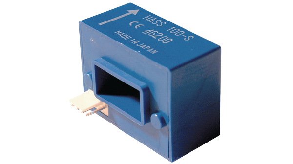

B - IH0515D
^^^^^^^^^^^

Pour l’alimentation (+15v/-15v) de la sonde, nous avons décidé d’utiliser un convertisseur DC/DC qui convertit une tension entre 4.5 et 5.5V, et en une tension 15v/-15v mais avec la contrepartie de limiter le courant.

C - XBee
^^^^^^^^

Les modules XBee sont des modules qui permettent d'envoyer et de recevoir des données, sans fil, performants et accessibles. Ils sont caractérisés par une portée très confortable d'une centaine de mètres en environnement intérieur, et jusqu'à plus d'un kilomètre en zone dégagée pour les modules XBee-PRO équipés d'une antenne adaptée.
Ils peuvent être utilisés couplés à un microcontrôleur ou de façon indépendante.
Ils sont très pratiques pour la réalisation de nombreux montages électroniques qui doivent pouvoir communiquer entre eux.
Ils doivent être alimentés entre 2,8 et 3,4 volts et il a une fréquence de 2,4 GHZ.

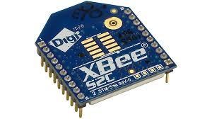

D - PIC12F1572
^^^^^^^^^^^^^^

Le PIC12F1572 est un convertisseur CAN à 10 bits, ce qui signifie que la tension peut prendre 1024 valeurs différentes échelonnées entre 0 et 5 V.

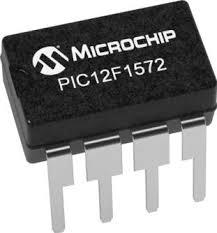

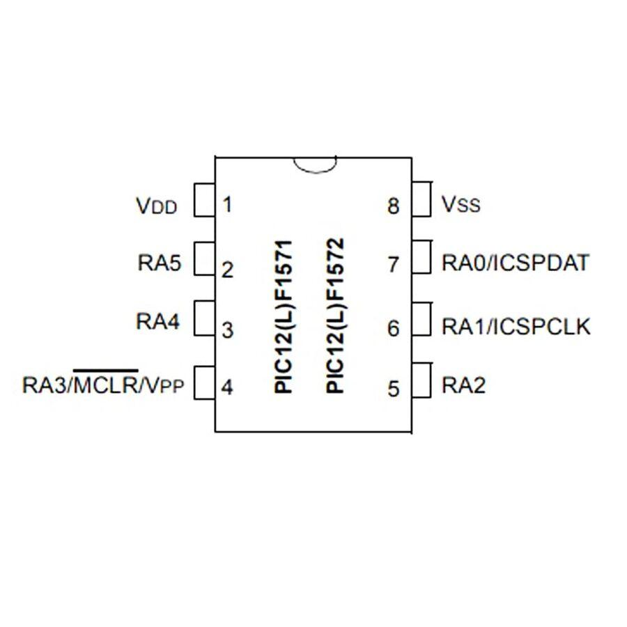

E - Ampli-op MCP6022
^^^^^^^^^^^^^^^^^^^^

Le MCP6022 est un amplificateur opérationnel, Pour mon montage j'utilise un Ampli-op MCP6022 en mode suiveur pour avoir la même tension en entrée et en sortie, il effectue une adaptation d'impédance, en entrée il reçoit une tension de 5 volts au lieu de 30 volts grâce à un pont diviseur de tension.

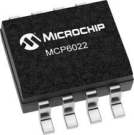

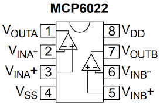

F - Diode Zener (1N4728A)
^^^^^^^^^^^^^^^^^^^^^^^^^

Une diode Zener est un type spécial de diode qui est conçue pour fonctionner dans la région de rupture inverse et maintenir une tension constante, appelée tension Zener, même lorsque la tension appliquée à ses bornes varie.
Dans le cas spécifique d'une diode Zener de 3,3V, cela signifie qu'elle maintiendra une tension de 3,3 volts à ses bornes, quelle que soit la tension appliquée dans la polarité inverse, tant que cette tension ne dépasse pas sa tension de rupture inverse maximale.
En résumé, une diode Zener de 3,3V est conçue pour maintenir une tension constante de 3,3 volts dans la polarité inverse, offrant ainsi une référence de tension stable dans les circuits de régulation de tension.

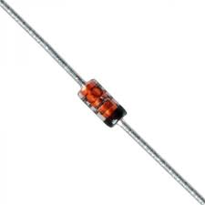

G - Multiplieur (AD633)
^^^^^^^^^^^^^^^^^^^^^^^

Le AD633 est un multiplicateur analogique à quatre quadrants fabriqué par Analog
Devices. Il permet de multiplier deux signaux analogiques ensemble en fournissant
en sortie le produit de ces signaux. C'est un circuit précis et largement utilisé dans
les applications de traitement de signal.

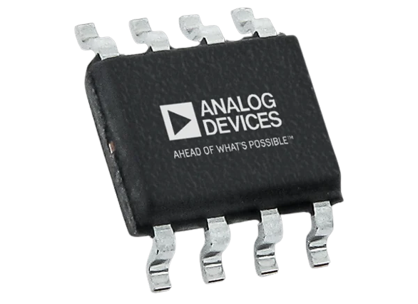

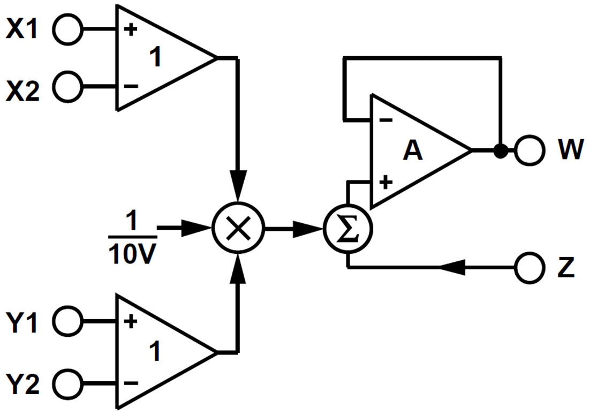

H - Traco power TSR 2450
^^^^^^^^^^^^^^^^^^^^^^^^

Leur rendement élevé permet un fonctionnement à pleine charge jusqu'à +60°C avec un déclenchement de température ambiante sans avoir besoin de dissipateur de chaleur ou de refroidissement par forcé.
rendement élevé et la faible consommation en veille font de ces régulateurs la solution idéale pour de nombreuses applications alimentées par batterie.
Les régulateurs à découpage TSR 1 offrent de nombreuses fonctions améliorées par rapport aux régulateurs linéaires, telles qu'une meilleure précision de sortie (±2%) et un courant de veille plus faible de 2mA, sans nécessiter de condensateurs externes

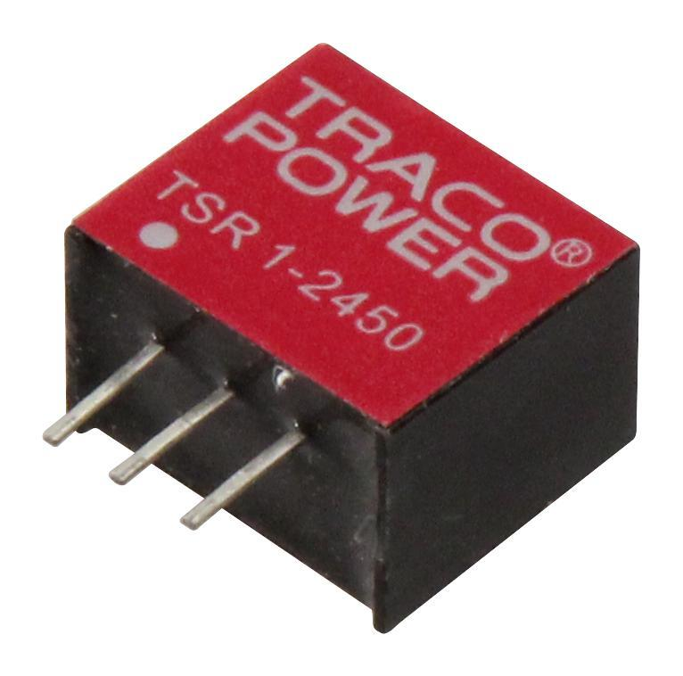

I - Les résistances
^^^^^^^^^^^^^^^^^^^

La résistance est un dipôle qui joue un rôle de protection sur les autres dipôles d'un circuit qui ne résistent pas à un surplus d'intensité. Plus la valeur d'une résistance est élevée, plus l'intensité du courant est faible.

Dans ce circuit électrique il y a 5 résistances :
- 10k Ω
- 10k Ω
- 3.3k Ω
- 1k Ω
- 100 Ω

La résistance de 570k et celle de 100k servent à faire un pont diviseur de tension
pour passer de 30 volts a 4,5 volts pour alimenter le MCP6022.

IV- Carte électronique
----------------------

La carte à été réalisée sur le logiciel Proteus.
Le schéma suivant correspond à la carte électronique finale, on y retrouve les composants présentés précédemment, elle contient aussi les différents borniers.
Le bornier J1 est branché à la sonde à effet Hall, le bornier J2 est pour les batteries.

Ensuite on retrouve aussi le tracopower “TSR-2450”, il alimente le circuit en 5 Volts, l’avantage des tracopower est leur rendement.
On retrouve aussi la diode Zener 3,3 Volts qui sert à passer de 5 Volts à 3,3 volts pour alimenter le module XBEE, ce même module envoie les données de point à point ( du module A au module “B” ).

Le MCP6022 est branché en mode suiveur pour avoir la même tension en entrée et en sortie ici il a une tension de 4,5 volts, un des avantages de MCP6022 c’est qu’il est alimenté en monomode c’est à dire qu il est alimentée en 5 volts et reliée à la masse.

La tension de 4,5 volts est obtenue grâce au pont diviseur de tension qui est composée de la résistance de 570 k ohm et 100 k ohm, il sert à atténuer la tension de 30 volts a 4,5 volts pour que le MCP6022 ne grille pas.

J’ai dû effectuer l’empreinte du module XBEE car elle n’existait pas sur proteus j’ai dû mesurer les dimensions entre chaque broche pour avoir les bonnes dimensions après que la plaque soit gravée.

Le IH0515D sert de convertisseur 5v -> +15v/-15v pour alimenter la sonde à effet hall

Le PIC12F1572 sert de Convertisseur Analogique-Numérique pour convertir la tension reçue en entrée en valeur ASCII qui sera envoyé entre mon module XBee et celui de l’IR 3 (Olivier JOURDAIN).

Pour finir, l’AD633 reçoit 2 tensions correspondantes au voltage et à l’ampérage des batteries, il va ensuite les multiplier pour obtenir la puissance.

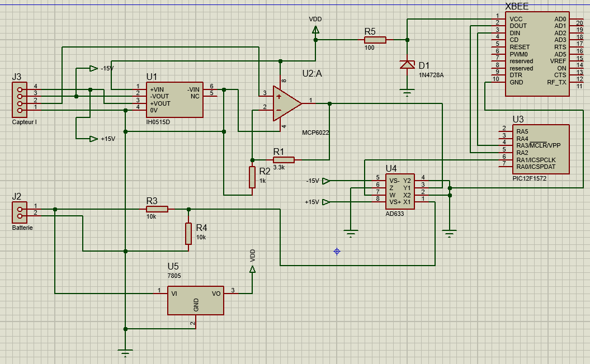

Voici un plan 3D de la carte électronique avec tous les composants réalisées sur ARES.

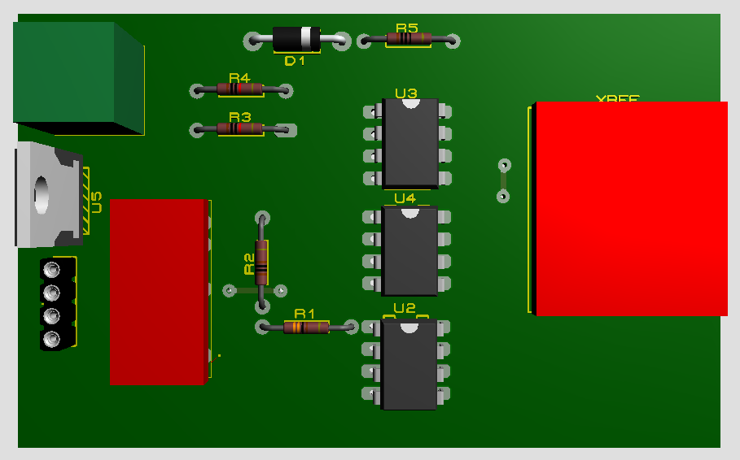

Et voici la carte électronique finale après la gravure où je devrais souder les composants.

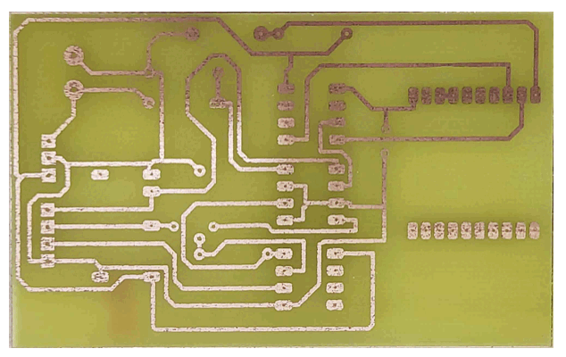

V - Description du code
-----------------------

.. note::

   Code en cours de mise à jour.

Ce code est écrit en langage C et semble être destiné à un microcontrôleur PIC12F1572. Il utilise les bibliothèques ``xc.h`` et ``pic12f1572.h`` spécifiques à ce microcontrôleur.

Voici une explication du code :

- ``#include <xc.h>`` : Cette ligne inclut la bibliothèque ``xc.h``, qui contient des définitions spécifiques au microcontrôleur PIC.
- ``#include <pic12f1572.h>`` : Cette ligne inclut la bibliothèque ``pic12f1572.h``, qui contient des définitions spécifiques au microcontrôleur PIC12F1572.
- ``#pragma config WDTE=OFF, FOSC=INTOSC, MCLRE=OFF`` : Cette directive pragma configure certains paramètres du microcontrôleur tels que la désactivation du watchdog timer (WDTE), la source d'horloge interne (INTOSC) et la désactivation de la broche MCLR (MCLRE).
- ``int res;`` : Déclaration de la variable ``res`` de type entier.

Ensuite, le code définit plusieurs fonctions :

- ``void Temp()`` : Cette fonction configure le Timer2 du microcontrôleur avec un prescaler et un postscaler spécifiques, puis effectue une boucle d'attente basée sur le drapeau d'interruption du Timer2 (`TMR2IF`) jusqu'à ce qu'il soit réinitialisé.
- ``void Init_CAN()`` : Cette fonction configure les registres nécessaires pour utiliser le CAN (Contrôleur d'ADC) du microcontrôleur.
- ``void init_uart()`` : Cette fonction configure les registres nécessaires pour utiliser l'UART (Universal Asynchronous Receiver-Transmitter) du microcontrôleur.
- ``void code(unsigned char c)`` : Cette fonction est utilisée pour envoyer un caractère via l'UART.

La fonction principale ``main()`` est la boucle principale du programme :

- ``OSCCON=0b01111011;`` : Configure la fréquence du microcontrôleur à 8 MHz.
- Configuration des registres pour le fonctionnement de l'ADC (conversion analogique-numérique) et de l'UART.
- Boucle infinie ``while (1)`` qui effectue les opérations suivantes en boucle :
  - Active le port ``RA1``.
  - Appel de la fonction ``Init_CAN()`` pour initialiser le CAN.
  - Conversion analogique-numérique à l'aide de l'ADC du microcontrôleur.
  - Appel de la fonction ``init_uart()`` pour initialiser l'UART.
  - Envoi de la valeur de ``res`` via l'UART en utilisant la fonction ``code()``.
  - Appel de la fonction ``Temp()`` pour effectuer une temporisation.

Ce code semble effectuer des opérations de conversion ADC, de communication UART et de temporisation en utilisant les périphériques du microcontrôleur PIC12F1572.

Ce code est écrit en langage C et est destiné à être compilé et exécuté sur un microcontrôleur PIC12F1572. Voici une explication partie par partie :

1. Les directives d'inclusion :

.. code-block:: c
   :linenos:

   #include <xc.h>
   #include <pic12f1572.h>

Ces directives incluent les fichiers d'en-tête nécessaires pour le microcontrôleur PIC12F1572 et le compilateur XC8.

2. La directive pragma config :

.. code-block:: c
   :linenos:

   #pragma config WDTE=OFF, FOSC=INTOSC, MCLRE=OFF
   
Cette directive configure les options de configuration du microcontrôleur. Ici, elle désactive le watchdog timer (WDTE), utilise une horloge interne (FOSC=INTOSC) et désactive la broche de réinitialisation (MCLRE=OFF).

3. Définition des variables globales :

.. code-block:: c
   :linenos:

   int res;
   
Cette ligne déclare une variable globale "res" de type entier.

4. La fonction Temp() :

.. code-block:: c
   :linenos:

   void Temp()
   {
     int u;
     T2CON = 0b01111111;      // Poscaler 16 et prescaler 64
     TMR2 = 0x00;
     PR2 = 255;
     PIE1bits.TMR2IE = 1;
     INTCONbits.GIE = 1;
     for (u = 0; u <= 1; u++)
     {
       while (TMR2IF = 0)
     }
     {
       PIR1bits.TMR2IF = 0;
     }
   }
   
Cette fonction configure le timer 2 du microcontrôleur pour générer une temporisation. Elle utilise le prescaler et le postscaler pour régler la fréquence du timer. Ensuite, elle effectue une boucle qui attend que le drapeau de débordement du timer 2 soit activé, puis le drapeau est effacé.

5. La fonction Init_CAN() :

.. code-block:: c
   :linenos:

   void Init_CAN()
   {
     ANSELA = 0x02;
     ADCON0 = 0x05;
     ADCON1 = 0x80;
   }
   
Cette fonction configure les registres associés au contrôleur CAN (Controller Area Network). Elle initialise les ports analogiques, le convertisseur analogique-numérique (CAN) et d'autres registres associés.

6. La fonction init_uart() :

.. code-block:: c
   :linenos:

   void init_uart(void)
   {
     TRISAbits.TRISA0 = 0;    // Configuration de la broche RA0 en sortie (TX)
     TXSTA = 0b00100000;     // Configuration du registre de transmission
     RCSTA = 0b10010000;     // Configuration du registre de réception
     SPBRG = 25;             // Définition de la vitesse de transmission à 9600 bauds
   }
   
   Cette fonction configure l'UART (Universal Asynchronous Receiver Transmitter) pour permettre la communication série. Elle définit les broches de transmission et de réception, les registres de configuration et la vitesse de transmission.

7. La fonction code() :

.. code-block:: c
   :linenos:

   void code(unsigned char c)
   {
     while (PIR1bits.TXIF == 0);   // Vérifie si une transmission est en cours
     TXREG = c;                   // Envoie un
     caractère
     }
   
Cette fonction est utilisée pour transmettre un octet sur l'UART. Elle attend que le registre de transmission soit prêt à envoyer des données, puis elle envoie l'octet.

8. La fonction main() :

.. code-block:: c
   :linenos:

   void main(void)
   {
     OSCCON = 0b01111011;    // Réglage de la fréquence à 8 MHz
     ANSELA = 0x02;
     TRISA = 0b00000110;
     while (1)
     {
       PORTAbits.RA1 = 1;
       Init_CAN();
       ADCON0bits.ADGO = 1;
       while (ADGO);
       res = ADRESH << 8;
       res = res | ADRESL;
       init_uart();
       code(res);
       Temp();
     }
   }

La fonction ``main()`` est la fonction principale du programme. Elle configure la fréquence du microcontrôleur, les ports et les registres associés. Ensuite, elle entre dans une boucle infinie où elle active une broche, initialise le CAN, effectue une conversion analogique-numérique, transmet les données sur l'UART à l'aide de la fonction ``code()``, et appelle la fonction ``Temp()`` pour effectuer une temporisation.

Cela représente une vue d'ensemble du code et de ses différentes parties. Chaque partie joue un rôle spécifique dans l'exécution du programme sur le microcontrôleur PIC12F1572.

VI- Diagramme d’utilisation
---------------------------

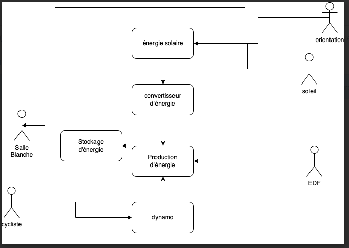

VII- Gantt
----------

VIII- Problèmes rencontrés
--------------------------

Lors de la réalisation de ce projet plusieurs problèmes ont été rencontrés et des solutions ont été trouvées.

Un des problèmes rencontré était dû au vélo car on ne la jamais reçu ça aurait pu nous être utile pour effectuer des tests supplémentaires pour la production d’énergie.

L’autre problème rencontré était lors des gravure des cartes électroniques, les cartes n'avaient pas les bonnes dimensions ce qui fait qu'on ne pouvait pas mettre les composants sur la carte.
Pour résoudre ce problème, on a dû refaire les cartes électroniques ce qui nous a fait perdre du temps.

IX - Nomenclature
-----------------

Contraintes financières (budget alloué) : 200 € à la charge du lycée.

X - Remerciements
-----------------

Je tiens à remercier avant tout Monsieur F.Duchiron, et Monsieur P.Dubois qui, en tant que professeur encadrant les projets, se sont montrés toujours à l’écoute et très disponibles tout au long de la réalisation de ce projet.

Grâce à leurs conseils et leurs expertise j’ai pu développer mes compétences et accomplir les missions de mon contrat.

Ainsi je les remercie pour leurs aides et tout le temps qu’ils ont bien voulu me consacrer afin de répondre à mes questions et m’aider lors de problèmes.

Enfin, je n’oublie pas de remercier les membres de mon groupe de projet, Laurent CARDONA, Bastien VIVIAN et Olivier JOURDAIN.
