EC2 - Laurent Cardona
====================

.. _installation:

I - Présentation du contrat
--------------------------

Mon contrat est destiné au contrôle de la charge des batteries et la commutation d'une source d'énergie à une autre.

Pour mesurer la tension des batteries j'ai dû faire un pont diviseur de tension. Un programme en C vérifie l'état de la batterie et envoie un message en cas de défaillance et il permet aussi la commutation.

Le programme est implanté sur un microcontrôleur PIC12F1572. J'ai d'abord effectué une simulation sur ISIS avant de faire des essais sur une plaque de prototypage pour au final réaliser une carte électronique avec tous les composants dont j'avais besoin. La commutation se fait entre les batteries et EDF dès que les batteries sont déchargées. 

Dans le cadre de ce projet, plusieurs fonctions doivent être réalisées pour assurer le contrôle de la charge de la batterie, la commutation entre différentes sources d'énergie et la mise en œuvre des actionneurs de puissance. Tout d'abord, une mesure de la tension de la batterie sera effectuée à l'aide d'un diviseur de tension. Ensuite, un programme en langage C sera développé pour vérifier l'état de la batterie et envoyer un message d'alerte en cas de défaillance. Une fonction supplémentaire en C sera mise en place pour permettre la commutation vers une autre source d'alimentation lorsque nécessaire.

Pour valider le fonctionnement du système, une simulation sera réalisée sur ISIS en utilisant un microcontrôleur PIC16F88. Par la suite, des essais seront effectués sur une plaque de prototypage pour évaluer la performance du système dans des conditions réelles. Une structure de puissance sera conçue pour permettre la commutation entre les différentes sources de tension.

Une étroite collaboration avec les autres membres de l'équipe du projet sera nécessaire pour valider les choix liés à la communication entre les différents composants. Enfin, des cartes seront réalisées et intégrées dans le système pour assurer son bon fonctionnement global.

Ce processus de réalisation permettra d'obtenir un système efficace et fiable pour le contrôle de la charge de la batterie, la commutation d'énergie et l'actionnement des composants de puissance.

`Cliquez ici pour voir le code <https://github.com/Oliopti/pppe/blob/main/projetBTS.X/PROJETBTS.c>`_

II- Logiciel utilisé
--------------------

- Google Drive : Pour la communication entre l’équipe et les échanges de documents.

- GitHub : Pour partager des fichiers entre le groupe.

- PROTEUS : Pour réaliser la carte électronique et les schémas.

- MPLAB : Pour réaliser le programme pour gérer les composants.

- MindView : Pour gérer l’emploi du temps.

- Google Chrome : Pour différentes recherches.

- Draw.io : Pour créer différents diagrammes.

III- Ressources et matériaux utilisés
-------------------------------------

A - Les batteries
^^^^^^^^^^^^^^^^^

Pour le projet j'utilise deux batteries de 12 volts et 14,7 volts si elles sont chargées au maximum, les deux batteries sont branchées en série pour avoir une tension de 29,4 volts au total.
Ces deux batteries sont un des moyens pour alimenter les panneaux lumineux de la salle de cours et les deux batteries sont rechargées à l'aide de deux panneaux solaires et d'un vélo. 

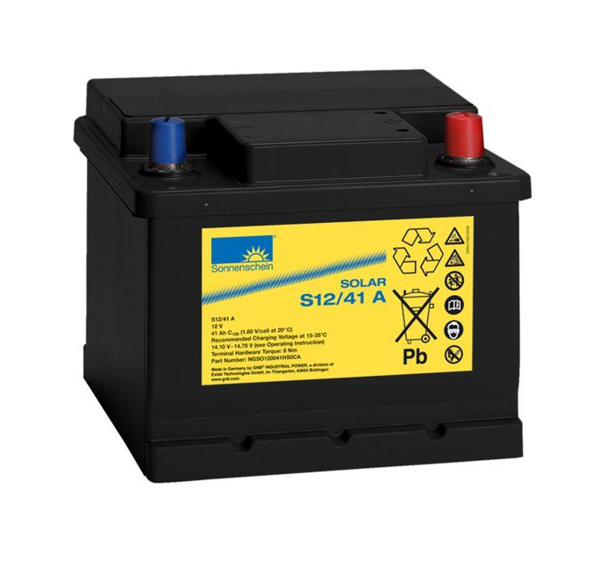

B - Les panneaux solaires
^^^^^^^^^^^^^^^^^^^^^^^^^

La courbe intensité – tension est la courbe rouge.
En fonction de la tension qu’on impose aux bornes, le panneau donnera une certaine intensité selon cette courbe.
La courbe bleue représente la puissance développée.
Ce n’est ni plus ni moins que le résultat du calcul P=UxI
Pour le projet nous disposons de deux panneaux solaires de 375 Watts qui servent à recharger les batteries
Les deux panneaux solaires seront branché en série pour avoir une puissance total de 750 Watts 

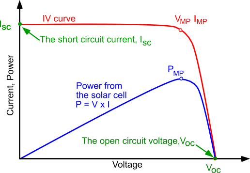

C - Ampli-op MCP6022
^^^^^^^^^^^^^^^^^^^^

Le MCP6022 est un amplificateur opérationnel,
Pour mon montage j'utilise un Ampli-op MCP6022 en mode suiveur pour avoir la même tension en entrée et en sortie, il effectue une adaptation d'impédance, en entrée il reçoit une tension de 5 volts au lieu de 30 volts grâce à un pont diviseur de tension. 

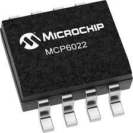

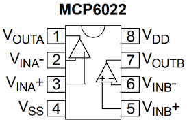

D - Module xbee
^^^^^^^^^^^^^^^

Les modules XBee sont des modules qui permettent d'envoyer et de recevoir des données, sans fil, performants et accessibles. Ils sont caractérisés par une portée très confortable d'une centaine de mètres en environnement intérieur, et jusqu'à plus d'un kilomètre en zone dégagée pour les modules XBee-PRO équipés d'une antenne adaptée.
Ils peuvent être utilisés couplés à un microcontrôleur ou de façon indépendante.
Ils sont très pratiques pour la réalisation de nombreux montages électroniques qui doivent pouvoir communiquer entre eux.
Ils doivent être alimentés entre 2,8 et 3,4 volts et il a une fréquence de 2,4 GHZ.

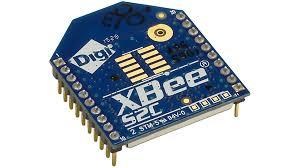

E - Traco power TSR 2450 et 24120
^^^^^^^^^^^^^^^^^^^^^^^^^^^^^^^^^

Leur rendement élevé permet un fonctionnement à pleine charge jusqu'à +60°C avec un déclenchement de température ambiante sans avoir besoin de dissipateur de chaleur ou de refroidissement par forcé. 
rendement élevé et la faible consommation en veille font de ces régulateurs la solution idéale pour de nombreuses applications alimentées par batterie.
Les régulateurs à découpage TSR 1 offrent de nombreuses fonctions améliorées par rapport aux régulateurs linéaires, telles qu'une meilleure précision de sortie (±2%) et un courant de veille plus faible de 2mA, sans nécessiter de condensateurs externes. 

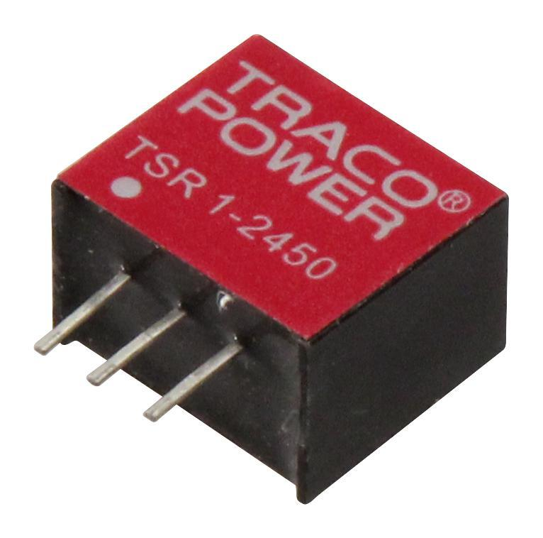

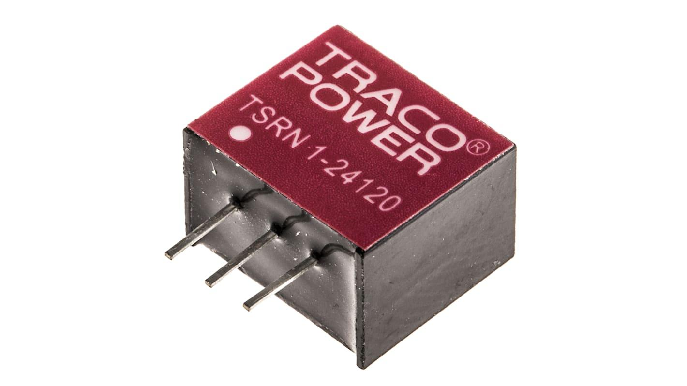

F - Microcontrôleur PIC12F1572
^^^^^^^^^^^^^^^^^^^^^^^^^^^^^^

Le PIC12F1572 est un convertisseur CAN à 10 bits, ce qui signifie que la tension peut
prendre 1024 valeurs différentes échelonnées entre 0 et 5 V.
Un convertisseur analogique numérique (CAN) est un dispositif électronique permettant
la conversion d’un signal analogique en un signal numérique.
Signal analogique : signal continu en temps et en amplitude.
Signal numérique : signal échantillonné et quantifié, discret en temps et en amplitude.

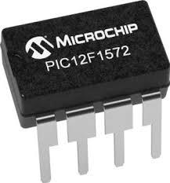

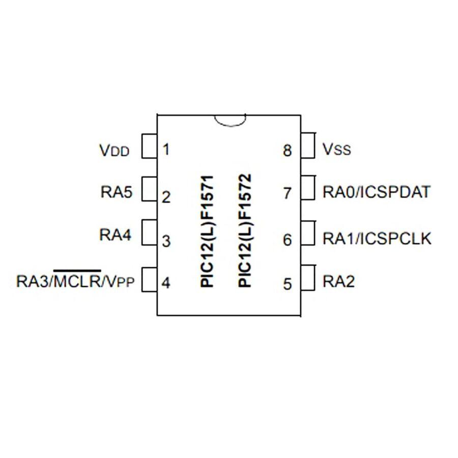

G - Les résistances
^^^^^^^^^^^^^^^^^^^

La résistance est un dipôle qui joue un rôle de protection sur les autres dipôles
d'un circuit qui ne résistent pas à un surplus d'intensité. Plus la valeur d'une résistance
est élevée, plus l'intensité du courant est faible.

Dans ce circuit électrique il y a 6 résistances :

570k Ω
100k Ω
10k Ω
470 Ω
100 Ω
22 Ω

La résistance de 570k et celle de 100k servent à faire un pont diviseur de tension pour passer de 30 volts a 4,5 volts pour alimenter le MCP6022.

- 570k : 
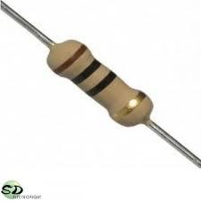

- 100k :
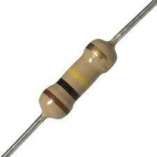

- 10k :
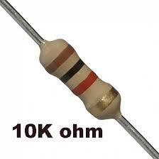

- 470 :
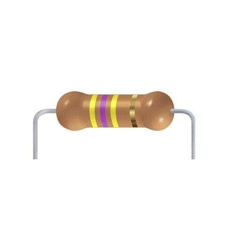

H - TIP122 (Transistor bipolaire)
^^^^^^^^^^^^^^^^^^^^^^^^^^^^^^^^^
 
Le transistor TIP122 est un transistor bipolaire à jonction NPN de puissance utilisé dans de nombreuses applications électroniques. Il est couramment utilisé comme interrupteur ou amplificateur de courant.
Le transistor TIP122 se compose de trois régions de semi-conducteurs : la région émetteur (E), la région base (B) et la région collecteur (C). La région base est placée entre la région émetteur et la région collecteur.
Le fonctionnement du transistor TIP122 est basé sur le contrôle du courant entre la région collecteur et la région émetteur par le courant appliqué à la région base.
En résumé, le transistor TIP122 est un transistor bipolaire de puissance qui permet de contrôler des courants élevés entre le collecteur et l'émetteur en fonction du courant appliqué à la base.

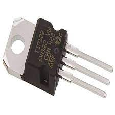

I - Diode Zener (1N4728A)
^^^^^^^^^^^^^^^^^^^^^^^^^

Une diode Zener est un type spécial de diode qui est conçue pour fonctionner dans la région de rupture inverse et maintenir une tension constante, appelée tension Zener, même lorsque la tension appliquée à ses bornes varie.
Dans le cas spécifique d'une diode Zener de 3,3V, cela signifie qu'elle maintiendra une tension de 3,3 volts à ses bornes, quelle que soit la tension appliquée dans la polarité inverse, tant que cette tension ne dépasse pas sa tension de rupture inverse maximale.
En résumé, une diode Zener de 3,3V est conçue pour maintenir une tension constante de 3,3 volts dans la polarité inverse, offrant ainsi une référence de tension stable dans les circuits de régulation de tension.

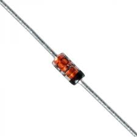

J - Raspberry
^^^^^^^^^^^^^

On dispose aussi d’un Raspberry qui servira à afficher les messages tels que le niveau de batterie et le message d’erreur quand la batterie sera vide.
Il sera relié à un bornier depuis les broches GPIO 12 et 15.
L’avantage du Raspberry est son poids et son faible coût.

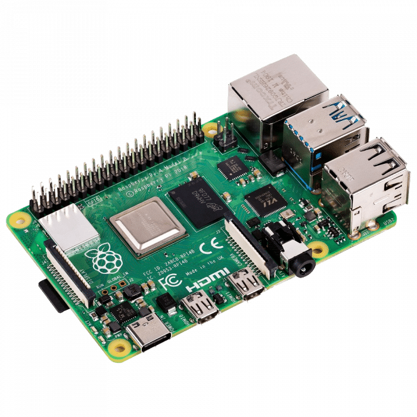

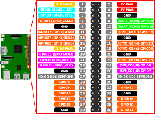

IV - Carte électronique
-----------------------

La carte à été réalisée sur le logiciel Proteus.
Ce premier schéma est le schéma de simulation, le niveau de la batterie est simulé avec un potentiomètre en modifiant le pourcentage du potentiomètre le message afficher change.
J’ai aussi dû implanter le code dans le microcontrôleur.

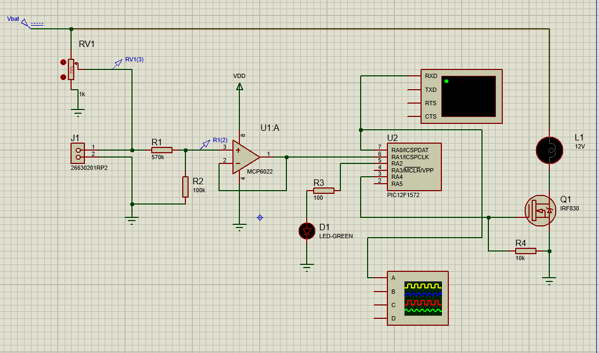

Suite à la simulation sur proteus j’ai effectué des tests sur une plaque de prototypage 
On y retrouve le pont diviseur de tension le MCP6022 et le PIC12F1572.
On peut aussi voir le pickit qui sert a implanté le code dans le microcontrôleur.

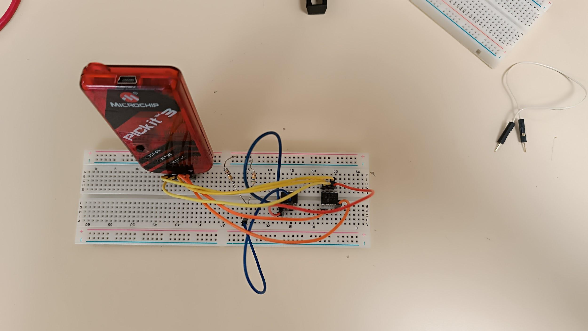

Le schéma suivant correspond à la carte électronique finale, on y retrouve les composants présentés précédemment, elle contient aussi les différents borniers.
le bornier J1 sera pour les batteries, le bornier J2 sera pour le relais il est accompagné d’une diode de roue libre elle sert à ce que le courant circule correctement lorsque le relai envoi l’énergie.

Le bornier J4 sert à brancher le pickit3 et implanter le code de commutation dans le microcontrôleur PIC12F1572, et le bornier J5 sert à brancher le raspberry qui va afficher le niveau de tension des batteries au broche “GPIO 12 ET 15”, ce bornier est accompagné de deux diode D4 et D5, elles servent à ce que le courant passe que dans un sens.

Ensuite on retrouve aussi les deux tracopower “TSR-2450” et “TSR-24120”, le TSR-2450 alimente  l’ampli-op MCP6022 en 5 Volts et le TSR-24120 alimente le relais en 12 Volts 
l’avantage des tracopower est leur rendement.
On retrouve aussi la diode Zener 3,3 Volts qui sert à passer de 5 Volts à 3,3 volts pour alimenter le module XBEE, ce même module envoie les données de point à point ( du module A au module “B” ).

Le MCP6022 est branché en mode suiveur pour avoir la même tension en entrée et en sortie ici il a une tension de 4,5 volts, un des avantages de MCP6022 c’est qu’il est alimenté en monomode c’est à dire qu il est alimentée en 5 volts et reliée à la masse.

La tension de 4,5 volts est obtenue grâce au pont diviseur de tension qui est composée de la résistance de 570 k ohm et 100 k ohm, il sert à atténuer la tension de 30 volts a 4,5 volts pour que le MCP6022 ne grille pas.

J’ai dû effectuer l’empreinte du module XBEE car elle n’existait pas sur proteus j’ai dû mesurer les dimensions entre chaque broche pour avoir les bonnes dimensions après que la plaque soit gravée.

Pour finir le transistor bipolaire “TIP122” agit comme un interrupteur lorsqu'il reçoit un courant assez élevé sur la base il laisse le courant passer entre l'émetteur et le collecteur il agit en tout ou rien.

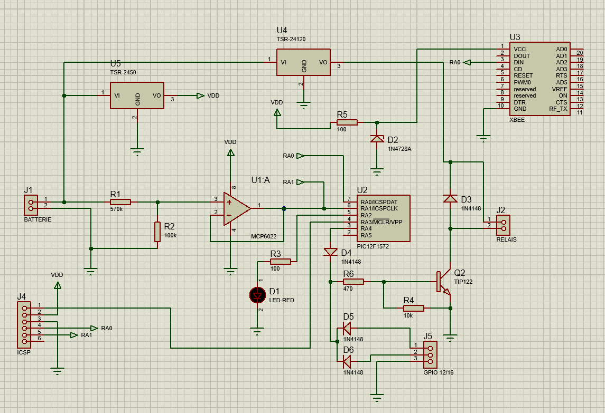

Voici le PCB de la carte électronique réalisé sur ARES ou nous pouvons voir tous les tracés que nous retrouverons sur la carte lorsqu'elle sera gravée.   

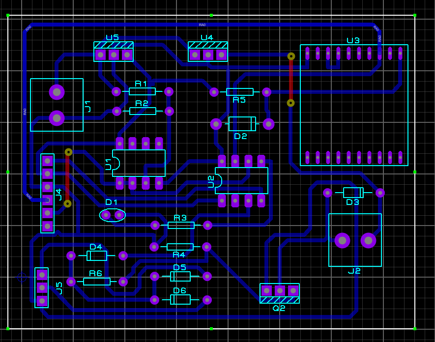

Voici un plan 3D de la carte électronique avec tous les composants réalisées sur ARES.

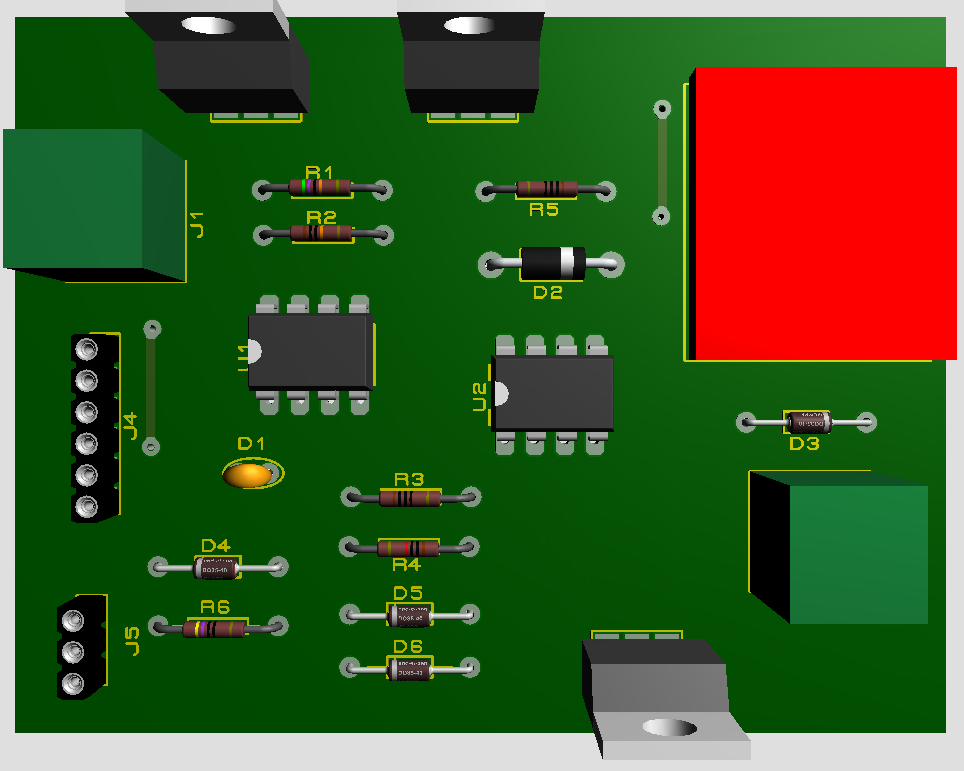

Et voici la carte électronique finale après la gravure où je devrais souder les composants.

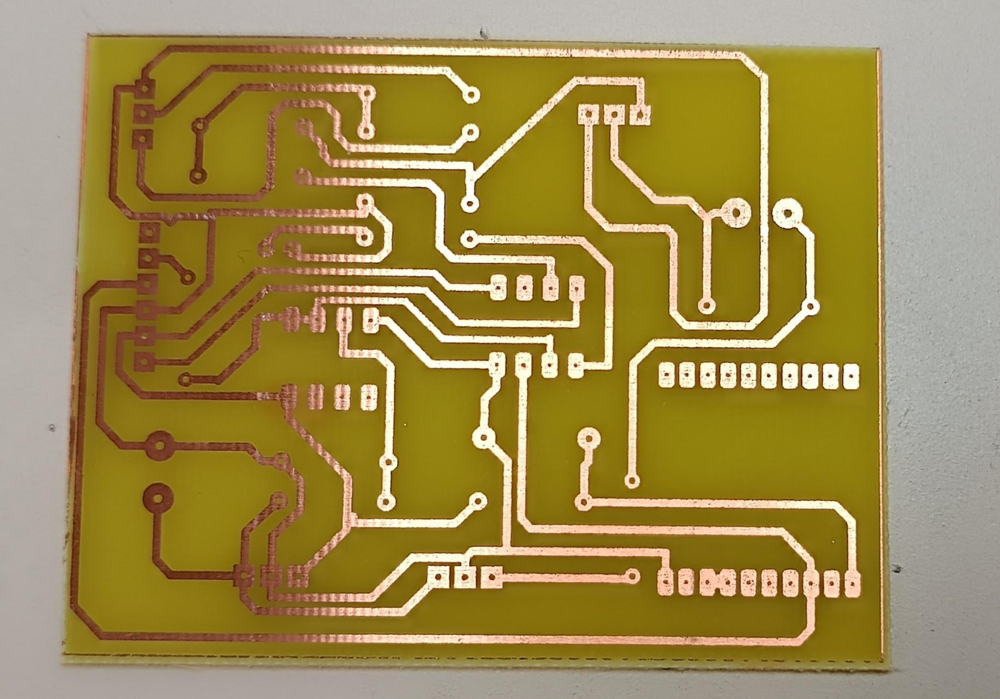

V - Description du code
-----------------------

.. warning::

   Code en cours de mise à jour.

Ce code est écrit en langage C et semble être destiné à un microcontrôleur PIC12F1572. Il utilise les bibliothèques ``xc.h`` et ``pic12f1572.h`` spécifiques à ce microcontrôleur.

Voici une explication du code :

- ``#include <xc.h>`` : Cette ligne inclut la bibliothèque ``xc.h``, qui contient des définitions spécifiques au microcontrôleur PIC.
- ``#include <pic12f1572.h>`` : Cette ligne inclut la bibliothèque ``pic12f1572.h``, qui contient des définitions spécifiques au microcontrôleur PIC12F1572.
- ``#pragma config FOSC=INTOSC, MCLRE=OFF, WDTE=OFF`` : Cette directive pragma configure certains paramètres du microcontrôleur tels que la source d'horloge interne (INTOSC), la désactivation de la broche MCLR (MCLRE) et la désactivation du watchdog timer (WDTE).
- ``int res, i;`` : Déclaration des variables ``res`` et ``i`` de type entier.
- Déclaration de plusieurs tableaux de caractères (``texte1``, ``texte2``, etc.) contenant des messages.
- ``volatile unsigned int timer0_interrupts = 0;`` : Déclaration d'une variable volatile ``timer0_interrupts`` de type ``unsigned int`` et initialisation à 0.

Ensuite, le code définit plusieurs fonctions :

- ``void Init_can()`` : Cette fonction configure les registres nécessaires pour utiliser le CAN (Contrôleur d'ADC) du microcontrôleur.
- ``void init_uart()`` : Cette fonction configure les registres nécessaires pour utiliser l'UART (Universal Asynchronous Receiver-Transmitter) du microcontrôleur.
- ``void code(unsigned char c)`` : Cette fonction est utilisée pour envoyer un caractère via l'UART.
- ``void Temp()`` : Cette fonction effectue une temporisation.

La fonction principale ``main()`` est la boucle principale du programme :

- ``OSCCON=0b01011011`` : Configure la fréquence du microcontrôleur à 1 MHz.
- Configuration des registres pour le fonctionnement du Timer1 en mode temporisation.
- Boucle infinie ``while (1)`` qui effectue les opérations suivantes en boucle :
  - Appel de la fonction ``Init_can()`` pour initialiser le CAN.
  - Conversion analogique-numérique à l'aide de l'ADC du microcontrôleur.
  - Appel de la fonction ``init_uart()`` pour initialiser l'UART.
  - Vérification d'un compteur ``timer0_interrupts``. Si celui-ci dépasse une certaine valeur (150 dans ce cas), certaines opérations sont effectuées en fonction de la valeur de ``res`` (résultat de la conversion ADC).
  - Dans chaque cas, des messages sont envoyés via l'UART en utilisant la fonction ``code()``.
  - Des temporisations (`Temp()`) sont effectuées entre l'envoi des messages.

Enfin, la fonction d'interruption ``isr()`` est définie. Cette fonction est appelée lorsque l'interruption du Timer1 se produit. Elle incrémente la variable ``timer0_interrupts`` et réinitialise les registres du Timer1 pour préparer la prochaine interruption.

Notez que ce code est spécifique au microcontrôleur PIC12F1572 et utilise des registres et des fonctionnalités spécifiques à ce microcontrôleur.

.. code-block:: c
   :linenos:

    #include <xc.h>
    #include <pic12f1572.h>
    #pragma config FOSC=INTOSC, MCLRE=OFF, WDTE=OFF
    int res, i;
    char texte1[]="Batterie 100% \r";
    char texte2[]="Batterie 80% \r";
    char texte3[]="Batterie 60% \r";
    char texte4[]="Batterie 40% \r";
    char texte5[]="Batterie 20% \r%";
    char texte6[]="Maintenance requise \r%";

    volatile unsigned int timer0_interrupts = 0;

    void Init_can()
    {
        ADCON0=0b00000101;
        ADCON1=0b10000000;
        ADCON2=0x00;
        ANSELA=0b00000010;
        OPTION_REG=0x80;
    }

    void init_uart(void)
    {
    TRISAbits.TRISA0 = 1; // TX broche RA0 du pic en sortie
    TXSTA = 0b00100000;   // configuration du registre de transmission
    RCSTA = 0b10010000;   // configuration du registre de réception
    SPBRG = 12;           // Défini la vitesse de transmission à 9600Bauds
    }

    void code(unsigned char c)    // fonction transmission du code
    {
    while(PIR1bits.TXIF==0);    // pas de transmission en cours ?
    TXREG=c;     /* envoie un caractère */
    }
    void Temp()
    {
        int u=65536;
        while(u--);
    }

    void main(void) 
    {   OSCCON=0b01011011;//fréquence réglée à 1MHz
        TRISA=0b00000010;
        PORTA=0x00;
        T1CONbits.TMR1CS = 0b00;
        T1CONbits.T1CKPS = 0b11;
        TMR1H = 0x0b;
        TMR1L = 0xDC;
        PIE1bits.TMR1IE = 1;
        INTCONbits.PEIE = 1;
        INTCONbits.GIE = 1;
        T1CONbits.TMR1ON =1;
        while (1)
        {
            
        Init_can();
        ADCON0bits.ADGO=1;
        while(ADGO);
        res=ADRESH<<8;
        res=res|ADRESL;
        _delay(1000);
        
        init_uart();
        if (timer0_interrupts >= 150) // 0.5 = 1s
        {
            timer0_interrupts =0;
            if (res>=922) //batterie 100%
            {
                PORTAbits.RA4=1;//Relais alimenté, alimentation par batteries
                PORTAbits.RA2=0;
                init_uart();
                for (i=0; i<=14; i++)
                {
                    code(texte1[i]);
                }
                Temp();
                Temp();
            }
            if ((res<922)&&(res>=891)) // batterie 80%
            {
                PORTAbits.RA2=0;
                PORTAbits.RA4=1; //Relais alimenté, alimentation par batteries
                init_uart();
                for (i=0; i<=14; i++)
                {
                code(texte2[i]);
                }
                _delay(100000);
            }
            if ((res<891)&&(res>=860)) // batterie 60%
            {
                PORTAbits.RA2=0;
                PORTAbits.RA4=1;//Relais alimenté, alimentation par batteries
                init_uart();
                for (i=0; i<=14; i++)
                {
                    code(texte3[i]);
                }
                Temp();
                Temp();
            }
            if ((res<860)&&(res>=819)) // batterie 40%
            {
                PORTAbits.RA2=0;
                PORTAbits.RA4=1;//Relais alimenté, alimentation par batteries
                init_uart();
                for (i=0; i<=14; i++)
                {
                    code(texte4[i]);
                }
                Temp();
                Temp();
            }
            if ((res<829)&&(res>=799)) // batterie 20%
            {
                PORTAbits.RA2=0;
                PORTAbits.RA4=1;//Relais alimenté, alimentation par batteries
                init_uart();
                for (i=0; i<=14; i++)
                {
                    code(texte5[i]);
                }
                Temp();
                Temp();
            }
            if (res<799) //Batterie déchargée
            {
                PORTAbits.RA2=1;
                PORTAbits.RA4=0;//Alimentation réseau
                init_uart();
                for (i=0; i<=20; i++)
                {
                    code(texte6[i]);
                }
                Temp();
                Temp();
            }
        }
        }
    }

    void __interrupt() isr(void) {
        if (PIR1bits.TMR1IF) {
            PIR1bits.TMR1IF = 0;
            TMR1H = 0x0B;
            TMR1L = 0xDC;
            timer0_interrupts++;
        }
    }

VI- Diagramme d’utilisation
---------------------------

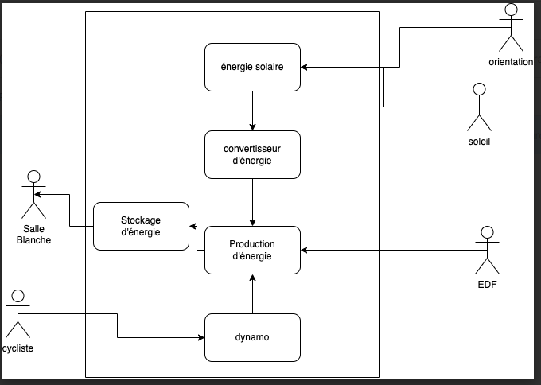

VII- Gantt
----------

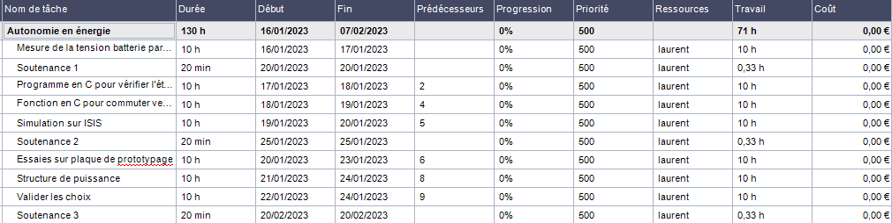

VIII- Problèmes rencontrés
--------------------------

Lors de la réalisation de ce projet plusieurs problèmes ont été rencontrés et des solutions ont été trouvées.

Un des problèmes rencontré était dû au vélo car on ne la jamais reçu ça aurait pu nous être utile pour effectuer des tests supplémentaires pour la production d’énergie.

L’autre problème rencontré était lors des gravure des cartes électroniques, les cartes n'avaient pas les bonnes dimensions ce qui fait qu'on ne pouvait pas mettre les composants sur la carte.
Pour résoudre ce problème, on a dû refaire les cartes électroniques ce qui nous a fait perdre du temps.

IX - Nomenclature
-----------------

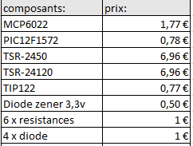

X - Remerciements
-----------------

Je tiens à remercier avant tout Monsieur F.Duchiron, et Monsieur P.Dubois qui, en tant que professeur encadrant les projets, se sont montrés toujours à l’écoute et très disponibles tout au long de la réalisation de ce projet.

Grâce à leurs conseils et leurs expertise j’ai pu développer mes compétences et accomplir les missions de mon contrat. 

Ainsi je les remercie pour leurs aides et tout le temps qu’ils ont bien voulu me consacrer afin de répondre à mes questions et m’aider lors de problèmes.

Je remercie également Florian MOSSE un collègue de classe qui m’a aidé pour la conception du code.

Enfin, je n’oublie pas de remercier les membres de mon groupe de projet, Djibril Chaabi, Bastien Vivian et Olivier Jourdain.

XI - Conclusion
---------------

Ce projet a été très bénéfique pour ma personne que ce soit du point de vue compétences ainsi que sur le plan de l’humain.En effet travailler en groupe m’a beaucoup appris.

Actuellement sur mon contrat il me reste plus qu'à souder les composants sur la carte électronique et faire d’autres tests au niveau du la liaison avec le XBEE

Ce projet m'a vraiment intéressé et j’aurais aimé consacrer plus de temps scolaire à ce projet afin de l’améliorer et de le perfectionner.
