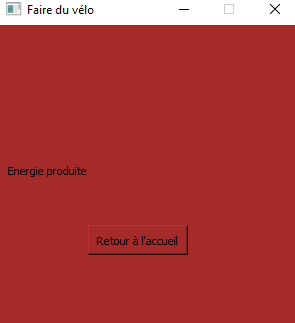

Mode d’emploi de l'IHM distante
===============================

Création de compte
Pour se créer un compte afin de commencer à utiliser l’application de production d’énergie, il faut cliquer sur « S’inscrire » quand on est sur la page d’accueil du service. 

Cela va nous mener vers une fenêtre où il nous faudra entrer un nom, prénom, un e-mail et un mot de passe. Ces deux derniers points seront nécessaires pour vous connecter alors notez les bien et ne le perdez pas, ou vous devrez vous recréer un compte. 

Si les formats sont bien respectés (@gmail.com, @free.fr etc ), un message vous informant que votre compte a bien été créé apparaîtra. 

Maintenant, retournez à la page d’accueil en appuyant sur le bouton « OK », et entrez vos nouveaux identifiants de connexion que vous avez créés. 

Si vos identifiants sont bien reconnus, vous serez redirigé vers la page d’accueil du service de production d’énergie. 

Si vous avez rentré de mauvaises informations, un message d’erreur apparaîtra vous demandant de vérifier les identifiants et/ou mot de passe que vous avez mis. 

En cas d’oubli d’identifiant, nous vous suggérons de recréer un compte. Si vous êtes sûr que les identifiants rentrés son correct, vous pouvez contacter le service administratif par e-mail : bastienvivian29@gmail.com ;
olivierjourdaintechnitien@gmail.com ou téléphone : +82682477639 (0,60 € la minutes + prix appel)

.. image:: img/mode_emploie/image6.png

Une fois que vous êtes sur la page d’accueil de l’application, 3 choix s’offrent à vous. 

Vous pouvez soit commencer à produire de l’énergie en cliquant sur «Faire du vélo» et l’énergie que vous produisez s'affiche à l’écran en temps réel.

Vous pouvez aussi optez pour voir l’historique de production en cliquant sur « Voir mes statistiques ».

Ou bien vous pouvez vous déconnecter de l’application en cliquant sur « Se déconnecter ». Facile non ? ;)

En cas de bug, ou de quelconque autre problème en lien avec l’application de production d’énergie, il est suggéré de revenir plus tard. Si le problème persiste, contactez les administrateurs via les e-mails et/ou appel (coordonnées plus haut). . 
