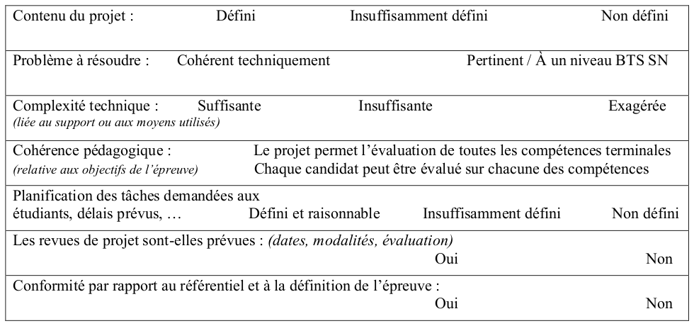
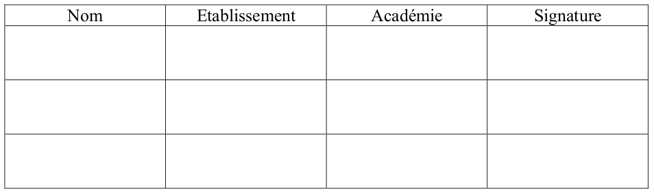

Partie commune
==============

.. _installation:

`Cliquez ici pour voir le Cahier des Charges <https://github.com/Oliopti/pppe/blob/main/ressource/Projet%20p%C3%A9dagogique%20de%20production%20d'%C3%A9nergie.pdf>`_

1 - Présentation et situation du projet dans son environnement
--------------------------------------------------------------

.. image:: img/comm/Presentation.png

1.1- Présentation du projet
^^^^^^^^^^^^^^^^^^^^^^^^^^^

Dans le contexte actuel où la production de l’énergie électrique pose quelques problèmes en ce qui
concerne la production, on souhaite rendre autonome l’éclairage de la salle blanche où se
déroulent les cours et les activités pratiques des BTS Systèmes Numériques.
L’installation sera composée de deux panneaux solaires de 390W et de deux vélos couplés à des
alternateurs permettant pour l’ensemble de recharger les deux batteries. L’énergie permettant ainsi 
d’alimenter tous les luminaires de la salle soit 11 points lumineux de 40W chacun.

1.2 - Situation du projet dans son contexte
^^^^^^^^^^^^^^^^^^^^^^^^^^^^^^^^^^^^^^^^^^^

Domaine d’activité du système support d’étude :

- Informatique, réseaux et infrastructures. 
- Mobilité et systèmes embarqués.
- Mesure, instrumentation et microsystèmes.

1.2 - Cahier des charges – Expression du besoin
^^^^^^^^^^^^^^^^^^^^^^^^^^^^^^^^^^^^^^^^^^^^^^^

Réaliser l’installation de l’ensemble panneaux, régulateur, batteries, vélos et alternateurs pour ensuite :

- Gérer l’éclairage via un écran tactile, prévoir un circuit de puissance pour un fonctionnement en 24V continu ou 230V alternatif.
- Mesurer la production des panneaux photovoltaïques, envoyer les informations via XBee. 
- Enregistrement de la production journalière et annuelle des étudiants participant.

2 - Spécifications
------------------

2.1 - Diagrammes SYSML
^^^^^^^^^^^^^^^^^^^^^^

2.1.1 - Exigences
+++++++++++++++++

.. image:: img/comm/Diagramme-1.png

2.1.2 - Constitution du système, diagramme de définition de blocs
+++++++++++++++++++++++++++++++++++++++++++++++++++++++++++++++++

.. image:: img/comm/Diagramme-2.png

2.2 - Contraintes de réalisation
^^^^^^^^^^^^^^^^^^^^^^^^^^^^^^^^

Contraintes financières (budget alloué) : 200 € à la charge du lycée.

Contraintes de développement (matériel et/ou logiciel imposé / technologies utilisées) :

Il s’agit de réaliser une solution :

- Embarquée, à base d’un microcontrôleur Microchip PIC16f88.
- Utilisation de circuits intégrés spécialisés et transistors.

Exigences qualité à respecter sur le produit à réaliser :

- Ergonomie Sur le développement.
- Respect des standards sur la documentation à produire.
- Dossier de suivi de projet.
- Dossier technique unique.

2.3 - Ressources mises à disposition des étudiants (logiciels / matériels / documents)
^^^^^^^^^^^^^^^^^^^^^^^^^^^^^^^^^^^^^^^^^^^^^^^^^^^^^^^^^^^^^^^^^^^^^^^^^^^^^^^^^^^^^^

.. tableau::

   +-----------------------+--------------------------------------------------------------------------------------------------------------------------------------------------------+
   | Désignation           | Caractéristiques techniques                                                                                                                            |
   +=======================+========================================================================================================================================================+
   | MPLABX                | IDE développée par Microchip permettant la programmation des microcontrôleurs PIC12, PIC16, PIC18…                                                     |
   +-----------------------+--------------------------------------------------------------------------------------------------------------------------------------------------------+
   | PROTEUS               | Suite logicielle composé d’ISIS pour la réalisation des schémas, la simulation et d’ARES permettant la réalisation du PCB de la carte électronique.    |
   +-----------------------+--------------------------------------------------------------------------------------------------------------------------------------------------------+
   | PICkit3 ou PICkit4    | Module permettant de transférer le programme dans le microcontrôleur ou de réaliser le dépannage (débogage).                                           |
   +-----------------------+--------------------------------------------------------------------------------------------------------------------------------------------------------+
   | Analyseur de spectre  | Analyseur Large bande Agilent.                                                                                                                         |
   +-----------------------+--------------------------------------------------------------------------------------------------------------------------------------------------------+
   | Oscilloscope Agilent  | Oscilloscope numérique permettant le décodage de trames (UART, SPI, I2C).                                                                              |
   +-----------------------+--------------------------------------------------------------------------------------------------------------------------------------------------------+
   | Machine à graver LPKF | Machine pour le prototypage de circuits imprimés.                                                                                                      |
   +-----------------------+--------------------------------------------------------------------------------------------------------------------------------------------------------+
   | Modules XBee          | Tout ou Rien, 0-10V…, passerelle Multitech.                                                                                                            |
   +-----------------------+--------------------------------------------------------------------------------------------------------------------------------------------------------+

3 - Répartition des fonctions ou cas d’utilisation par étudiant
---------------------------------------------------------------

3.1 - Djibril Chaabi - EC1
^^^^^^^^^^^^^^^^^^^^^^^^^^

1. Réalisation de la fonction mesure de puissance.

2. Envoyer les informations en utilisant un protocole choisi (I2C, UART…)

- Utilisation d’une sonde à effet hall pour mesurer les courants.
- Faire un choix technologique pour mesurer la tension.
- Utilisation d’un multiplieur pour déduire une image de la puissance.
- Réalisation des essais des différentes structures sélectionnées sur plaque de prototypage.
- Se concerter avec les autres membres du projet pour valider les choix concernant la communication.
- Choisir un mode de communication (synchrone ou asynchrone).
- Réaliser les schémas sur ISIS, simulation et importation sur ARES pour réaliser le PCB des cartes électroniques Intégration dans le système.

3.2 - Laurent Cardona - EC2
^^^^^^^^^^^^^^^^^^^^^^^^^^^

1. Réalisation de la fonction contrôle de la charge de la batterie.

2. Réaliser la fonction basculer d’une source d’énergie à une autre.

3. Réaliser les actionneurs de puissance.

- Mesure de la tension batterie par diviseur de tension.
- Réalisation du programme en C permettant de vérifier l’état de la batterie et d’envoyer un message en cas de défaillance.
- Réaliser une fonction en C permettant de commuter vers une autre source d’alimentation.
- Réaliser une simulation sur ISIS en utilisant un PIC16F88.
- Réalisation des essais sur plaque de prototypage.
- Réaliser la structure de puissance permettant la commutation des différentes sources de tension.
- Se concerter avec les autres membres du projet pour valider les choix concernant la communication.
- Réalisation des cartes et intégration dans le système.

3.3 - Olivier Jourdain - IR3
^^^^^^^^^^^^^^^^^^^^^^^^^^^^

1. Réceptionner les informations et les enregistrer dans une base de données.

2. Créer sur une interface graphique un slider permettant de changer la luminosité du luminaire et des bouton permettant de changer le réseau électrique d’alimentation entre EDF et les panneaux solaires.

3. Automatiser différentes tâches. (Tâche supplémentaire)

- Déterminer les données à récupérer et leurs formats.
- Etablir un protocole d’encodage des données avec l’étudiant 1 pour le transfert des informations depuis la carte électronique.
- Etablir le modèle des données pour la base de données.
- Choisir la technologie SGBD à utiliser
- Prendre en main la technologie Radio utilisée pour la transmission de données.
- Créer le script de réception des données qui permet de récupérer les données à intervalle de temps régulier.
- Enregistrer les données récupérées dans la base de données.
- Etablir un moyen avec l’étudiant 4 pour déterminer l’utilisateur courant du système et enregistrer les données en tant que données utilisateurs.
- Créer une interface graphique sur la raspberry pi permettant de changer le réseau électrique d’alimentation entre EDF et les panneaux solaires.
- Créer un slider sur l’interface tactile permettant de changer la luminosité du luminaire.

3.4 - Bastien Vivian - IR4
^^^^^^^^^^^^^^^^^^^^^^^^^^

1. Visualiser les informations sous forme graphique de façon général et de façon spécifique en cas d’utilisateur connecté.

- Choix d’une technologie graphique (C++,Python, php, etc.).
- Créer une interface de connexion utilisateur.
- Distinguer 3 types de connexions : utilisateur, administrateur, cycliste.
- Etablir un moyen avec l’étudiant 3 pour que lorsqu’un cycliste est connecté, les données de production soient enregistrées sous son profil.
- Permettre à l’administrateur d’ajouter des utilisateurs ou des cyclistes.
- Permettre à un utilisateur connecté de visualiser l’état du système : production instantanée, graphique de l’historique de la production.

4 - Exploitation Pédagogique – Compétences terminales évaluées
--------------------------------------------------------------

.. image:: img/comm/Contrats-tache.png

5 - Planification
-----------------

- Début du projet semaine 4
- Revue 1 (R1) semaine 9
- Revue 2 (R2) semaine 14
- Remise du projet (Re) 26 / 05 / 2021.
- Soutenance finale (Sf) semaine 24 ou 25

6 - Conditions d’évaluation pour l’épreuve E6-2
-----------------------------------------------

6.1 - Disponibilité des équipements
^^^^^^^^^^^^^^^^^^^^^^^^^^^^^^^^^^^

L’équipement sera-t-il disponible ? --> OUI

6.2 - Atteintes des objectifs du point de vue client
^^^^^^^^^^^^^^^^^^^^^^^^^^^^^^^^^^^^^^^^^^^^^^^^^^^^

Que devra-t-on observer à la fin du projet qui témoignera de l’atteinte des objectifs fixés, du point de vue du client :

- Les fonctionnalités exposées dans le diagramme des cas d’utilisation devront être validées.
- Le candélabre doit être opérationnel avec une autonomie de 8h. La communication entre l’écran tactile et le candélabre via le Raspberry doit être validée.

6.3 - Avenants
^^^^^^^^^^^^^^

.. note::

   En cours de mise à jour.

Date des avenants : ............... 

Nombre de pages : ...............

7/ Observations de la commission de Validation
----------------------------------------------

.. note::

   En cours de mise à jour.

Observations : ...............

7.1 - Avis formulé par la commission de validation
^^^^^^^^^^^^^^^^^^^^^^^^^^^^^^^^^^^^^^^^^^^^^^^^^^

.. note::

   En cours de mise à jour.

7.2 - Nom des membres de la commission de validation académique
^^^^^^^^^^^^^^^^^^^^^^^^^^^^^^^^^^^^^^^^^^^^^^^^^^^^^^^^^^^^^^^

.. note::

   En cours de mise à jour.

7.3 - Visa de l’autorité académique
^^^^^^^^^^^^^^^^^^^^^^^^^^^^^^^^^^^

.. note::

   En cours de mise à jour.

**Nota :**

Ce document est contractuel pour la sous-épreuve E6-2 (Projet Technique) et sera joint au « Dossier Technique » de l’étudiant.

En cas de modification du cahier des charges, un avenant sera élaboré et joint au dossier du candidat pour présentation au jury, en même temps que le carnet de suivi.

