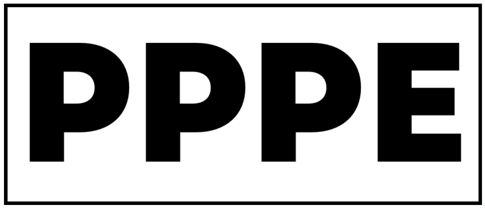

Bienvenue dans la documentation du Projet Pédagogique de Production d'Énergie !
===============================================================================

Le **Projet Pédagogique de Production d'Énergie** consiste à rendre autonome l'éclairage 
de la salle blanche du `BTS SN du lycée Marie Madeleine Fourcade <http://btssnfourcade.free.fr//>`_ en utilisant deux panneaux solaires, deux vélos couplés à des alternateurs 
et des batteries, permettant d'alimenter les 11 points lumineux de la salle, avec comme objectifs 
supplémentaires la mesure de la production des panneaux solaires, l'enregistrement de la production 
des étudiants et la participation à un concours annuel sur l'énergie verte, tout en relevant des défis 
liés à l'informatique, aux réseaux, à la mobilité et à la mesure.

`L'intégralité du code que nous utilisons est sur GitHub <https://github.com/Oliopti/pppe?search=1>`_

.. note::

   Ce projet est en cours de développement.

Sommaire
--------

.. toctree::

   Partie_commune
   Mode_emploi 

   Djibril_CHAABI
   Laurent_CARDONA
   Olivier_JOURDAIN
   Bastien_VIVIAN
   

   Annexe_IR3

   test_img

   usage
   api
   test
